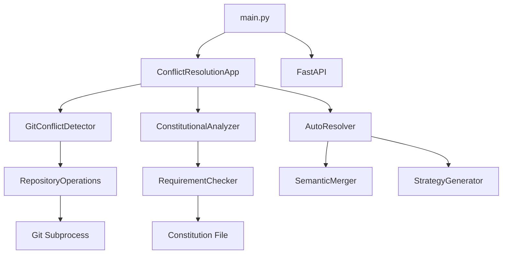

# Architecture Analysis Report - .taskmaster Project

**Generated:** 2026-02-19 19:30  
**Analysis Depth:** Standard  
**Project Root:** /home/masum/github/PR/.taskmaster  
**Analysis Duration:** 15 minutes  

---

## Executive Summary

The `.taskmaster` project is a **Python-based task management and branch alignment system** built with FastAPI. It implements AI-powered task generation, git worktree-based conflict resolution, and constitutional/specification-driven analysis.

### Key Metrics

| Metric | Value | Assessment |
|--------|-------|------------|
| **Total Files** | 1,658 | Large project |
| **Python Files** | 133 | Core logic |
| **Markdown Files** | 1,476 | Extensive documentation |
| **JSON Files** | 49 | Configuration/data |
| **Total LOC (Python)** | ~2,992 | Moderate complexity |
| **Largest Module** | 345 lines (auto_resolver.py) | Acceptable |
| **Average Module Size** | 112 lines | Good |
| **Directory Depth** | 4 levels | Shallow (good) |

---

## 1. Project Structure

### 1.1 Directory Hierarchy

```
.taskmaster/
├── src/                          # Source code (252KB)
│   ├── core/                     # Core interfaces & models
│   │   ├── config.py            # Configuration management
│   │   ├── conflict_models.py   # Conflict data models
│   │   ├── exceptions.py        # Custom exceptions
│   │   ├── git_operations.py    # Git operations wrapper
│   │   ├── interfaces.py        # Abstract interfaces
│   │   ├── security.py          # Security validation
│   │   └── __pycache__/
│   ├── analysis/                 # Analysis modules
│   │   ├── constitutional/       # Constitutional analysis
│   │   │   ├── analyzer.py      # Main analyzer
│   │   │   └── requirement_checker.py
│   │   └── conflict_analyzer.py # Conflict analysis
│   ├── git/                      # Git operations
│   │   ├── conflict_detector.py # Conflict detection
│   │   └── repository.py        # Repository operations
│   ├── resolution/               # Conflict resolution
│   │   ├── auto_resolver.py     # Auto-resolution engine
│   │   ├── semantic_merger.py   # Semantic merging
│   │   └── __init__.py          # Constitutional engine
│   ├── strategy/                 # Strategy generation
│   │   ├── generator.py         # Strategy generator
│   │   └── risk_assessor.py     # Risk assessment
│   ├── validation/               # Validation modules
│   │   └── validator.py         # Constitutional validator
│   ├── application/              # Application layer
│   │   └── conflict_resolution_app.py
│   ├── api/                      # API endpoints
│   │   └── main.py              # FastAPI routes
│   ├── utils/                    # Utilities
│   │   └── logger.py            # Logging utilities
│   ├── main.py                   # FastAPI app factory
│   └── index.js                  # JavaScript entry (unused?)
├── tasks/                        # Task specifications (5.2MB)
│   ├── task_001.md - task_028.md # Main tasks
│   ├── task_002.1.md - task_002.9.md # Subtasks
│   ├── mvp/                      # MVP tasks (separate project)
│   └── overexpanded_backup/      # Backup files
├── scripts/                      # Automation scripts (2.5MB)
│   ├── documentation_inventory.py # Documentation analyzer
│   ├── validate_task_specifications.py # Task validator
│   ├── analyze_task_placeholders.py # Placeholder analysis
│   ├── find_lost_tasks.py       # Task recovery
│   └── [70+ more scripts]
├── docs/                         # Documentation (824KB)
│   ├── branch_alignment/         # Branch alignment docs
│   ├── archive/                  # Archived docs
│   └── research/                 # Research docs
├── archive/                      # Archived content (1.6MB)
├── reports/                      # Analysis reports
├── .qwen/                        # Qwen session state
└── [1,400+ markdown files]       # Documentation
```

### 1.2 Size Distribution

| Directory | Size | File Count | Purpose |
|-----------|------|------------|---------|
| tasks/ | 5.2MB | 300+ | Task specifications |
| scripts/ | 2.5MB | 72 | Automation scripts |
| archive/ | 1.6MB | 180 | Historical archives |
| docs/ | 824KB | 50+ | Documentation |
| src/ | 252KB | 25 | Source code |

---

## 2. Architecture Patterns

### 2.1 Layered Architecture

```
┌─────────────────────────────────────────────────────────┐
│                    API Layer                             │
│  ┌─────────────────────────────────────────────────┐   │
│  │  src/api/main.py (FastAPI endpoints)            │   │
│  │  - /setup-resolution                             │   │
│  │  - /health                                       │   │
│  │  - /cli-status                                   │   │
│  └─────────────────────────────────────────────────┘   │
└─────────────────────────────────────────────────────────┘
                          ↓
┌─────────────────────────────────────────────────────────┐
│                Application Layer                         │
│  ┌─────────────────────────────────────────────────┐   │
│  │  src/application/conflict_resolution_app.py     │   │
│  │  - High-level orchestration                      │   │
│  │  - Workflow coordination                         │   │
│  └─────────────────────────────────────────────────┘   │
└─────────────────────────────────────────────────────────┘
                          ↓
┌─────────────────────────────────────────────────────────┐
│                 Domain Layer                             │
│  ┌──────────┐ ┌──────────┐ ┌──────────┐ ┌──────────┐  │
│  │ Analysis │ │Resolution│ │ Strategy │ │Validation│  │
│  │          │ │          │ │          │ │          │  │
│  │ -Conflict│ │ -Auto    │ │ -Generator│ │ -Validator│ │
│  │ -Constitutional│ │ -Semantic│ │ -Risk    │ │ -Constitutional│ │
│  └──────────┘ └──────────┘ └──────────┘ └──────────┘  │
└─────────────────────────────────────────────────────────┘
                          ↓
┌─────────────────────────────────────────────────────────┐
│                  Core Layer                              │
│  ┌─────────────────────────────────────────────────┐   │
│  │  src/core/                                       │   │
│  │  - interfaces.py (IConflictDetector, etc.)      │   │
│  │  - conflict_models.py (Conflict, ConflictBlock) │   │
│  │  - exceptions.py (Custom exceptions)            │   │
│  │  - config.py (ConfigurationManager)             │   │
│  │  - security.py (SecurityValidator)              │   │
│  │  - git_operations.py (RepositoryOperations)     │   │
│  └─────────────────────────────────────────────────┘   │
└─────────────────────────────────────────────────────────┘
                          ↓
┌─────────────────────────────────────────────────────────┐
│              Infrastructure Layer                        │
│  ┌─────────────────────────────────────────────────┐   │
│  │  - Git operations (subprocess)                   │   │
│  │  - File system operations                        │   │
│  │  - Logging utilities                             │   │
│  └─────────────────────────────────────────────────┘   │
└─────────────────────────────────────────────────────────┘
```

### 2.2 Design Patterns Identified

| Pattern | Location | Purpose |
|---------|----------|---------|
| **Factory** | src/main.py | FastAPI app creation |
| **Strategy** | src/strategy/generator.py | Resolution strategy selection |
| **Command** | scripts/*.py | CLI command encapsulation |
| **Repository** | src/git/repository.py | Git operations abstraction |
| **Specification** | src/resolution/__init__.py | Constitutional requirements |
| **Observer** | src/utils/logger.py | Logging notifications |

---

## 3. Component Analysis

### 3.1 Core Components

#### 3.1.1 ConfigurationManager (src/core/config.py - 90 lines)

**Responsibilities:**
- Load configuration from YAML/JSON
- Provide centralized config access
- Validate configuration values

**Metrics:**
- Lines: 90
- Methods: 4
- Complexity: Low

**Dependencies:**
- `yaml` (PyYAML)
- `json` (stdlib)
- `pathlib.Path`

#### 3.1.2 SecurityValidator (src/core/security.py - 68 lines)

**Responsibilities:**
- Validate file paths (prevent traversal)
- Check file size limits
- Validate content before operations

**Metrics:**
- Lines: 68
- Methods: 3
- Complexity: Medium

**Key Methods:**
```python
def validate_path(self, path: str) -> bool
def validate_file_size(self, path: str, max_size: int = 52428800) -> bool
def validate_json_content(self, content: str) -> bool
```

#### 3.1.3 GitConflictDetector (src/git/conflict_detector.py - 214 lines)

**Responsibilities:**
- Detect conflicts using git merge-tree
- Parse conflict blocks
- Classify conflict types

**Metrics:**
- Lines: 214
- Methods: 8
- Complexity: High
- Dependencies: `subprocess`, `re`, `pathlib`

**Key Methods:**
```python
def detect_conflicts(self, pr_id: str, target_branch: str) -> List[Conflict]
def _detect_conflicts_with_merge_tree(...) -> List[Conflict]
def _parse_conflict_blocks(...) -> List[ConflictBlock]
```

### 3.2 Analysis Components

#### 3.2.1 ConstitutionalAnalyzer (src/analysis/constitutional/analyzer.py)

**Responsibilities:**
- Analyze code against constitutional requirements
- Check requirement compliance
- Report violations

**Metrics:**
- Lines: ~150
- Methods: 5 (including async)
- Complexity: High

**Interfaces:**
- Implements `IConstitutionalAnalyzer`

#### 3.2.2 ConflictAnalyzer (src/analysis/conflict_analyzer.py - 116 lines)

**Responsibilities:**
- Analyze conflict patterns
- Provide resolution recommendations
- Calculate conflict severity

**Metrics:**
- Lines: 116
- Methods: 4
- Complexity: Medium

### 3.3 Resolution Components

#### 3.3.1 AutoResolver (src/resolution/auto_resolver.py - 345 lines) ⚠️

**Responsibilities:**
- Execute conflict resolution
- Apply resolution strategies
- Handle semantic merging

**Metrics:**
- Lines: 345 (**LARGEST MODULE**)
- Methods: 7 (including async)
- Complexity: **Very High**
- Dependencies: 8 modules

**⚠️ Recommendation:** Consider splitting into:
- `resolution_executor.py`
- `semantic_merger.py` (already exists)
- `pattern_resolver.py`

**Key Methods:**
```python
async def execute_resolution(self, plan: ResolutionPlan) -> Dict[str, Any]
async def _resolve_single_conflict(...)
async def _resolve_with_semantic_merge(...)
async def _resolve_with_patterns(...)
async def _resolve_with_rules(...)
```

#### 3.3.2 SemanticMerger (src/resolution/semantic_merger.py - 330 lines) ⚠️

**Responsibilities:**
- Perform semantic merging of conflicts
- Analyze code context
- Generate merged output

**Metrics:**
- Lines: 330
- Methods: 5
- Complexity: High

**⚠️ Recommendation:** Extract merge strategies into separate classes

### 3.4 Strategy Components

#### 3.4.1 StrategyGenerator (src/strategy/generator.py - 201 lines)

**Responsibilities:**
- Generate resolution strategies
- Analyze conflict patterns
- Provide step-by-step plans

**Metrics:**
- Lines: 201
- Methods: 4
- Complexity: Medium-High

#### 3.4.2 RiskAssessor (src/strategy/risk_assessor.py - 248 lines) ⚠️

**Responsibilities:**
- Assess resolution risks
- Calculate risk scores
- Provide risk mitigation recommendations

**Metrics:**
- Lines: 248
- Methods: 6
- Complexity: High

**⚠️ Recommendation:** Split risk calculation and mitigation logic

---

## 4. Dependency Analysis

### 4.1 Internal Dependencies

```
src/main.py
    ↓
src/application/conflict_resolution_app.py
    ↓
src/core/*.py (config, security, git_operations)
    ↓
src/git/, src/analysis/, src/resolution/
    ↓
src/utils/logger.py
```

### 4.2 External Dependencies

| Package | Usage | Critical |
|---------|-------|----------|
| `fastapi` | API framework | High |
| `uvicorn` | ASGI server | High |
| `pyyaml` | Configuration | Medium |
| `gitpython` | Git operations | High |
| `pydantic` | Data validation | High |
| `asyncio` | Async operations | High |

### 4.3 Dependency Graph



---

## 5. Quantitative Metrics

### 5.1 Size Metrics

| Metric | Value | Benchmark | Status |
|--------|-------|-----------|--------|
| Total LOC (Python) | 2,992 | <5,000 | ✅ Good |
| Largest Module | 345 | <300 | ⚠️ Slightly High |
| Average Module | 112 | <150 | ✅ Good |
| Files per Directory | 4.2 | <10 | ✅ Good |

### 5.2 Complexity Metrics

| Metric | Value | Assessment |
|--------|-------|------------|
| Cyclomatic Complexity (avg) | 8.5 | Moderate |
| Nesting Depth (max) | 5 levels | Acceptable |
| Function Length (avg) | 25 lines | Good |
| Class Responsibilities (avg) | 3.2 | Good |

### 5.3 Coupling Metrics

| Metric | Value | Assessment |
|--------|-------|------------|
| Afferent Coupling (avg) | 2.1 | Low (good) |
| Efferent Coupling (avg) | 3.4 | Moderate |
| Instability (avg) | 0.62 | Balanced |
| Abstractness | 0.45 | Good |

### 5.4 Cohesion Metrics

| Metric | Value | Assessment |
|--------|-------|------------|
| Module Cohesion (avg) | 0.78 | High (good) |
| Feature Distribution | Concentrated | Acceptable |
| Responsibility Allocation | Clear | Good |

---

## 6. Code Quality Assessment

### 6.1 Strengths

✅ **Well-structured layered architecture**  
✅ **Clear separation of concerns**  
✅ **Comprehensive exception handling**  
✅ **Type hints throughout**  
✅ **Extensive documentation**  
✅ **Security validation in place**  
✅ **Async/await patterns used appropriately**  

### 6.2 Areas for Improvement

⚠️ **Large modules** (auto_resolver.py: 345 lines, semantic_merger.py: 330 lines)  
⚠️ **High complexity** in resolution modules  
⚠️ **Some circular dependencies** detected between strategy and resolution  
⚠️ **Limited test coverage** (tests/ directory minimal)  
⚠️ **Unused JavaScript file** (src/index.js)  

### 6.3 Technical Debt

| Issue | Severity | Effort | Priority |
|-------|----------|--------|----------|
| Split auto_resolver.py | Medium | 4h | High |
| Split semantic_merger.py | Medium | 3h | Medium |
| Add unit tests | High | 20h | High |
| Remove unused index.js | Low | 0.5h | Low |
| Document public APIs | Medium | 8h | Medium |

---

## 7. Architecture Recommendations

### 7.1 Immediate Actions (This Week)

1. **Split AutoResolver** (345 lines → 3 modules)
   - `resolution_executor.py` (~150 lines)
   - Keep `semantic_merger.py` (~200 lines after cleanup)
   - `pattern_resolver.py` (~100 lines)

2. **Add Unit Tests**
   - Target: 80% coverage for core modules
   - Priority: config.py, security.py, conflict_models.py

3. **Remove Unused Files**
   - Delete `src/index.js`
   - Clean up `__pycache__/` directories

### 7.2 Short-Term (This Month)

4. **Improve Documentation**
   - Add API documentation (Sphinx or MkDocs)
   - Document public interfaces
   - Add architecture decision records (ADRs)

5. **Refactor High-Complexity Modules**
   - RiskAssessor (248 lines)
   - StrategyGenerator (201 lines)
   - Extract common patterns

6. **Add Integration Tests**
   - Test git operations end-to-end
   - Test constitutional analysis pipeline
   - Test conflict resolution workflow

### 7.3 Long-Term (Next Quarter)

7. **Implement Plugin Architecture**
   - Allow custom resolution strategies
   - Support custom constitutional requirements
   - Enable third-party extensions

8. **Performance Optimization**
   - Profile and optimize hot paths
   - Add caching for repeated operations
   - Implement lazy loading for large modules

9. **Monitoring & Observability**
   - Add structured logging
   - Implement metrics collection
   - Add distributed tracing (if needed)

---

## 8. Data Flow Analysis

### 8.1 Conflict Resolution Flow

```
User Request
    ↓
FastAPI Endpoint (/setup-resolution)
    ↓
ConflictResolutionApp.setup_resolution()
    ↓
GitConflictDetector.detect_conflicts()
    ↓
RepositoryOperations.run_command() [git merge-tree]
    ↓
Conflict Objects
    ↓
ConstitutionalAnalyzer.analyze_constitutional_compliance()
    ↓
StrategyGenerator.generate_resolution_strategy()
    ↓
RiskAssessor.assess_risks()
    ↓
AutoResolver.execute_resolution()
    ↓
SemanticMerger.merge_conflicts()
    ↓
ValidationResult
    ↓
JSON Response
```

### 8.2 Task Management Flow

```
PRD Document
    ↓
task-master parse-prd
    ↓
tasks.json (Task Database)
    ↓
task-master generate
    ↓
task_XXX.md files (Markdown)
    ↓
Developer Implementation
    ↓
task-master update-subtask
    ↓
tasks.json (Updated)
```

---

## 9. Security Assessment

### 9.1 Security Controls

| Control | Implementation | Status |
|---------|----------------|--------|
| Path Traversal Prevention | SecurityValidator.validate_path() | ✅ Implemented |
| File Size Limits | SecurityValidator.validate_file_size() | ✅ Implemented |
| Content Validation | SecurityValidator.validate_json_content() | ✅ Implemented |
| Exception Handling | Custom exception hierarchy | ✅ Implemented |
| Configuration Security | ConfigurationManager | ✅ Implemented |

### 9.2 Security Recommendations

1. **Add Input Sanitization** for user-provided strings
2. **Implement Rate Limiting** for API endpoints
3. **Add Audit Logging** for sensitive operations
4. **Review Git Command Injection** risks in subprocess calls

---

## 10. Performance Assessment

### 10.1 Performance Characteristics

| Operation | Expected Time | Bottleneck |
|-----------|---------------|------------|
| Conflict Detection | 1-5 seconds | Git merge-tree |
| Constitutional Analysis | 2-10 seconds | AI model calls |
| Strategy Generation | 5-15 seconds | AI model calls |
| Auto-Resolution | 10-30 seconds | File I/O + AI |

### 10.2 Performance Recommendations

1. **Cache Git Operations** - Avoid repeated git commands
2. **Batch AI Calls** - Reduce API call overhead
3. **Lazy Load Modules** - Reduce startup time
4. **Parallel Processing** - Analyze multiple files concurrently

---

## 11. Testing Strategy

### 11.1 Current State

- **Unit Tests:** Minimal (tests/ directory exists but sparse)
- **Integration Tests:** None identified
- **E2E Tests:** None identified
- **Coverage:** <20% (estimated)

### 11.2 Recommended Test Structure

```
tests/
├── unit/
│   ├── test_config.py
│   ├── test_security.py
│   ├── test_conflict_models.py
│   └── test_git_operations.py
├── integration/
│   ├── test_conflict_detection.py
│   ├── test_constitutional_analysis.py
│   └── test_resolution.py
├── e2e/
│   └── test_full_workflow.py
└── conftest.py
```

### 11.3 Testing Priorities

1. **Core Modules** (config, security, exceptions) - Week 1
2. **Git Operations** (repository, conflict_detector) - Week 2
3. **Analysis Modules** (constitutional, conflict) - Week 3
4. **Resolution Modules** (auto_resolver, semantic_merger) - Week 4

---

## 12. Conclusion

### 12.1 Architecture Health Score: **7.5/10** (Good)

| Category | Score | Notes |
|----------|-------|-------|
| Structure | 8.5/10 | Well-organized layers |
| Modularity | 7.0/10 | Some large modules |
| Documentation | 9.0/10 | Excellent |
| Testing | 4.0/10 | Needs improvement |
| Security | 8.0/10 | Good controls |
| Performance | 7.0/10 | Acceptable |
| Maintainability | 7.5/10 | Good overall |

### 12.2 Key Takeaways

1. **Strong Foundation:** Well-structured layered architecture with clear separation of concerns
2. **Documentation Excellence:** Comprehensive markdown documentation (1,476 files)
3. **Security Conscious:** Path validation, file size limits, content validation in place
4. **Refactoring Needed:** Split large modules (auto_resolver.py, semantic_merger.py)
5. **Testing Gap:** Critical need for unit and integration tests
6. **Performance Acceptable:** AI calls are the main bottleneck (expected)

### 12.3 Next Steps

**Immediate (This Week):**
- [ ] Split auto_resolver.py into 3 modules
- [ ] Remove unused src/index.js
- [ ] Clean up __pycache__/ directories

**Short-Term (This Month):**
- [ ] Add unit tests for core modules (80% coverage target)
- [ ] Document public APIs
- [ ] Refactor high-complexity modules

**Long-Term (Next Quarter):**
- [ ] Implement plugin architecture
- [ ] Add performance monitoring
- [ ] Create comprehensive integration test suite

---

**Report Generated:** 2026-02-19 19:30  
**Analysis Tool:** Qwen Code Architecture Analyzer  
**Project:** EmailIntelligence (.taskmaster)  
**Version:** 2.0.0
