```mermaid
graph TD
    A[Main Development Lines] --> B[Feature Branches]
    A --> C[Documentation Branches]
    A --> D[Backend/Refactor Branches]
    A --> E[Experimental/Optimization Branches]
    A --> F[Integration & Alignment Branches]

    B --> B1[feat/emailintelligence-cli-v2.0-with-pr-framework]
    B --> B2[feat/modular-ai-platform]
    B --> B3[feature-architectural-and-security-enhancements]
    B --> B4[feature-dashboard-improvements-part-2]
    B --> B5[feature-notmuch-tagging-1]

    C --> C1[docs-cleanup]
    C --> C2[docs-main]
    C --> C3[docs-scientific]
    C --> C4[docs/comprehensive-documentation]
    C --> C5[documentation-merge-20251104]

    D --> D1[backend-consolidation]
    D --> D2[backend-refactor]
    D --> D3[migrate-backend-to-src]
    D --> D4[feature/backend-to-src-migration]

    E --> E1[enhancements-for-later]
    E --> E2[feature/jules-mcp-email-intelligence-schedule]
    E --> E3[feature/launch-solid-refactoring]

    F --> F1[align-feature-notmuch-tagging-1]
    F --> F2[branch-integration]
    F --> F3[feature-architectural-and-security-enhancements]
```

# 🧠 Local Branch Mindmap Analysis

## 🌳 Branch Relationship Tree (Mindmap Style)



## 🔍 Historical Relationships Analysis

### 1. **Core Development Lines**

#### 🏗️ Main Feature Development
- **`feat/emailintelligence-cli-v2.0-with-pr-framework`** (CURRENT)
  - Latest commit: `830ce29e` (Merge from feat-emailintelligence-cli-v2.0)
  - Focus: CLI v2.0 with PR framework integration
  - Relationship: Direct evolution of `feat-emailintelligence-cli-v2.0`

- **`feat-emailintelligence-cli-v2.0`**
  - Base for current branch
  - Focus: Core CLI v2.0 functionality

#### 📚 Documentation Evolution
```
master → docs-cleanup (2025-11-02)
          → docs-main (2025-11-03)
          → docs-scientific (2025-11-03)
          → docs/comprehensive-documentation (2025-11-04)
          → documentation-merge-20251104 (2025-11-04)
```

### 2. **Backend Architecture Evolution**

```
master → backend-refactor (2025-11-07)
          → backend-consolidation (2025-11-14)
          → feature/backend-to-src-migration (2025-11-07)
          → migrate-backend-to-src (2025-11-07)
```

### 3. **Integration & Alignment Patterns**

#### 🔄 Cross-Branch Alignment
- **`align-feature-notmuch-tagging-1`** (2025-11-04)
  - Purpose: Replace feature branch backlog with scientific branch backlog
  - Relationship: Connects feature branches to scientific branch

- **`branch-integration`** (2025-11-08)
  - Purpose: Update Taskmaster tasks with scientific branch optimizations
  - Relationship: Integration point between orchestration and scientific branches

#### 🎯 Task-Specific Integrations
- **`001-*` branches**: Agent context control, command registry, planning workflow
- **`002-*` branches**: Validation and execution layer tasks
- **`003-*` branches**: Execution layer and unified analysis

## 🧬 Code Similarity Clusters

### Cluster 1: CLI & Framework Development
**Branches**: 
- `feat/emailintelligence-cli-v2.0-with-pr-framework`
- `feat-emailintelligence-cli-v2.0`
- `feat/modular-ai-platform`

**Common Patterns**:
- CLI command structures
- PR framework integration
- Task management systems
- Constitutional engine initialization

### Cluster 2: Documentation Systems
**Branches**:
- `docs-cleanup`, `docs-main`, `docs-scientific`
- `docs/comprehensive-documentation`
- `documentation-merge-20251104`

**Common Patterns**:
- Markdown documentation structures
- Taskmaster documentation
- Branch comparison reports
- Workflow documentation

### Cluster 3: Backend Architecture
**Branches**:
- `backend-refactor`, `backend-consolidation`
- `feature/backend-to-src-migration`
- `migrate-backend-to-src`

**Common Patterns**:
- Python backend structures
- Module organization
- Database connectivity
- Service layer patterns

### Cluster 4: Integration & Alignment
**Branches**:
- `align-feature-notmuch-tagging-1`
- `branch-integration`
- `feature-architectural-and-security-enhancements`

**Common Patterns**:
- Cross-branch synchronization
- Backlog management
- Taskmaster integration
- Security enhancements

## 📊 Branch Statistics

### By Category
- **Feature Development**: 12 branches (40%)
- **Documentation**: 8 branches (27%)
- **Backend/Refactor**: 6 branches (20%)
- **Integration/Alignment**: 4 branches (13%)

### By Age (Most Recent First)
1. `001-agent-context-control` (2025-11-19)
2. `001-command-registry-integration` (2025-11-11)
3. `001-implement-planning-workflow` (2025-11-10)
4. `001-orchestration-tools-consistency` (2025-11-11)
5. `001-pr176-integration-fixes` (2025-11-08)

### By Commit Activity
- **Most Active**: `feat/emailintelligence-cli-v2.0-with-pr-framework` (current working branch)
- **Recent Merges**: Multiple branches show merge commit patterns
- **Stale Branches**: Several branches show no recent activity

## 🔗 Relationship Matrix

| Branch Group | Related Groups | Connection Type |
|--------------|----------------|------------------|
| CLI Features | Documentation | Shared task structures, PR frameworks |
| CLI Features | Backend | Service integration, module patterns |
| Documentation | Integration | Cross-reference systems, merge patterns |
| Backend | Integration | Migration scripts, consolidation efforts |
| Integration | All | Central coordination point |

## 🎯 Key Insights

### 1. **Central Integration Pattern**
The repository shows a strong pattern of integration-focused development:
- Multiple branches serve as connection points between different feature areas
- `branch-integration` and alignment branches act as hubs
- Documentation branches often merge content from multiple sources

### 2. **Documentation-Driven Development**
- Documentation branches are numerous and frequently updated
- Documentation serves as both output and coordination mechanism
- Taskmaster documentation appears central to workflow

### 3. **Backend Migration Focus**
- Significant effort in backend consolidation and migration
- Multiple attempts at backend-to-src migration patterns
- Indicates architectural evolution in progress

### 4. **CLI as Primary Interface**
- CLI development branches are most recent and active
- Integration with PR frameworks suggests workflow automation focus
- Constitutional engine patterns indicate AI/automation components

## 💡 Recommendations

### 1. **Consolidation Opportunities**
- **Documentation**: Merge `docs-*` branches into unified documentation system
- **Backend**: Complete backend-to-src migration and retire old backend branches
- **Integration**: Standardize on one integration pattern (currently multiple approaches)

### 2. **Cleanup Targets**
- **Stale Branches**: Branches with no recent commits and `[gone]` remote status
- **Duplicate Patterns**: Multiple branches with similar purposes (e.g., backend migration)
- **Experimental**: Branches marked as "enhancements-for-later" that may be obsolete

### 3. **Development Focus**
- **Primary**: Continue CLI v2.0 development with PR framework integration
- **Secondary**: Complete backend consolidation efforts
- **Tertiary**: Unify documentation systems

## 🧭 Navigation Guide

### For New Developers
1. Start with `feat/emailintelligence-cli-v2.0-with-pr-framework` (current branch)
2. Reference `docs/comprehensive-documentation` for overall structure
3. Use `backend-consolidation` for backend architecture understanding
4. Check `branch-integration` for cross-branch patterns

### For Maintenance
1. **Cleanup**: Use provided `cleanup-branches.sh` script
2. **Consolidation**: Focus on merging documentation and backend branches
3. **Integration**: Standardize on one integration pattern
4. **Archiving**: Move obsolete branches to archive/ namespace

---

*Generated: 2025-12-20* | *Analysis based on current branch state and commit history*