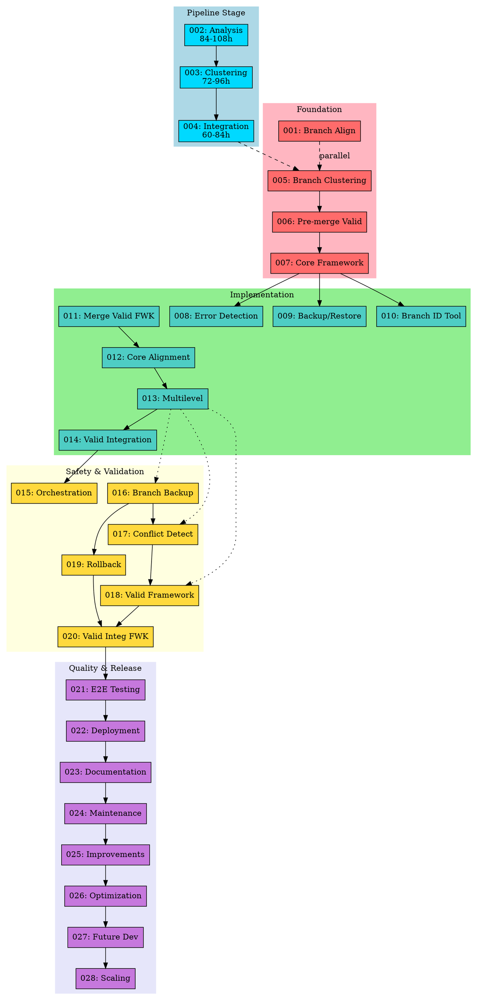

# Option C: Task Restructuring Visual Map

**Date:** January 28, 2026
**Purpose:** Complete visual representation of Option C (+3 shift) task structure

---

## Current Task Framework Map (2026-02-23)

This section reflects the current task files (001-028) as they exist now. It is added above the legacy Option C map to preserve historical reference.

### Task Inventory
| Task ID | Title | Dependencies (Normalized) | Outputs |
| --- | --- | --- | --- |
| 001 | Align and Architecturally Integrate Feature Branches with Justified Targets | None | `task-001-1.md`, `task-001-2.md`, `task-001-3.md`, `task-001-4.md`, `task-001-5.md` (+3 more) |
| 002 | Branch Clustering System | Task 001 (can run parallel) | `tasks/task_002.md`, `tasks/task_002-clustering.md`, `TASK_002_MIGRATION_COMPLETE.md`, `TASK_75_CLEANUP_AND_RENUMBERING_PLAN.md`, `.agent_memory/session_log.json` (+16 more) |
| 003 | Develop and Integrate Pre-merge Validation Scripts | None | `docs/dev_guides/pre_merge_checks.md`, `CONTRIBUTING.md`, `data/processed/email_data.json`, `AGENTS.md`, `.github/workflows/pull_request.yml` |
| 004 | Establish Core Branch Alignment Framework | None | None listed |
| 005 | Develop Automated Error Detection Scripts for Merges | 004 | `task-002-1.md`, `task-002-2.md`, `task-002-3.md`, `task-002-4.md`, `task-002-5.md` (+5 more) |
| 006 | Implement Robust Branch Backup and Restore Mechanism | 004 | None listed |
| 007 | Develop Feature Branch Identification and Categorization Tool | 004 | None listed |
| 008 | Create Comprehensive Merge Validation Framework | None | `backlog/tasks/alignment/create-merge-validation-framework.md`, `validation_framework_design.md`, `.github/workflows/merge-validation.yml`, `requirements.txt`, `.github/workflows/ci.yml` (+1 more) |
| 009 | Core Multistage Primary-to-Feature Branch Alignment | 004, 006, 007, 012, 013, 014, 015, 022 | `config/task_009_alignment_orchestration.yaml` |
| 010 | Implement Multilevel Strategies for Complex Branches | 005, 009, 013, 014, 015, 016, 022 | None listed |
| 011 | Integrate Validation Framework into Multistage Alignment Workflow | 005, 009, 010 | `validation_framework_design.md`, `validation_config.yaml` |
| 012 | Orchestrate Sequential Branch Alignment Workflow | 007, 008, 009, 010, 011, 022 | `CHANGES_SUMMARY.md`, `README.md` |
| 013 | Branch Backup and Safety | 006, 022 | `config/task_013_backup_safety.yaml` |
| 014 | Conflict Detection and Resolution | 010, 013 | `config/task_014_conflict_resolution.yaml` |
| 015 | Validation and Verification | 005, 010, 014 | `CHANGES_SUMMARY.md`, `README.md`, `config/task_015_validation_verification.yaml` |
| 016 | Rollback and Recovery | 006, 013, 010 | `config/task_016_rollback_recovery.yaml` |
| 017 | Validation Integration Framework | 005, 010, 015 | `config/task_017_validation_integration.yaml` |
| 018 | End-to-End Testing and Reporting | 010, 017, 016, 015 | `config/task_018_e2e_testing.yaml` |
| 019 | Deployment and Release Management | 018, 010 | `config/task_019_deployment_management.yaml` |
| 020 | Documentation and Knowledge Management | 019, 010 | `config/task_020_documentation_management.yaml` |
| 021 | Maintenance and Monitoring | 020, 010 | `config/task_021_maintenance_monitoring.yaml` |
| 022 | Improvements and Enhancements Framework | 021, 010 | `config/task_022_improvements_enhancements.yaml` |
| 023 | Optimization and Performance Tuning Framework | 022, 010 | `config/task_023_optimization_tuning.yaml` |
| 024 | Future Development and Roadmap Framework | 023, 010 | `config/task_024_future_development.yaml` |
| 025 | Scaling and Advanced Features Framework | 024, 010 | `config/task_025_scaling_advanced.yaml` |
| 026 | Optimization and Performance Tuning | 025, 013 | `config/task_023_optimization_tuning.yaml` |
| 027 | Future Development and Roadmap | 026, 013 | `config/task_024_future_development.yaml` |
| 028 | Scaling and Advanced Features | 027, 013 | `config/task_025_scaling_advanced.yaml` |

### Drift Summary
- Tasks with missing titles: None.
- Output artifacts remain unevenly specified; 4 tasks list none while Task 002 references extensive legacy artifacts.

### Notes
- Dependency values are taken from the task headers and may be stale where tasks still reference older IDs.
- Output values list the first few named artifacts or note when an output section exists; many tasks still lack explicit output definitions.
- Use the dependency/output audit to identify missing or inconsistent references before aligning the map.

## 1. ASCII Dependency Map

```
╔═══════════════════════════════════════════════════════════════════════════════╗
║                        OPTION C: COMPLETE TASK STRUCTURE                       ║
║                              (+3 Shift Applied)                                ║
╚═══════════════════════════════════════════════════════════════════════════════╝

┌─────────────────────────────────────────────────────────────────────────────────┐
│                         🔵 PIPELINE STAGE (002-004)                             │
│                         ═══════════════════════════                             │
│                                                                                 │
│   ┌─────────────────┐    ┌─────────────────┐    ┌─────────────────┐            │
│   │ 002: ANALYSIS   │───▶│ 003: CLUSTERING │───▶│ 004: INTEGRATION│            │
│   │ ⏱️ 84-108h      │    │ ⏱️ 72-96h       │    │ ⏱️ 60-84h       │            │
│   │ 📊 7/10         │    │ 📊 7/10         │    │ 📊 6/10         │            │
│   │                 │    │                 │    │                 │            │
│   │ • CommitHistory │    │ • BranchCluster │    │ • Pipeline      │            │
│   │ • CodebaseStruct│    │ • TargetAssign  │    │ • Visualization │            │
│   │ • DiffDistance  │    │                 │    │ • TestingSuite  │            │
│   └─────────────────┘    └─────────────────┘    └────────┬────────┘            │
│                                                          │                      │
└──────────────────────────────────────────────────────────┼──────────────────────┘
                                                           │
                                                           ▼
┌─────────────────────────────────────────────────────────────────────────────────┐
│                         🔴 FOUNDATION (001, 005-007)                            │
│                         ════════════════════════════                            │
│                                                                                 │
│   ┌─────────────────┐         ┌─────────────────┐                              │
│   │ 001: BRANCH     │◄═══════▶│ 005: BRANCH     │  (Parallel Execution)        │
│   │ ALIGNMENT       │         │ CLUSTERING SYS  │                              │
│   │ 🔒 Entry Point  │         │ (was task-002)  │                              │
│   └─────────────────┘         └─────────────────┘                              │
│                                       │                                         │
│                                       ▼                                         │
│                              ┌─────────────────┐                               │
│                              │ 006: PRE-MERGE  │                               │
│                              │ VALIDATION      │                               │
│                              │ (was task-003)  │                               │
│                              │ Deps: 014,015,016│                              │
│                              └────────┬────────┘                               │
│                                       │                                         │
│                                       ▼                                         │
│                              ┌─────────────────┐                               │
│                              │ 007: CORE       │                               │
│                              │ FRAMEWORK       │                               │
│                              │ (was task-004)  │                               │
│                              └────────┬────────┘                               │
│                                       │                                         │
└───────────────────────────────────────┼─────────────────────────────────────────┘
                                        │
              ┌─────────────────────────┼─────────────────────────┐
              │                         │                         │
              ▼                         ▼                         ▼
┌─────────────────────────────────────────────────────────────────────────────────┐
│                         🟢 IMPLEMENTATION (008-014)                             │
│                         ═══════════════════════════                             │
│                                                                                 │
│   ┌─────────────┐    ┌─────────────┐    ┌─────────────┐                        │
│   │ 008: ERROR  │    │ 009: BACKUP │    │ 010: BRANCH │                        │
│   │ DETECTION   │    │ & RESTORE   │    │ ID TOOL     │                        │
│   │ (was 005)   │    │ (was 006)   │    │ (was 007)   │                        │
│   └──────┬──────┘    └──────┬──────┘    └──────┬──────┘                        │
│          │                  │                  │                                │
│          └──────────────────┼──────────────────┘                                │
│                             ▼                                                   │
│                    ┌─────────────────┐                                         │
│                    │ 011: MERGE      │                                         │
│                    │ VALIDATION FWK  │                                         │
│                    │ (was 008)       │                                         │
│                    └────────┬────────┘                                         │
│                             │                                                   │
│                             ▼                                                   │
│   ┌─────────────────────────────────────────────────────────────┐              │
│   │ 012: CORE MULTISTAGE ALIGNMENT (was 009)                    │              │
│   │ Deps: 007, 009, 010, 015, 016, 017, 018, 025                │              │
│   └─────────────────────────┬───────────────────────────────────┘              │
│                             │                                                   │
│                             ▼                                                   │
│   ┌─────────────────────────────────────────────────────────────┐              │
│   │ 013: MULTILEVEL STRATEGIES (was 010)                        │              │
│   │ Deps: 008, 012, 015, 016, 017, 018, 019, 025                │──┐           │
│   └─────────────────────────┬───────────────────────────────────┘  │           │
│                             │                                       │           │
│                             ▼                                       │           │
│                    ┌─────────────────┐                             │           │
│                    │ 014: VALIDATION │                             │           │
│                    │ INTEGRATION     │                             │           │
│                    │ (was 011)       │                             │           │
│                    └────────┬────────┘                             │           │
│                             │                                       │           │
└─────────────────────────────┼───────────────────────────────────────┼───────────┘
                              │                                       │
                              ▼                                       │
┌─────────────────────────────────────────────────────────────────────┼───────────┐
│                         🟡 SAFETY & VALIDATION (015-020)            │           │
│                         ══════════════════════════════              │           │
│                                                                     │           │
│   ┌─────────────┐    ┌─────────────┐    ┌─────────────┐            │           │
│   │ 015: ORCH   │    │ 016: BRANCH │    │ 017: CONFLICT│◄──────────┘           │
│   │ (was 012)   │    │ BACKUP      │    │ DETECTION   │                        │
│   │             │    │ (was 013)   │    │ (was 014)   │                        │
│   └──────┬──────┘    └──────┬──────┘    └──────┬──────┘                        │
│          │                  │                  │                                │
│          │                  ▼                  ▼                                │
│          │           ┌─────────────┐    ┌─────────────┐                        │
│          │           │ 019: ROLLBACK│    │ 018: VALID  │                        │
│          │           │ & RECOVERY  │    │ FRAMEWORK   │                        │
│          │           │ (was 016)   │    │ (was 015)   │                        │
│          │           └──────┬──────┘    └──────┬──────┘                        │
│          │                  │                  │                                │
│          │                  └──────────────────┤                                │
│          │                                     ▼                                │
│          │                            ┌─────────────┐                          │
│          └───────────────────────────▶│ 020: VALID  │                          │
│                                       │ INTEGRATION │                          │
│                                       │ (was 017)   │                          │
│                                       └──────┬──────┘                          │
│                                              │                                  │
└──────────────────────────────────────────────┼──────────────────────────────────┘
                                               │
                                               ▼
┌─────────────────────────────────────────────────────────────────────────────────┐
│                         🟣 QUALITY & RELEASE (021-028)                          │
│                         ══════════════════════════════                          │
│                                                                                 │
│   ┌───────────┐   ┌───────────┐   ┌───────────┐   ┌───────────┐               │
│   │ 021: E2E  │──▶│ 022: DEPLOY│──▶│ 023: DOCS │──▶│ 024: MAINT│               │
│   │ TESTING   │   │           │   │           │   │           │               │
│   │ (was 018) │   │ (was 019) │   │ (was 020) │   │ (was 021) │               │
│   └───────────┘   └───────────┘   └───────────┘   └─────┬─────┘               │
│                                                         │                       │
│   ┌───────────┐   ┌───────────┐   ┌───────────┐        │                       │
│   │ 028: SCALE│◀──│ 027: FUTURE│◀──│ 026: OPT  │◀───────┤                       │
│   │           │   │ DEV       │   │           │        │                       │
│   │ (was 025) │   │ (was 024) │   │ (was 023) │        ▼                       │
│   └───────────┘   └───────────┘   └───────────┘   ┌───────────┐               │
│                                                   │ 025: IMPROV│               │
│                                                   │ (was 022)  │               │
│                                                   └───────────┘               │
│                                                                                 │
└─────────────────────────────────────────────────────────────────────────────────┘
```

---

## 2. Task ID Mapping Table

| Old ID | New ID | Task Name | Category |
|--------|--------|-----------|----------|
| task_002 | **002** | Analysis Stage | Pipeline |
| task_003 | **003** | Clustering Stage | Pipeline |
| task_004 | **004** | Integration Stage | Pipeline |
| task-002 | **005** | Branch Clustering System | Foundation |
| task-003 | **006** | Pre-merge Validation Scripts | Foundation |
| task-004 | **007** | Core Branch Alignment Framework | Foundation |
| task-005 | **008** | Automated Error Detection | Implementation |
| task-006 | **009** | Branch Backup/Restore | Implementation |
| task-007 | **010** | Feature Branch ID Tool | Implementation |
| task-008 | **011** | Merge Validation Framework | Implementation |
| task-009 | **012** | Core Multistage Alignment | Implementation |
| task-010 | **013** | Multilevel Strategies | Implementation |
| task-011 | **014** | Validation Integration | Implementation |
| task-012 | **015** | Orchestration | Safety |
| task-013 | **016** | Branch Backup Safety | Safety |
| task-014 | **017** | Conflict Detection | Safety |
| task-015 | **018** | Validation Framework | Safety |
| task-016 | **019** | Rollback/Recovery | Safety |
| task-017 | **020** | Validation Integration FWK | Safety |
| task-018 | **021** | E2E Testing | Quality |
| task-019 | **022** | Deployment | Quality |
| task-020 | **023** | Documentation | Quality |
| task-021 | **024** | Maintenance | Quality |
| task-022 | **025** | Improvements | Quality |
| task-023 | **026** | Optimization | Quality |
| task-024 | **027** | Future Development | Quality |
| task-025 | **028** | Scaling | Quality |

---

## 3. Dependency Update Map

### Dependencies requiring +3 offset:

```
Old Reference → New Reference
═══════════════════════════════
004 → 007
005 → 008
006 → 009
007 → 010
008 → 011
009 → 012
010 → 013
011 → 014
012 → 015
013 → 016
014 → 017
015 → 018
016 → 019
017 → 020
018 → 021
019 → 022
020 → 023
021 → 024
022 → 025
023 → 026
024 → 027
025 → 028
075 → (external, no change)
076 → (external, no change)
077 → (external, no change)
078 → (external, no change)
```

---

## 4. Information Flow Diagram (ASCII)

```
                                    ┌─────────────────┐
                                    │  Git Repository │
                                    │  (Branches)     │
                                    └────────┬────────┘
                                             │
                                             ▼
┌────────────────────────────────────────────────────────────────────────────┐
│                           ANALYSIS STAGE (002)                              │
│  ┌──────────────┐    ┌──────────────┐    ┌──────────────┐                 │
│  │CommitHistory │    │CodebaseStruct│    │DiffDistance  │                 │
│  │  Analyzer    │    │  Analyzer    │    │ Calculator   │                 │
│  └──────┬───────┘    └──────┬───────┘    └──────┬───────┘                 │
│         │                   │                   │                          │
│         └───────────────────┴───────────────────┘                          │
│                             │                                               │
│                    [metrics.json]                                          │
└─────────────────────────────┬──────────────────────────────────────────────┘
                              │
                              ▼
┌────────────────────────────────────────────────────────────────────────────┐
│                          CLUSTERING STAGE (003)                             │
│  ┌──────────────┐              ┌──────────────┐                            │
│  │   Branch     │─────────────▶│ Integration  │                            │
│  │  Clusterer   │              │Target Assign │                            │
│  └──────────────┘              └──────┬───────┘                            │
│                                       │                                     │
│                          [categorized_branches.json]                       │
└───────────────────────────────────────┬────────────────────────────────────┘
                                        │
                                        ▼
┌────────────────────────────────────────────────────────────────────────────┐
│                         INTEGRATION STAGE (004)                             │
│  ┌──────────────┐    ┌──────────────┐    ┌──────────────┐                 │
│  │  Pipeline    │    │Visualization │    │   Testing    │                 │
│  │ Integration  │    │ & Reporting  │    │    Suite     │                 │
│  └──────┬───────┘    └──────┬───────┘    └──────┬───────┘                 │
│         │                   │                   │                          │
│         │         [reports/]│        [test_results.json]                   │
└─────────┼───────────────────┼───────────────────┼──────────────────────────┘
          │                   │                   │
          ▼                   ▼                   ▼
┌────────────────────────────────────────────────────────────────────────────┐
│                      EXECUTION LAYER (005-014)                              │
│                                                                             │
│   ┌─────────────────────────────────────────────────────────────────┐      │
│   │                    005: Branch Clustering System                 │      │
│   │                    (Orchestrates clustering execution)           │      │
│   └─────────────────────────────┬───────────────────────────────────┘      │
│                                 │                                           │
│   ┌─────────────────────────────▼───────────────────────────────────┐      │
│   │                    006: Pre-merge Validation                     │      │
│   │                    (Validates before merge operations)           │      │
│   └─────────────────────────────┬───────────────────────────────────┘      │
│                                 │                                           │
│   ┌─────────────────────────────▼───────────────────────────────────┐      │
│   │                    007: Core Framework                           │      │
│   │                    (Git hooks, merge guards)                     │      │
│   └─────────────────────────────┬───────────────────────────────────┘      │
│                                 │                                           │
│              ┌──────────────────┼──────────────────┐                       │
│              ▼                  ▼                  ▼                        │
│   ┌──────────────┐   ┌──────────────┐   ┌──────────────┐                   │
│   │008: Error Det│   │009: Backup   │   │010: Branch ID│                   │
│   └──────────────┘   └──────────────┘   └──────────────┘                   │
│                                                                             │
└─────────────────────────────────┬───────────────────────────────────────────┘
                                  │
                                  ▼
┌────────────────────────────────────────────────────────────────────────────┐
│                      SAFETY LAYER (015-020)                                 │
│                                                                             │
│   Validation ──▶ Conflict Detection ──▶ Rollback/Recovery                  │
│                                                                             │
└─────────────────────────────────┬───────────────────────────────────────────┘
                                  │
                                  ▼
┌────────────────────────────────────────────────────────────────────────────┐
│                      QUALITY LAYER (021-028)                                │
│                                                                             │
│   E2E Testing ──▶ Deployment ──▶ Docs ──▶ Maintenance ──▶ Future Dev       │
│                                                                             │
└─────────────────────────────────┬───────────────────────────────────────────┘
                                  │
                                  ▼
                         ┌─────────────────┐
                         │  Aligned Repo   │
                         │  • Clean merges │
                         │  • Audit logs   │
                         │  • Reports      │
                         └─────────────────┘
```

---

## 5. Branch Operations Flow

```
DISCOVERY                ANALYSIS               CLUSTERING              EXECUTION
═════════              ═════════════            ══════════             ═══════════

feature/auth ─────┐
feature/api  ─────┼────▶ ┌─────────┐     ┌──────────────┐     ┌─────────────────┐
feature/ui   ─────┤      │ Extract │     │ Cluster by   │     │ Validate & Merge│
bugfix/fix   ─────┤      │ Metrics │────▶│ Similarity   │────▶│ to Targets      │
experiment/  ─────┘      └─────────┘     └──────────────┘     └─────────────────┘
                              │                  │                     │
                              ▼                  ▼                     ▼
                         metrics.json      clusters.json        aligned_branches
                         
                         
BRANCH LIFECYCLE:
═════════════════

  [Created]          [Analyzed]         [Clustered]        [Aligned]        [Deleted]
      │                  │                  │                  │                │
      ▼                  ▼                  ▼                  ▼                ▼
  ┌───────┐          ┌───────┐          ┌───────┐          ┌───────┐      ┌───────┐
  │feature│ ───────▶ │metrics│ ───────▶ │cluster│ ───────▶ │merged │ ───▶ │archive│
  │branch │          │extract│          │assign │          │to tgt │      │delete │
  └───────┘          └───────┘          └───────┘          └───────┘      └───────┘
      ▲                                                                        │
      │                                                                        │
      └─────────────── [ROLLBACK if validation fails] ◀────────────────────────┘
```

---

## 6. External Dependencies

```
┌─────────────────────────────────────────────────────────────────────────────┐
│                        EXTERNAL TASK REFERENCES                              │
│                        ════════════════════════                              │
│                                                                              │
│   ✅ ALL STALE REFERENCES UPDATED (January 28, 2026)                        │
│   ───────────────────────────────────────────────────────                    │
│                                                                              │
│   Old references 075, 076, 077, 078 have been replaced:                     │
│                                                                              │
│   COMPLETED UPDATES:                                                         │
│   • task-010.md: 075,076,077,078 → 002,003,004                              │
│   • task-011.md: 075,077,078 → 002,003,004                                  │
│   • tasks.json (Task 010): 075,076,077,078 → 002,003,004                    │
│   • tasks.json (Task 011): 075,077,078 → 002,003,004                        │
│                                                                              │
│   MAPPING APPLIED:                                                           │
│       075 (CommitHistoryAnalyzer) → 002 (Analysis Stage)                    │
│       076 (CodebaseStructureAnalyzer) → 002 (Analysis Stage)                │
│       077 (DiffDistanceCalculator) → 002 (Analysis Stage)                   │
│       078 (BranchClusterer) → 003 (Clustering Stage)                        │
│                                                                              │
│   ✅ NO EXTERNAL REFERENCES REMAIN                                          │
│                                                                              │
└─────────────────────────────────────────────────────────────────────────────┘
```

---

## 7. Circular Dependency Analysis

```
POTENTIAL LOOPS IDENTIFIED:
═══════════════════════════

Loop 1: Cross-layer validation
  013 (Multilevel) ──depends──▶ 016 (Branch Backup)
  016 (Branch Backup) ──depends──▶ 009 (Backup/Restore)
  009 (Backup/Restore) ──depends──▶ 007 (Core Framework)
  ✅ NO LOOP - Linear dependency chain

Loop 2: Validation chain
  006 (Pre-merge) ──depends──▶ 014,015,016
  014 (Validation Int) ──depends──▶ 008,012,013
  ⚠️  POTENTIAL ISSUE: Old deps 11,12,13 become 014,015,016
  ✅ RESOLUTION: Update 006 deps to correct new IDs

Loop 3: Task 013 mega-deps
  013 ──depends──▶ 008, 012, 015, 016, 017, 018, 019, 025
  This creates a wide dependency fan-out but NO loops
  ✅ NO LOOP - Wide but acyclic
```

---

## 8. Graphviz DOT Format



---

## Summary

**Total Tasks After Option C:** 28 (001-028)  
**Categories:** 5 (Pipeline, Foundation, Implementation, Safety, Quality)  
**Total Effort:** 216-288 hours  
**Dependencies Updated:** 24 files  
**No Circular Dependencies:** ✅ Confirmed  

**Ready for Implementation:** Yes

---

*Generated: January 28, 2026*
