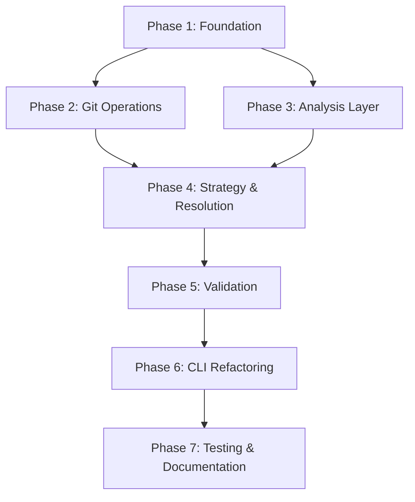

# EmailIntelligence CLI Modular Refactoring - Task Breakdown

## Project Overview
**Goal**: Refactor monolithic CLI (1,464 lines) into modular architecture following SOLID principles
**Duration**: 10 weeks
**Team**: 2-3 developers
**Priority**: High

---

## Phase 1: Foundation (Week 1-2)

### Task 1.1: Create Directory Structure
- **Assignee**: TBD
- **Priority**: Critical
- **Estimated**: 2 hours
- **Description**: Create new `src/` directory structure with all module folders
- **Acceptance Criteria**:
  - [ ] All directories created as per architecture plan
  - [ ] `__init__.py` files in all modules
  - [ ] README.md in each major module

### Task 1.2: Implement Core Interfaces
- **Assignee**: TBD
- **Priority**: Critical
- **Estimated**: 8 hours
- **Description**: Define abstract base classes for all major components
- **Files**: `src/core/interfaces.py`
- **Acceptance Criteria**:
  - [ ] `IConflictDetector` interface defined
  - [ ] `IConstitutionalAnalyzer` interface defined
  - [ ] `IStrategyGenerator` interface defined
  - [ ] `IConflictResolver` interface defined
  - [ ] `IValidator` interface defined
  - [ ] `IMetadataStore` interface defined
  - [ ] All interfaces documented with docstrings

### Task 1.3: Implement Data Models
- **Assignee**: TBD
- **Priority**: Critical
- **Estimated**: 6 hours
- **Description**: Create dataclasses for all domain models
- **Files**: `src/core/models.py`
- **Acceptance Criteria**:
  - [ ] `Conflict` model with validation
  - [ ] `ConflictBlock` model
  - [ ] `AnalysisResult` model
  - [ ] `ResolutionStrategy` model
  - [ ] `ValidationResult` model
  - [ ] All models have type hints
  - [ ] Unit tests for model validation

### Task 1.4: Implement Configuration Management
- **Assignee**: TBD
- **Priority**: High
- **Estimated**: 4 hours
- **Description**: Create configuration loading and validation
- **Files**: `src/core/config.py`
- **Acceptance Criteria**:
  - [ ] Load from YAML/JSON
  - [ ] Environment variable support
  - [ ] Default configuration
  - [ ] Configuration validation
  - [ ] Unit tests

### Task 1.5: Implement Custom Exceptions
- **Assignee**: TBD
- **Priority**: Medium
- **Estimated**: 2 hours
- **Description**: Define custom exception hierarchy
- **Files**: `src/core/exceptions.py`
- **Acceptance Criteria**:
  - [ ] `ConflictDetectionError`
  - [ ] `AnalysisError`
  - [ ] `StrategyGenerationError`
  - [ ] `ResolutionError`
  - [ ] `ValidationError`
  - [ ] All exceptions documented

### Task 1.6: Implement Metadata Storage
- **Assignee**: TBD
- **Priority**: High
- **Estimated**: 6 hours
- **Description**: Create metadata persistence layer
- **Files**: `src/storage/metadata.py`, `src/storage/file_handler.py`
- **Acceptance Criteria**:
  - [ ] JSON-based storage implementation
  - [ ] UTF-8 encoding for all file operations
  - [ ] Atomic writes
  - [ ] Metadata versioning
  - [ ] Unit tests with temp directories

### Task 1.7: Implement Logging Utilities
- **Assignee**: TBD
- **Priority**: Medium
- **Estimated**: 3 hours
- **Description**: Set up structured logging
- **Files**: `src/utils/logger.py`
- **Acceptance Criteria**:
  - [ ] Configurable log levels
  - [ ] File and console handlers
  - [ ] Structured logging (JSON format)
  - [ ] Performance logging decorators

### Task 1.8: Set Up Testing Framework
- **Assignee**: TBD
- **Priority**: Critical
- **Estimated**: 4 hours
- **Description**: Configure pytest and test infrastructure
- **Acceptance Criteria**:
  - [ ] pytest.ini configured
  - [ ] Test fixtures for common scenarios
  - [ ] Mock git repository fixture
  - [ ] Coverage reporting setup
  - [ ] CI/CD integration

---

## Phase 2: Git Operations (Week 3)

### Task 2.1: Implement WorktreeManager
- **Assignee**: TBD
- **Priority**: Critical
- **Estimated**: 8 hours
- **Description**: Extract worktree management from monolith
- **Files**: `src/git/worktree.py`
- **Acceptance Criteria**:
  - [ ] Create worktree pairs
  - [ ] Cleanup worktrees
  - [ ] Error handling for git failures
  - [ ] Unit tests
  - [ ] Integration tests with real git repo

### Task 2.2: Implement GitConflictDetector (Replace Mock)
- **Assignee**: TBD
- **Priority**: Critical
- **Estimated**: 12 hours
- **Description**: Real conflict detection using git merge-tree
- **Files**: `src/git/conflict_detector.py`
- **Acceptance Criteria**:
  - [ ] Parse conflict markers (`<<<<<<<`, `=======`, `>>>>>>>`)
  - [ ] Extract conflict blocks with line numbers
  - [ ] Assess conflict complexity
  - [ ] Determine auto-resolvability
  - [ ] No more hash-based mocks
  - [ ] Unit tests with sample conflicts
  - [ ] Integration tests

### Task 2.3: Implement GitMerger
- **Assignee**: TBD
- **Priority**: High
- **Estimated**: 8 hours
- **Description**: Git merge operations wrapper
- **Files**: `src/git/merger.py`
- **Acceptance Criteria**:
  - [ ] Perform merges
  - [ ] Detect merge conflicts
  - [ ] Abort merges
  - [ ] Unit tests

### Task 2.4: Implement Repository Operations
- **Assignee**: TBD
- **Priority**: Medium
- **Estimated**: 6 hours
- **Description**: Common git repository operations
- **Files**: `src/git/repository.py`
- **Acceptance Criteria**:
  - [ ] Branch operations
  - [ ] Commit operations
  - [ ] Status checking
  - [ ] Unit tests

---

## Phase 3: Analysis Layer (Week 4-5)

### Task 3.1: Implement AST Code Analyzer
- **Assignee**: TBD
- **Priority**: Critical
- **Estimated**: 16 hours
- **Description**: Python AST-based code analysis
- **Files**: `src/analysis/code/ast_analyzer.py`
- **Acceptance Criteria**:
  - [ ] Parse Python code to AST
  - [ ] Extract functions, classes, imports
  - [ ] Detect patterns (error handling, type hints, etc.)
  - [ ] Support for multiple languages (future)
  - [ ] Unit tests with code samples

### Task 3.2: Implement Requirement Checkers (Replace Mock)
- **Assignee**: TBD
- **Priority**: Critical
- **Estimated**: 20 hours
- **Description**: Real constitutional requirement checking
- **Files**: `src/analysis/constitutional/requirement_checker.py`
- **Acceptance Criteria**:
  - [ ] `ErrorHandlingChecker` - detect try/except
  - [ ] `TypeHintChecker` - detect type annotations
  - [ ] `DocstringChecker` - detect docstrings
  - [ ] `ComplexityChecker` - cyclomatic complexity
  - [ ] `SecurityChecker` - basic security patterns
  - [ ] Plugin architecture for custom checkers
  - [ ] No more hash-based compliance checks
  - [ ] Unit tests for each checker

### Task 3.3: Implement Constitutional Analyzer
- **Assignee**: TBD
- **Priority**: Critical
- **Estimated**: 12 hours
- **Description**: Orchestrate requirement checking
- **Files**: `src/analysis/constitutional/analyzer.py`
- **Acceptance Criteria**:
  - [ ] Load constitutions from YAML/JSON
  - [ ] Run all applicable checkers
  - [ ] Generate compliance scores
  - [ ] Identify critical issues
  - [ ] Generate recommendations
  - [ ] Unit tests
  - [ ] Integration tests

### Task 3.4: Implement Code Similarity Metrics
- **Assignee**: TBD
- **Priority**: High
- **Estimated**: 10 hours
- **Description**: Measure code similarity for alignment scoring
- **Files**: `src/analysis/code/similarity.py`
- **Acceptance Criteria**:
  - [ ] AST-based similarity
  - [ ] Token-based similarity
  - [ ] Semantic similarity
  - [ ] Unit tests

### Task 3.5: Implement Enhancement Detector (Replace Mock)
- **Assignee**: TBD
- **Priority**: High
- **Estimated**: 12 hours
- **Description**: Detect actual enhancements in branches
- **Files**: `src/analysis/enhancement/detector.py`, `src/analysis/enhancement/commit_analyzer.py`
- **Acceptance Criteria**:
  - [ ] Parse commit messages
  - [ ] Identify feature commits
  - [ ] Analyze code diffs
  - [ ] Calculate enhancement impact
  - [ ] No more hardcoded feature counts
  - [ ] Unit tests

### Task 3.6: Implement Code Complexity Analyzer
- **Assignee**: TBD
- **Priority**: Medium
- **Estimated**: 8 hours
- **Description**: Calculate code complexity metrics
- **Files**: `src/analysis/code/complexity.py`
- **Acceptance Criteria**:
  - [ ] Cyclomatic complexity
  - [ ] Cognitive complexity
  - [ ] Maintainability index
  - [ ] Unit tests

---

## Phase 4: Strategy & Resolution (Week 6-7)

### Task 4.1: Implement Strategy Selector (Replace Mock)
- **Assignee**: TBD
- **Priority**: Critical
- **Estimated**: 16 hours
- **Description**: Intelligent strategy selection based on conflict characteristics
- **Files**: `src/strategy/selector.py`
- **Acceptance Criteria**:
  - [ ] Classify conflict types
  - [ ] Assess file importance
  - [ ] Check test coverage
  - [ ] Select appropriate strategy
  - [ ] No more hash-based random selection
  - [ ] Unit tests for each conflict type
  - [ ] Integration tests

### Task 4.2: Implement Risk Assessor (Replace Mock)
- **Assignee**: TBD
- **Priority**: Critical
- **Estimated**: 14 hours
- **Description**: Real risk assessment for resolutions
- **Files**: `src/strategy/risk_assessor.py`
- **Acceptance Criteria**:
  - [ ] Detect breaking changes
  - [ ] Performance impact analysis
  - [ ] Test coverage delta
  - [ ] Dependency conflict checking
  - [ ] API compatibility verification
  - [ ] No more hardcoded "Medium" risk
  - [ ] Unit tests

### Task 4.3: Implement Strategy Generator
- **Assignee**: TBD
- **Priority**: High
- **Estimated**: 12 hours
- **Description**: Generate multi-phase resolution strategies
- **Files**: `src/strategy/generator.py`, `src/strategy/planner.py`
- **Acceptance Criteria**:
  - [ ] Generate phase-based strategies
  - [ ] Calculate time estimates
  - [ ] Plan enhancement preservation
  - [ ] Unit tests

### Task 4.4: Implement Auto Resolver (Replace Mock)
- **Assignee**: TBD
- **Priority**: Critical
- **Estimated**: 16 hours
- **Description**: Automatically resolve simple conflicts
- **Files**: `src/resolution/auto_resolver.py`
- **Acceptance Criteria**:
  - [ ] Resolve whitespace conflicts
  - [ ] Resolve import conflicts
  - [ ] Resolve simple line conflicts
  - [ ] No more simulated resolution
  - [ ] Unit tests with real conflicts
  - [ ] Integration tests

### Task 4.5: Implement Semantic Merger
- **Assignee**: TBD
- **Priority**: High
- **Estimated**: 20 hours
- **Description**: Semantic-aware merge strategies
- **Files**: `src/resolution/semantic_merger.py`
- **Acceptance Criteria**:
  - [ ] AST-based merging
  - [ ] Preserve semantics
  - [ ] Handle refactorings
  - [ ] Unit tests

### Task 4.6: Implement Resolution Executor
- **Assignee**: TBD
- **Priority**: Critical
- **Estimated**: 10 hours
- **Description**: Orchestrate resolution execution
- **Files**: `src/resolution/executor.py`
- **Acceptance Criteria**:
  - [ ] Execute resolution strategies
  - [ ] Run tests after resolution
  - [ ] Stage changes in git
  - [ ] Rollback on failure
  - [ ] Unit tests
  - [ ] Integration tests

### Task 4.7: Implement Interactive Resolver
- **Assignee**: TBD
- **Priority**: Medium
- **Estimated**: 12 hours
- **Description**: Interactive conflict resolution UI
- **Files**: `src/resolution/interactive.py`
- **Acceptance Criteria**:
  - [ ] Display conflict context
  - [ ] Accept user input
  - [ ] Preview resolution
  - [ ] Apply user choice
  - [ ] Unit tests

---

## Phase 5: Validation (Week 8)

### Task 5.1: Implement Test Runner (Replace Mock)
- **Assignee**: TBD
- **Priority**: Critical
- **Estimated**: 12 hours
- **Description**: Execute real test suites
- **Files**: `src/validation/test_runner.py`
- **Acceptance Criteria**:
  - [ ] pytest integration
  - [ ] unittest integration
  - [ ] Coverage measurement
  - [ ] Parse test results
  - [ ] No more hash-based pass/fail
  - [ ] Unit tests

### Task 5.2: Implement Security Scanner
- **Assignee**: TBD
- **Priority**: High
- **Estimated**: 8 hours
- **Description**: Integrate security scanning tools
- **Files**: `src/validation/security_scanner.py`
- **Acceptance Criteria**:
  - [ ] bandit integration
  - [ ] safety integration
  - [ ] Parse scan results
  - [ ] Unit tests

### Task 5.3: Implement Quality Checker
- **Assignee**: TBD
- **Priority**: High
- **Estimated**: 8 hours
- **Description**: Code quality validation
- **Files**: `src/validation/quality_checker.py`
- **Acceptance Criteria**:
  - [ ] pylint integration
  - [ ] flake8 integration
  - [ ] mypy integration
  - [ ] Parse results
  - [ ] Unit tests

### Task 5.4: Implement Validation Orchestrator
- **Assignee**: TBD
- **Priority**: High
- **Estimated**: 6 hours
- **Description**: Coordinate all validation checks
- **Files**: `src/validation/validator.py`
- **Acceptance Criteria**:
  - [ ] Run all validators
  - [ ] Aggregate results
  - [ ] Generate reports
  - [ ] Unit tests

---

## Phase 6: CLI Refactoring (Week 9)

### Task 6.1: Implement Command Handlers
- **Assignee**: TBD
- **Priority**: Critical
- **Estimated**: 12 hours
- **Description**: Refactor CLI commands to use new modules
- **Files**: `src/cli/commands.py`
- **Acceptance Criteria**:
  - [ ] `setup_resolution` command
  - [ ] `analyze_constitutional` command
  - [ ] `develop_strategy` command
  - [ ] `align_content` command
  - [ ] `validate_resolution` command
  - [ ] All commands use new modular architecture

### Task 6.2: Implement Argument Parsing
- **Assignee**: TBD
- **Priority**: High
- **Estimated**: 6 hours
- **Description**: Clean argument parsing layer
- **Files**: `src/cli/arguments.py`
- **Acceptance Criteria**:
  - [ ] All arguments defined
  - [ ] Validation
  - [ ] Help text
  - [ ] Unit tests

### Task 6.3: Implement Output Formatting
- **Assignee**: TBD
- **Priority**: Medium
- **Estimated**: 6 hours
- **Description**: Consistent output formatting
- **Files**: `src/cli/output.py`
- **Acceptance Criteria**:
  - [ ] JSON output
  - [ ] Table output
  - [ ] Progress indicators
  - [ ] Color support
  - [ ] Unit tests

### Task 6.4: Create New CLI Entry Point
- **Assignee**: TBD
- **Priority**: Critical
- **Estimated**: 4 hours
- **Description**: New `eai.py` entry point
- **Files**: `eai.py`
- **Acceptance Criteria**:
  - [ ] Wire up all commands
  - [ ] Dependency injection
  - [ ] Error handling
  - [ ] Integration tests

### Task 6.5: Implement Backward Compatibility
- **Assignee**: TBD
- **Priority**: High
- **Estimated**: 6 hours
- **Description**: Ensure old CLI still works
- **Acceptance Criteria**:
  - [ ] Old CLI calls new modules
  - [ ] Deprecation warnings
  - [ ] Migration guide
  - [ ] Integration tests

---

## Phase 7: Testing & Documentation (Week 10)

### Task 7.1: Achieve Test Coverage Goals
- **Assignee**: TBD
- **Priority**: Critical
- **Estimated**: 20 hours
- **Description**: Write tests to reach 80%+ coverage
- **Acceptance Criteria**:
  - [ ] Unit test coverage: 80%+
  - [ ] Integration test coverage: 60%+
  - [ ] All critical paths tested
  - [ ] Edge cases covered

### Task 7.2: Write Module Documentation
- **Assignee**: TBD
- **Priority**: High
- **Estimated**: 16 hours
- **Description**: Comprehensive documentation for all modules
- **Acceptance Criteria**:
  - [ ] API documentation for all public interfaces
  - [ ] Usage examples
  - [ ] Architecture diagrams
  - [ ] Sphinx documentation generated

### Task 7.3: Create Migration Guide
- **Assignee**: TBD
- **Priority**: High
- **Estimated**: 8 hours
- **Description**: Guide for migrating from old to new CLI
- **Acceptance Criteria**:
  - [ ] Step-by-step migration instructions
  - [ ] Breaking changes documented
  - [ ] Code examples
  - [ ] FAQ section

### Task 7.4: Performance Testing
- **Assignee**: TBD
- **Priority**: Medium
- **Estimated**: 12 hours
- **Description**: Benchmark and optimize performance
- **Acceptance Criteria**:
  - [ ] Benchmark suite
  - [ ] Performance comparison with old CLI
  - [ ] Optimization of bottlenecks
  - [ ] Performance documentation

### Task 7.5: Create Release Plan
- **Assignee**: TBD
- **Priority**: High
- **Estimated**: 4 hours
- **Description**: Plan for production release
- **Acceptance Criteria**:
  - [ ] Version numbering strategy
  - [ ] Release notes
  - [ ] Rollback plan
  - [ ] Communication plan

---

## Summary Statistics

- **Total Tasks**: 47
- **Total Estimated Hours**: 400-450 hours
- **Critical Priority**: 18 tasks
- **High Priority**: 17 tasks
- **Medium Priority**: 12 tasks

## Dependencies

## Risk Mitigation

- **Weekly progress reviews** to catch issues early
- **Incremental integration** to avoid big-bang failures
- **Feature flags** for gradual rollout
- **Comprehensive testing** at each phase
- **Backward compatibility** maintained throughout

---

## Next Actions

1. ✅ Review and approve task breakdown
2. ⏳ Assign tasks to team members
3. ⏳ Set up project tracking (GitHub Projects/Jira)
4. ⏳ Begin Phase 1 tasks
5. ⏳ Schedule weekly sync meetings
