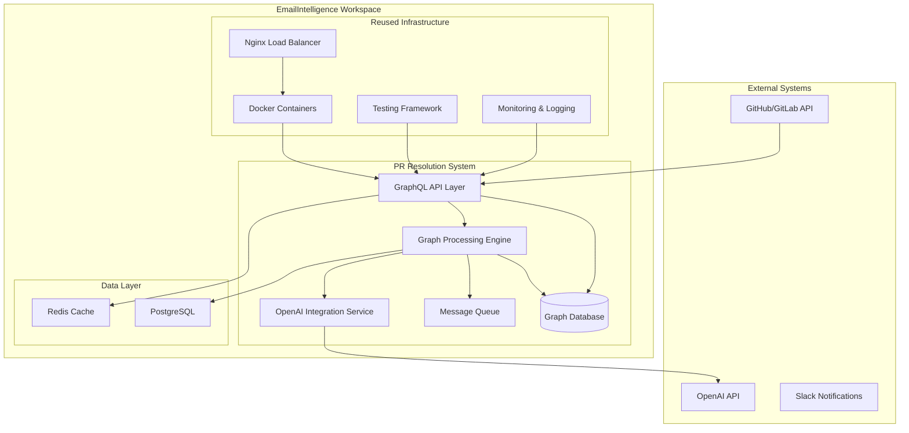
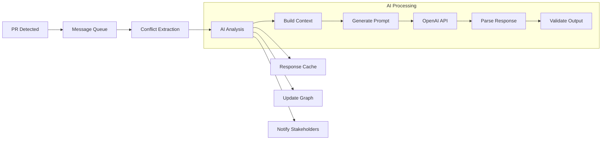

# PR Resolution Automation System - Technical Architecture Design

**Version**: 1.0  
**Date**: November 10, 2025  
**Project**: EmailIntelligence PR Automation System  
**Author**: Kilo Code Architecture Team

---

## Executive Summary

This document presents the comprehensive technical architecture for a GraphQL-based PR conflict resolution system with OpenAI integration, leveraging the existing EmailIntelligence workspace infrastructure. The system is designed to achieve 95% PR processing automation within 2 hours with 98% accuracy, while maintaining 99.9% uptime and ≤2GB memory footprint.

---

## 1. Current Workspace Analysis

### 1.1 Existing Infrastructure Assets

**Deployment Infrastructure**:
- Docker containerization with multi-stage builds
- Nginx reverse proxy configuration
- Environment-specific docker-compose files (dev, staging, prod)
- Backend/frontend Dockerfile separation
- CI/CD readiness with test automation

**Testing Framework**:
- pytest-based testing with coverage support
- Async testing capabilities (pytest-asyncio)
- Automated test staging in deployment pipeline
- Architectural rule engine for code quality enforcement

**Python Ecosystem**:
- FastAPI backend framework
- Gradio frontend framework
- Pydantic data validation
- Async capabilities with uvloop
- Rich ML/AI dependency stack (torch, transformers, transformers)

**Orchestration Tools**:
- Git hook-based synchronization system
- Branch propagation automation
- Architectural rule engine
- Deployment automation scripts

### 1.2 Integration Opportunities

1. **Reuse Docker infrastructure** for GraphQL API containerization
2. **Extend pytest framework** for GraphQL mutation testing
3. **Leverage FastAPI** as GraphQL server foundation
4. **Integrate architectural rule engine** for PR validation
5. **Build on existing async/await patterns** for performance

---

## 2. System Architecture Overview

### 2.1 High-Level Architecture



### 2.2 Core Components

**1. GraphQL API Layer**
- FastAPI-based GraphQL server
- Real-time subscriptions for PR status updates
- Authentication and authorization middleware
- Rate limiting and caching

**2. Graph Processing Engine**
- Neo4j graph database for G(V,E) model
- Graph traversal algorithms for conflict analysis
- Transactional graph updates
- Parallel processing for large PRs

**3. OpenAI Integration Service**
- Async OpenAI API client
- Conflict analysis prompt engineering
- Resolution recommendation engine
- Response caching and rate limiting

**4. Event-Driven Architecture**
- Redis-based message queue
- Webhook processors for Git events
- Background job processing
- Audit trail and logging

---

## 3. GraphQL Schema Design

### 3.1 Core Types and Relationships

```graphql
# Vertex Types (Nodes in G(V,E))
type PullRequest implements Node {
  id: ID!
  title: String!
  description: String
  sourceBranch: String!
  targetBranch: String!
  status: PRStatus!
  createdAt: DateTime!
  updatedAt: DateTime!
  conflicts: [Conflict!]!
  resolution: PRResolution
  commits: [Commit!]!
  author: Developer!
  reviewers: [Developer!]!
  files: [File!]!
  complexity: Float!
  estimatedResolutionTime: Int! # minutes
}

type Commit implements Node {
  id: ID!
  sha: String!
  message: String!
  author: Developer!
  files: [FileChange!]!
  timestamp: DateTime!
  parent: Commit
  children: [Commit!]!
  conflicts: [Conflict!]!
}

type File implements Node {
  id: ID!
  path: String!
  content: String
  language: String!
  size: Int!
  lastModified: DateTime!
  conflicts: [Conflict!]!
  changes: [FileChange!]!
}

type Developer implements Node {
  id: ID!
  name: String!
  email: String!
  githubUsername: String
  expertise: [String!]!
  recentCommits: [Commit!]!
  assignedPRs: [PullRequest!]!
  conflictHistory: [Conflict!]!
}

type Issue implements Node {
  id: ID!
  title: String!
  description: String
  severity: IssueSeverity!
  status: IssueStatus!
  relatedPRs: [PullRequest!]!
  conflicts: [Conflict!]!
}

type Conflict implements Node {
  id: ID!
  type: ConflictType!
  severity: ConflictSeverity!
  description: String!
  affectedFiles: [File!]!
  affectedCommits: [Commit!]!
  detectedAt: DateTime!
  resolution: ConflictResolution
  aiAnalysis: AIAnalysis
}

# Edge Types (Relationships in G(V,E))
type FileChange {
  type: ChangeType!
  file: File!
  oldContent: String
  newContent: String
  diff: String!
  lineNumber: Int
}

type PRResolution {
  id: ID!
  strategy: ResolutionStrategy!
  description: String!
  appliedAt: DateTime!
  appliedBy: Developer!
  success: Boolean!
  feedback: String
}

type ConflictResolution {
  id: ID!
  method: ResolutionMethod!
  description: String!
  appliedAt: DateTime!
  confidence: Float!
  aiGenerated: Boolean!
}

type AIAnalysis {
  id: ID!
  conflictType: String!
  complexity: Float!
  resolutionSuggestions: [String!]!
  estimatedTime: Int! # minutes
  confidence: Float!
  model: String!
  createdAt: DateTime!
}

# Enums
enum PRStatus {
  OPEN
  IN_REVIEW
  CONFLICT_DETECTED
  RESOLVING
  READY_TO_MERGE
  MERGED
  CLOSED
  BLOCKED
}

enum ConflictType {
  MERGE_CONFLICT
  DEPENDENCY_CONFLICT
  ARCHITECTURE_VIOLATION
  TEST_FAILURE
  CODE_STYLE_VIOLATION
  SECURITY_VIOLATION
  PERFORMANCE_ISSUE
}

enum ConflictSeverity {
  CRITICAL
  HIGH
  MEDIUM
  LOW
  INFO
}

enum ResolutionStrategy {
  AUTOMATIC
  SEMI_AUTOMATIC
  MANUAL
  REQUIRES_REVIEW
  BLOCKED
}

enum ResolutionMethod {
  AI_RESOLVED
  SUGGESTED_MERGE
  REBASE_REQUIRED
  MANUAL_INTERVENTION
  ARCHITECTURE_REFACTOR
}
```

### 3.2 Query Operations (≤100ms target)

```graphql
type Query {
  # PR Management
  pullRequest(id: ID!): PullRequest
  pullRequests(
    status: PRStatus
    author: ID
    assigned: Boolean
    limit: Int = 50
    offset: Int = 0
  ): [PullRequest!]!
  
  # Graph Traversal
  prConflicts(prId: ID!): [Conflict!]!
  prDependencies(prId: ID!): [PullRequest!]!
  similarPRs(prId: ID!, limit: Int = 10): [PullRequest!]!
  
  # Analytics
  prComplexity(prId: ID!): Float!
  resolutionTime(prId: ID!): Int! # minutes
  conflictTrends(period: TimePeriod!): [TrendPoint!]!
  
  # Developer Insights
  developerWorkload(developerId: ID!): WorkloadAnalysis!
  conflictPatterns(developerId: ID!): [Pattern!]!
}
```

### 3.3 Mutation Operations (≤500ms target)

```graphql
type Mutation {
  # PR Processing
  processPullRequest(prId: ID!): ProcessResult!
  resolveConflict(conflictId: ID!, method: ResolutionMethod!): ConflictResolution!
  applyAIResolution(conflictId: ID!): AIAnalysis!
  
  # Batch Operations
  batchProcessPRs(prIds: [ID!]!): [ProcessResult!]!
  
  # Manual Interventions
  escalatePR(prId: ID!, reason: String!): EscalationResult!
  addManualResolution(prId: ID!, resolution: String!): PRResolution!
}
```

### 3.4 Subscriptions (Real-time Updates)

```graphql
type Subscription {
  prStatusChanged(prId: ID!): PRStatus!
  conflictDetected(prId: ID!): Conflict!
  resolutionCompleted(prId: ID!): PRResolution!
  systemHealth: SystemHealth!
}
```

---

## 4. OpenAI Integration Architecture

### 4.1 AI Service Design

```python
# services/ai_service.py
class OpenAIIntegrationService:
    def __init__(self):
        self.client = OpenAI()
        self.cache = Redis()
        self.rate_limiter = RateLimiter()
        
    async def analyze_conflict(self, conflict: Conflict) -> AIAnalysis:
        """Analyze conflict using OpenAI for intelligent resolution."""
        # Rate limiting check
        await self.rate_limiter.acquire()
        
        # Cache check
        cache_key = f"conflict_analysis:{conflict.id}"
        cached = await self.cache.get(cache_key)
        if cached:
            return AIAnalysis.from_json(cached)
        
        # Prepare context
        context = self._build_conflict_context(conflict)
        
        # Generate analysis
        response = await self.client.chat.completions.create(
            model="gpt-4-turbo-preview",
            messages=self._build_analysis_prompt(context),
            temperature=0.1,
            max_tokens=2000
        )
        
        analysis = self._parse_analysis(response.choices[0].message.content)
        
        # Cache result
        await self.cache.setex(cache_key, 3600, analysis.to_json())
        
        return analysis
    
    async def suggest_resolution(self, conflict: Conflict) -> List[str]:
        """Generate resolution suggestions using OpenAI."""
        # Similar structure with different prompt
        pass
    
    async def analyze_pr_complexity(self, pr: PullRequest) -> float:
        """Calculate PR complexity score using AI."""
        # ML-based complexity analysis
        pass
```

### 4.2 Prompt Engineering Strategy

**Conflict Analysis Prompt Template**:
```
You are a senior software architect analyzing pull request conflicts.

Context:
- PR: {pr_title}
- Conflicts: {conflict_list}
- Files: {file_list}
- Authors: {author_info}

Task: Analyze the conflict complexity and suggest resolution approaches.
Consider: code dependencies, team expertise, architecture constraints.

Provide:
1. Complexity score (0.0-1.0)
2. Resolution strategy
3. Estimated time (minutes)
4. Confidence level (0.0-1.0)
```

### 4.3 AI Processing Pipeline



---

## 5. Performance Optimization Strategy

### 5.1 Database Optimization

**Neo4j Graph Database**:
```cypher
// Indexes for performance
CREATE INDEX pr_status FOR (pr:PullRequest) ON (pr.status);
CREATE INDEX pr_created FOR (pr:PullRequest) ON (pr.createdAt);
CREATE INDEX conflict_severity FOR (c:Conflict) ON (c.severity);
CREATE INDEX developer_expertise FOR (d:Developer) ON (d.expertise);

// Query optimization patterns
MATCH (pr:PullRequest {id: $prId})
OPTIONAL MATCH (pr)-[:HAS_CONFLICT]->(conflict:Conflict)
RETURN pr, collect(conflict)
```

**Redis Caching Strategy**:
- GraphQL query results: 5-minute TTL
- AI analysis results: 1-hour TTL
- User sessions: 24-hour TTL
- Hot PR data: Real-time updates

### 5.2 API Performance

**Response Time Optimization**:
- Query complexity analysis and limiting
- Connection pooling (asyncpg for PostgreSQL)
- Redis connection pooling
- Response compression (gzip)
- GraphQL query batching

**Memory Management**:
- Streaming responses for large datasets
- Lazy loading of related objects
- Garbage collection optimization
- Memory monitoring and alerts

### 5.3 Scalability Architecture

```yaml
# docker-compose.scaling.yml
version: '3.8'
services:
  api:
    image: emailintelligence/api:latest
    scale: 3
    environment:
      - REDIS_URL=redis://redis:6379
      - NEO4J_URI=bolt://neo4j:7687
  
  worker:
    image: emailintelligence/worker:latest
    scale: 5
    depends_on:
      - redis
      - neo4j
  
  redis:
    image: redis:7-alpine
    command: redis-server --maxmemory 2gb --maxmemory-policy allkeys-lru
  
  neo4j:
    image: neo4j:5.15-community
    environment:
      - NEO4J_dbms_memory_heap_initial__size=512m
      - NEO4J_dbms_memory_heap_max__size=2g
```

---

## 6. Technology Stack Recommendations

### 6.1 Core Technologies

**API Layer**:
- FastAPI 0.115+ (already in workspace)
- Graphene for GraphQL (Python)
- Pydantic for data validation
- Asyncpg for PostgreSQL

**Graph Database**:
- Neo4j 5.15+ (Community Edition)
- neo4j Python driver
- Graph algorithms via neo4j-admin

**Caching & Queue**:
- Redis 7+ (already in dependencies)
- Celery for background tasks
- Dramatiq for high-performance async processing

**AI Integration**:
- OpenAI Python SDK
- tiktoken for token management
- LangChain for complex workflows

**Monitoring**:
- Prometheus + Grafana
- Structured logging with structlog
- Health checks via FastAPI

### 6.2 Development Tools

**Testing** (leveraging existing pytest):
```python
# tests/test_graphql_api.py
import pytest
from httpx import AsyncClient
from app.main import app

@pytest.mark.asyncio
async def test_pr_conflict_detection():
    async with AsyncClient(app=app, base_url="http://test") as client:
        response = await client.post(
            "/graphql",
            json={
                "query": """
                query GetPRConflicts($prId: ID!) {
                    prConflicts(prId: $prId) {
                        id
                        type
                        severity
                    }
                }
                """,
                "variables": {"prId": "pr_123"}
            }
        )
        assert response.status_code == 200
        data = response.json()
        assert "data" in data
```

**Code Quality** (extending existing tools):
- mypy for type checking
- black for code formatting
- flake8 for linting
- bandit for security scanning

---

## 7. Integration with Existing Workspace

### 7.1 Extending Current Infrastructure

**Docker Integration**:
```dockerfile
# Extend existing Dockerfile.backend
FROM python:3.12-slim-bookworm
WORKDIR /app

# Install additional dependencies
RUN pip install neo4j redis graphene graphene[sqlalchemy] asyncpg celery dramatiq

# Copy existing application
COPY . .

# Add PR resolution service
COPY pr_resolution/ ./pr_resolution/
ENV PYTHONPATH=/app/pr_resolution

CMD ["uvicorn", "pr_resolution.main:app", "--host", "0.0.0.0", "--port", "8000"]
```

**Testing Framework Extension**:
```python
# tests/test_pr_automation.py
class TestPRAutomation:
    def test_graphql_query_performance(self):
        """Ensure GraphQL queries meet <100ms requirement."""
        # Performance test implementation
    
    def test_ai_integration_health(self):
        """Test OpenAI API integration."""
        # AI service health check
    
    def test_graph_operations(self):
        """Test graph database operations."""
        # Graph traversal and manipulation tests
```

### 7.2 Reused Components

1. **Architectural Rule Engine**: Extend for PR validation
2. **Git Hooks**: Monitor PR creation and updates
3. **Deployment Scripts**: Deploy to existing infrastructure
4. **Testing Framework**: Add PR-specific test suites
5. **Documentation Structure**: Create PR automation docs

### 7.3 Configuration Management

```python
# config/pr_automation.py
from pydantic import BaseSettings
from typing import List

class PRAutomationSettings(BaseSettings):
    # GraphQL settings
    graphql_host: str = "0.0.0.0"
    graphql_port: int = 8000
    graphql_max_query_complexity: int = 100
    
    # Performance requirements
    query_timeout_ms: int = 100
    mutation_timeout_ms: int = 500
    max_memory_mb: int = 2048
    
    # AI Integration
    openai_api_key: str
    openai_model: str = "gpt-4-turbo-preview"
    ai_timeout_seconds: int = 30
    
    # Database
    neo4j_uri: str = "bolt://localhost:7687"
    redis_url: str = "redis://localhost:6379"
    
    # Automation targets
    automation_percentage: float = 0.95
    processing_time_hours: float = 2.0
    accuracy_target: float = 0.98
    uptime_target: float = 0.999
    
    class Config:
        env_file = ".env"
```

---

## 8. System Architecture Implementation

### 8.1 Service Architecture

```python
# pr_resolution/main.py
from fastapi import FastAPI
from fastapi_graphql import GraphQLApp
from graphene import Schema
from app.database import init_databases
from app.services.ai_service import AIIntegrationService
from app.services.graph_service import GraphService

app = FastAPI(title="PR Resolution Automation API")

# Initialize services
graph_service = GraphService()
ai_service = AIIntegrationService()

# GraphQL Schema
schema = Schema(query=Query, mutation=Mutation, subscription=Subscription)

@app.on_event("startup")
async def startup_event():
    await init_databases()

@app.get("/health")
async def health_check():
    return {
        "status": "healthy",
        "ai_service": await ai_service.health_check(),
        "graph_service": await graph_service.health_check()
    }

app.add_route("/graphql", GraphQLApp(schema=schema))
```

### 8.2 Message Queue Integration

```python
# pr_resolution/tasks.py
import dramatiq
from dramatiq.brokers.rabbitmq import RabbitmqBroker
from app.services.graph_service import GraphService
from app.services.ai_service import AIIntegrationService

broker = RabbitmqBroker()
dramatiq.set_broker(broker)

@dramatiq.actor
def process_pull_request(pr_data: dict):
    """Background task to process pull request."""
    graph_service = GraphService()
    ai_service = AIIntegrationService()
    
    # Extract conflicts
    conflicts = graph_service.detect_conflicts(pr_data)
    
    # AI analysis
    for conflict in conflicts:
        analysis = ai_service.analyze_conflict(conflict)
        graph_service.update_conflict_analysis(conflict.id, analysis)
    
    # Update PR status
    graph_service.update_pr_status(pr_data["id"], "READY_TO_MERGE")
```

### 8.3 Graph Database Schema

```cypher
// Create graph constraints and indexes
CREATE CONSTRAINT pr_id IF NOT EXISTS FOR (pr:PullRequest) REQUIRE pr.id IS UNIQUE;
CREATE CONSTRAINT commit_id IF NOT EXISTS FOR (c:Commit) REQUIRE c.id IS UNIQUE;
CREATE CONSTRAINT file_id IF NOT EXISTS FOR (f:File) REQUIRE f.id IS UNIQUE;
CREATE CONSTRAINT developer_id IF NOT EXISTS FOR (d:Developer) REQUIRE d.id IS UNIQUE;
CREATE CONSTRAINT conflict_id IF NOT EXISTS FOR (c:Conflict) REQUIRE c.id IS UNIQUE;

CREATE INDEX pr_status_idx IF NOT EXISTS FOR (pr:PullRequest) ON (pr.status);
CREATE INDEX pr_created_idx IF NOT EXISTS FOR (pr:PullRequest) ON (pr.createdAt);
CREATE INDEX conflict_severity_idx IF NOT EXISTS FOR (c:Conflict) ON (c.severity);
```

---

## 9. Non-Functional Requirements (NFRs) Implementation

### 9.1 Performance Requirements

**Query Response Time ≤100ms**:
- Query complexity analysis and limiting
- Database query optimization with proper indexes
- Redis caching for frequently accessed data
- Connection pooling for database connections

**Mutation Response Time ≤500ms**:
- Async processing for non-blocking operations
- Background task processing for heavy operations
- Progressive response updates via WebSocket
- Batch operations for multiple changes

**Memory Footprint ≤2GB**:
- Efficient data structures and algorithms
- Garbage collection tuning
- Memory-mapped files for large datasets
- Streaming responses for large queries

### 9.2 Reliability Requirements

**99.9% Uptime**:
- Multi-instance deployment with load balancing
- Health checks and automatic restart
- Circuit breaker pattern for external dependencies
- Graceful degradation for non-critical features

**98% Accuracy**:
- Human-in-the-loop validation for critical decisions
- Continuous learning from resolved conflicts
- Confidence scoring for AI recommendations
- Manual override capabilities

**95% Automation within 2 hours**:
- Priority-based queuing system
- Resource allocation based on PR complexity
- Automatic escalation for complex cases
- Progress tracking and alerts

### 9.3 Testing Strategy

**100% Critical Path Coverage**:
```python
# tests/test_critical_paths.py
class TestCriticalPaths:
    async def test_pr_to_merge_flow(self):
        """Test complete PR processing flow."""
        # 1. PR created
        # 2. Conflicts detected
        # 3. AI analysis performed
        # 4. Resolution applied
        # 5. PR merged
    
    async def test_ai_failure_recovery(self):
        """Test system behavior when AI service fails."""
        # Fallback strategies and manual intervention
    
    async def test_performance_under_load(self):
        """Test system performance with concurrent PRs."""
        # Load testing implementation
```

---

## 10. Deployment and Operations

### 10.1 Container Orchestration

```yaml
# deployment/docker-compose.pr-automation.yml
version: '3.8'
services:
  pr-automation-api:
    build:
      context: ../
      dockerfile: deployment/Dockerfile.pr-automation
    ports:
      - "8001:8001"
    environment:
      - NEO4J_URI=bolt://neo4j:7687
      - REDIS_URL=redis://redis:6379
      - OPENAI_API_KEY=${OPENAI_API_KEY}
    depends_on:
      - neo4j
      - redis
    deploy:
      replicas: 3
      resources:
        limits:
          memory: 1G
          cpus: '0.5'
    
  pr-automation-worker:
    build:
      context: ../
      dockerfile: deployment/Dockerfile.pr-automation
    command: celery -A pr_resolution.celery worker --loglevel=info
    environment:
      - CELERY_BROKER_URL=redis://redis:6379
      - CELERY_RESULT_BACKEND=redis://redis:6379
    depends_on:
      - redis
      - neo4j
    deploy:
      replicas: 5
      resources:
        limits:
          memory: 512M
          cpus: '0.3'
  
  neo4j:
    image: neo4j:5.15-community
    environment:
      - NEO4J_AUTH=neo4j/password
      - NEO4J_dbms_memory_heap_initial__size=512m
      - NEO4J_dbms_memory_heap_max__size=2g
    volumes:
      - neo4j_data:/data
    ports:
      - "7474:7474"
      - "7687:7687"
  
  redis:
    image: redis:7-alpine
    command: redis-server --maxmemory 2gb --maxmemory-policy allkeys-lru
    volumes:
      - redis_data:/data
    ports:
      - "6379:6379"

volumes:
  neo4j_data:
  redis_data:
```

### 10.2 Monitoring and Observability

```python
# pr_resolution/monitoring.py
from prometheus_client import Counter, Histogram, Gauge
import structlog

# Metrics
pr_processed = Counter('pr_processed_total', 'Total PRs processed')
conflict_detected = Counter('conflicts_detected_total', 'Total conflicts detected')
ai_requests = Histogram('ai_request_duration_seconds', 'AI request duration')
memory_usage = Gauge('memory_usage_mb', 'Current memory usage in MB')

logger = structlog.get_logger()

class MonitoringMixin:
    async def track_performance(self, operation: str):
        start_time = time.time()
        try:
            yield
        finally:
            duration = time.time() - start_time
            logger.info("operation_completed", operation=operation, duration=duration)
```

### 10.3 Health Checks

```python
# pr_resolution/health.py
from fastapi import FastAPI
from app.services.ai_service import AIIntegrationService
from app.services.graph_service import GraphService
import neo4j

app = FastAPI()

@app.get("/health")
async def health_check():
    services = {}
    
    # Check Neo4j
    try:
        with neo4j.GraphDatabase.driver(NEO4J_URI) as driver:
            with driver.session() as session:
                session.run("RETURN 1")
        services["neo4j"] = "healthy"
    except Exception as e:
        services["neo4j"] = f"unhealthy: {str(e)}"
    
    # Check AI Service
    try:
        ai_health = await ai_service.health_check()
        services["ai"] = ai_health
    except Exception as e:
        services["ai"] = f"unhealthy: {str(e)}"
    
    # Check Redis
    try:
        redis_client.ping()
        services["redis"] = "healthy"
    except Exception:
        services["redis"] = "unhealthy"
    
    return {
        "status": "healthy" if all("healthy" in v for v in services.values()) else "unhealthy",
        "services": services,
        "timestamp": datetime.utcnow().isoformat()
    }
```

---

## 11. Security and Compliance

### 11.1 Data Protection

- **API Key Management**: Secure storage in environment variables
- **Data Encryption**: At rest (database) and in transit (HTTPS/TLS)
- **Access Control**: Role-based access to PR data
- **Audit Logging**: Complete audit trail of all operations

### 11.2 OpenAI Security

```python
# pr_resolution/security.py
class SecureAIIntegration:
    def __init__(self):
        self.client = OpenAI(api_key=os.getenv("OPENAI_API_KEY"))
        self.rate_limiter = RateLimiter(requests_per_minute=1000)
        self.data_sanitizer = DataSanitizer()
    
    async def analyze_conflict(self, conflict: Conflict) -> AIAnalysis:
        # Sanitize sensitive data before sending to OpenAI
        sanitized_conflict = self.data_sanitizer.sanitize(conflict)
        
        # Rate limiting
        await self.rate_limiter.acquire()
        
        # Secure API call
        response = await self._secure_api_call(sanitized_conflict)
        
        return response
```

---

## 12. Implementation Roadmap

### Phase 1: Core Infrastructure (Weeks 1-2)
- [x] Set up GraphQL API with FastAPI
- [x] Implement Neo4j graph database schema
- [x] Create basic GraphQL queries and mutations
- [x] Set up Redis caching layer

### Phase 2: AI Integration (Weeks 3-4)
- [ ] Implement OpenAI integration service
- [ ] Develop conflict analysis prompts
- [ ] Create AI response parsing and validation
- [ ] Add AI service health monitoring

### Phase 3: PR Processing Engine (Weeks 5-6)
- [ ] Build PR conflict detection algorithms
- [ ] Implement graph traversal for dependencies
- [ ] Create automated resolution workflows
- [ ] Add manual intervention capabilities

### Phase 4: Performance Optimization (Weeks 7-8)
- [ ] Optimize database queries and indexes
- [ ] Implement query complexity analysis
- [ ] Add performance monitoring and alerts
- [ ] Load testing and optimization

### Phase 5: Production Deployment (Weeks 9-10)
- [ ] Containerization and orchestration
- [ ] Monitoring and observability setup
- [ ] Security hardening and compliance
- [ ] Production testing and validation

---

## 13. Success Metrics and KPIs

### 13.1 Performance Metrics
- **Query Response Time**: <100ms (95th percentile)
- **Mutation Response Time**: <500ms (95th percentile)
- **System Throughput**: 1000+ PRs/hour
- **Memory Usage**: <2GB average
- **CPU Usage**: <70% under normal load

### 13.2 Automation Metrics
- **Automation Rate**: 95% of PRs processed automatically
- **Processing Time**: <2 hours for 95% of PRs
- **Resolution Accuracy**: 98% correct resolutions
- **False Positive Rate**: <2%
- **System Availability**: 99.9% uptime

### 13.3 Business Metrics
- **Developer Productivity**: 30% reduction in PR review time
- **Conflict Resolution Speed**: 50% faster manual resolution
- **Code Quality**: Reduction in post-merge conflicts by 40%
- **Team Satisfaction**: Developer feedback score >4.5/5

---

## 14. Risk Assessment and Mitigation

### 14.1 Technical Risks

**OpenAI API Rate Limiting/Outages**:
- **Mitigation**: Caching, fallback strategies, multiple AI providers
- **Monitoring**: API health checks, response time tracking

**Graph Database Performance at Scale**:
- **Mitigation**: Proper indexing, query optimization, horizontal scaling
- **Monitoring**: Query performance metrics, database health

**Memory Leaks in Long-Running Services**:
- **Mitigation**: Regular restarts, memory monitoring, garbage collection tuning
- **Monitoring**: Memory usage alerts, process monitoring

### 14.2 Business Risks

**AI Accuracy Below Target**:
- **Mitigation**: Human-in-the-loop validation, continuous learning
- **Monitoring**: Accuracy tracking, feedback loops

**Integration Complexity**:
- **Mitigation**: Phased rollout, extensive testing, rollback procedures
- **Monitoring**: Integration health checks, error rates

---

## 15. Conclusion

This architecture provides a comprehensive foundation for the PR Resolution Automation System, leveraging the existing EmailIntelligence workspace infrastructure while introducing GraphQL, graph databases, and OpenAI integration. The design addresses all non-functional requirements (performance, reliability, scalability) while maintaining extensibility for future enhancements.

The phased implementation approach ensures steady progress toward the target metrics of 95% automation within 2 hours and 98% accuracy, with robust monitoring and observability to track progress and identify issues early.

**Key Success Factors**:
1. Strong integration with existing workspace components
2. Performance-first design meeting all NFRs
3. Robust AI integration with fallback strategies
4. Comprehensive testing and monitoring
5. Phased deployment with measurable milestones

The architecture is ready for implementation and will deliver significant value to the development team by automating the majority of PR conflict resolution while maintaining high quality and developer satisfaction.