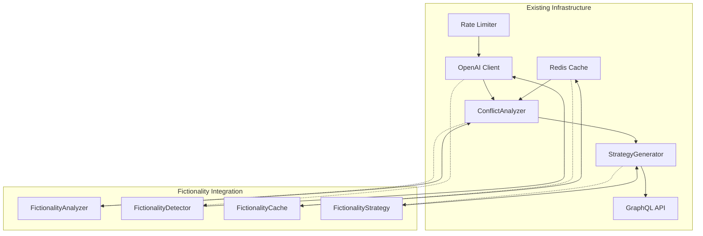

# Fictionality Detection Integration Design for EmailIntelligence

## Executive Summary

This document outlines a comprehensive plan to integrate fictionality detection capabilities into the existing EmailIntelligence PR resolution automation system. The integration leverages the sophisticated OpenAI infrastructure, GraphQL API patterns, and conflict resolution strategies already in place.

## Table of Contents

1. [System Overview](#system-overview)
2. [Architecture Integration](#architecture-integration)
3. [Data Model Extensions](#data-model-extensions)
4. [GraphQL Schema Extensions](#graphql-schema-extensions)
5. [Fictionality Detection Service](#fictionality-detection-service)
6. [Strategy Generation Integration](#strategy-generation-integration)
7. [Performance and Caching](#performance-and-caching)
8. [Testing Strategy](#testing-strategy)
9. [Implementation Roadmap](#implementation-roadmap)
10. [Code Examples](#code-examples)

## System Overview

### Current Architecture Strengths

The existing EmailIntelligence system provides a robust foundation:

- **Sophisticated OpenAI Integration**: Rate limiting (3 RPM), caching (1hr TTL), circuit breakers
- **AI Analysis Pipeline**: ConflictAnalyzer with background processing
- **Strategy Generation**: Multi-approach strategy generator with confidence scoring
- **GraphQL API**: Comprehensive schema with AI analysis types
- **Graph Database**: Neo4j with relationship modeling
- **Caching Layer**: Redis-based caching with connection pooling

### Fictionality Detection Integration Goals

1. **Seamless Integration**: Extend existing AI analysis patterns
2. **Confidence-Based Filtering**: Enhance current 0.6+ threshold system
3. **Multi-Strategy Support**: Fictionality-aware resolution approaches
4. **Performance Optimization**: Leverage existing caching and rate limiting
5. **Production Ready**: Full monitoring, health checks, and error handling

## Architecture Integration

### Integration Points



### Key Integration Patterns

1. **Extend ConflictAnalyzer**: Add fictionality analysis methods
2. **Enhance StrategyGenerator**: Include fictionality in strategy ranking
3. **Extend GraphQL Schema**: Add fictionality types and queries
4. **Data Model Updates**: Add fictionality properties to existing entities

## Data Model Extensions

### Fictionality Analysis Entity

```python
from pydantic import BaseModel, Field
from datetime import datetime
from typing import List, Optional
from enum import Enum

class FictionalityScore(str, Enum):
    HIGHLY_FICTIONAL = "HIGHLY_FICTIONAL"
    PROBABLY_FICTIONAL = "PROBABLY_FICTIONAL"
    UNCERTAIN = "UNCERTAIN"
    PROBABLY_REAL = "PROBABLY_REAL"
    HIGHLY_REAL = "HIGHLY_REAL"

class FictionalityAnalysis(BaseModel):
    """Fictionality analysis model"""
    id: str = Field(..., description="Analysis ID")
    conflict_id: str = Field(..., description="Associated conflict ID")
    pr_id: str = Field(..., description="Associated PR ID")
    
    # Core fictionality metrics
    fictionality_score: float = Field(..., description="Fictionality score (0.0-1.0)")
    confidence_level: FictionalityScore = Field(..., description="Confidence categorization")
   真实性: FictionalityScore
    
    # Analysis details
    text_content: str = Field(..., description="Content analyzed for fictionality")
    analysis_features: Dict[str, float] = Field(default_factory=dict, description="Analysis features")
    fictionality_indicators: List[str] = Field(default_factory=list, description="Fictionality indicators found")
    realism_indicators: List[str] = Field(default_factory=list, description="Realism indicators found")
    
    # Metadata
    model: str = Field(..., description="AI model used for analysis")
    processing_time: float = Field(..., description="Processing time in seconds")
    tokens_used: int = Field(..., description="Tokens consumed")
    created_at: datetime = Field(default_factory=datetime.utcnow)
    
    # Integration with existing systems
    resolution_impact: Optional[str] = Field(None, description="Impact on resolution strategy")
    strategy_adjustments: List[str] = Field(default_factory=list, description="Suggested strategy adjustments")
```

### Graph Model Extensions

```python
# Extend existing Conflict model
class ConflictWithFictionality(Conflict):
    """Enhanced Conflict model with fictionality"""
    fictionality_analysis_id: Optional[str] = Field(None, description="Fictionality analysis ID")
    fictionality_score: Optional[float] = Field(None, description="Cached fictionality score")
    fictionality_indicators: List[str] = Field(default_factory=list, description="Fictionality indicators")
    
    # Relationships
    fictionality_analysis: Optional[FictionalityAnalysis] = Field(None, description="Related fictionality analysis")

# Extend PullRequest model
class PullRequestWithFictionality(PullRequest):
    """Enhanced PR model with fictionality metrics"""
    fictionality_metrics: Dict[str, float] = Field(default_factory=dict, description="Fictionality metrics")
    fictionality_flags: List[str] = Field(default_factory=list, description="Fictionality flags")
    
    # Fictionality relationships
    fictionality_analyses: List[str] = Field(default_factory=list, description="Related fictionality analyses")
```

## GraphQL Schema Extensions

### Fictionality Types

```graphql
# Fictionality Enums
enum FictionalityScore {
  HIGHLY_FICTIONAL
  PROBABLY_FICTIONAL
  UNCERTAIN
  PROBABLY_REAL
  HIGHLY_REAL
}

# Fictionality Analysis Type
type FictionalityAnalysisType {
  id: ID!
  conflictId: String!
  prId: String!
  fictionalityScore: Float!
  confidenceLevel: FictionalityScore!
  textContent: String!
  analysisFeatures: JSONString
  fictionalityIndicators: [String!]!
  realismIndicators: [String!]!
  model: String!
  processingTime: Float!
  tokensUsed: Int!
  createdAt: DateTime!
  resolutionImpact: String
  strategyAdjustments: [String!]!
}

# Fictionality Metrics Type
type FictionalityMetricsType {
  overallFictionalityScore: Float!
  highFictionalityConflicts: Int!
  uncertainFictionalityConflicts: Int!
  lowFictionalityConflicts: Int!
  averageProcessingTime: Float!
  fictionalityDistribution: JSONString
}

# Fictionality Analysis Summary
type FictionalitySummaryType {
  totalAnalyses: Int!
  highFictionalityCount: Int!
  uncertainCount: Int!
  lowFictionalityCount: Int!
  averageScore: Float!
  recentAnalyses: [FictionalityAnalysisType!]!
  trends: [TrendPointType!]!
}
```

### Extended Query Types

```graphql
extend type Query {
  # Fictionality Analysis Queries
  fictionalityAnalysis(id: ID!): FictionalityAnalysisType
  fictionalityAnalyses(
    conflictId: String,
    prId: String,
    minScore: Float,
    maxScore: Float,
    confidence: FictionalityScore,
    limit: Int = 50,
    offset: Int = 0
  ): [FictionalityAnalysisType!]!
  
  # Fictionality Analytics
  fictionalityMetrics(prId: String, period: String = "7d"): FictionalityMetricsType
  fictionalitySummary(prId: String): FictionalitySummaryType
  fictionalityTrends(period: String = "30d"): [TrendPointType!]!
  
  # Fictionality Health
  fictionalityHealthReport: AIHealthReportType
}

extend type Mutation {
  # Fictionality Processing
  analyzeFictionality(
    prId: String!,
    conflictId: String!,
    content: String!,
    analysisOptions: JSONString
  ): FictionalityAnalysisType!
  
  # Batch Fictionality Analysis
  batchAnalyzeFictionality(
    requests: [FictionalityAnalysisRequest!]!
  ): [FictionalityAnalysisType!]!
  
  # Fictionality Configuration
  updateFictionalitySettings(
    sensitivity: Float,
    cacheTtl: Int,
    customPrompts: JSONString
  ): Boolean!
  
  # Fictionality Cache Management
  clearFictionalityCache(pattern: String): Int!
  prefetchFictionalityAnalysis(prId: String!): Boolean!
}
```

### Input Types

```graphql
input FictionalityAnalysisRequest {
  prId: String!
  conflictId: String!
  content: String!
  analysisType: String = "comprehensive"
  priority: String = "normal"
}

input FictionalityAnalysisOptions {
  includeFeatures: Boolean = true
  includeIndicators: Boolean = true
  includeStrategies: Boolean = true
  customThreshold: Float
  analysisDepth: String = "standard"  # quick, standard, deep
}
```

## Fictionality Detection Service

### Core Service Architecture

```python
"""
Fictionality Detection Service Implementation
"""

import asyncio
import json
import structlog
import time
from typing import Dict, List, Any, Optional
from datetime import datetime
from dataclasses import dataclass

from .interfaces import AIClient
from ..ai.client import get_openai_client
from ..utils.caching import cache_manager
from ..config.settings import settings
from ..models.graph_entities import FictionalityAnalysis, FictionalityScore

logger = structlog.get_logger()

@dataclass
class FictionalityAnalysisContext:
    """Context for fictionality analysis"""
    pr_data: Dict[str, Any]
    conflict_data: Dict[str, Any]
    content_to_analyze: str
    analysis_depth: str = "standard"
    include_strategies: bool = True
    custom_threshold: Optional[float] = None

class FictionalityAnalyzer:
    """
    Fictionality Detection Service
    
    Integrates with existing OpenAI infrastructure to provide
    comprehensive fictionality analysis for conflicts and PRs.
    """
    
    def __init__(self):
        self.client: Optional[AIClient] = None
        self.analysis_stats = {
            "analyses_completed": 0,
            "total_processing_time": 0.0,
            "average_confidence": 0.0,
            "cache_hit_rate": 0.0
        }
        self.default_threshold = 0.6
        self.fictionality_cache_ttl = 3600  # 1 hour
    
    async def initialize(self) -> bool:
        """Initialize the fictionality analyzer"""
        try:
            self.client = await get_openai_client()
            logger.info("Fictionality analyzer initialized")
            return True
        except Exception as e:
            logger.error("Failed to initialize fictionality analyzer", error=str(e))
            return False
    
    async def analyze_fictionality(
        self,
        context: FictionalityAnalysisContext,
        cache_key: Optional[str] = None
    ) -> FictionalityAnalysis:
        """
        Perform comprehensive fictionality analysis
        
        Args:
            context: Analysis context with PR, conflict, and content data
            cache_key: Optional cache key for request deduplication
        
        Returns:
            FictionalityAnalysis: Complete fictionality analysis results
        """
        
        start_time = time.time()
        
        try:
            # Check cache first
            if cache_key:
                cached_result = await self._get_cached_analysis(cache_key)
                if cached_result:
                    logger.debug("Returning cached fictionality analysis", cache_key=cache_key)
                    return cached_result
            
            if not self.client:
                raise Exception("Fictionality analyzer not initialized")
            
            # Generate analysis prompt
            messages = self._create_fictionality_prompt(context)
            
            # Make AI request with existing rate limiting and circuit breaker
            response = await self.client.chat_completion(
                messages=messages,
                temperature=0.1,  # Low temperature for consistent analysis
                max_tokens=1500,
                model="gpt-4"  # Use the most capable model for fictionality detection
            )
            
            # Parse AI response
            analysis_data = self._parse_fictionality_response(response)
            
            # Create FictionalityAnalysis object
            fictionality_analysis = FictionalityAnalysis(
                id=f"fictionality_{int(time.time())}_{hash(context.content_to_analyze) % 10000}",
                conflict_id=context.conflict_data.get("id"),
                pr_id=context.pr_data.get("id"),
                fictionality_score=analysis_data.get("fictionality_score", 0.0),
                confidence_level=self._categorize_confidence(analysis_data.get("fictionality_score", 0.0)),
                text_content=context.content_to_analyze,
                analysis_features=analysis_data.get("features", {}),
                fictionality_indicators=analysis_data.get("fictionality_indicators", []),
                realism_indicators=analysis_data.get("realism_indicators", []),
                model=response.get("model", "unknown"),
                processing_time=response.get("response_time", 0),
                tokens_used=response.get("usage", {}).get("total_tokens", 0),
                resolution_impact=self._assess_resolution_impact(analysis_data),
                strategy_adjustments=self._generate_strategy_adjustments(analysis_data)
            )
            
            # Cache the result
            if cache_key:
                await self._cache_analysis(cache_key, fictionality_analysis)
            
            # Update statistics
            self._update_stats(fictionality_analysis, time.time() - start_time)
            
            logger.info(
                "Fictionality analysis completed",
                pr_id=context.pr_data.get("id"),
                conflict_id=context.conflict_data.get("id"),
                fictionality_score=fictionality_analysis.fictionality_score,
                confidence_level=fictionality_analysis.confidence_level.value
            )
            
            return fictionality_analysis
            
        except Exception as e:
            logger.error(
                "Fictionality analysis failed",
                pr_id=context.pr_data.get("id"),
                error=str(e)
            )
            return self._create_fallback_analysis(context, str(e))
    
    def _create_fictionality_prompt(self, context: FictionalityAnalysisContext) -> List[Dict[str, str]]:
        """Create fictionality analysis prompt"""
        
        system_prompt = """You are an expert fictionality detection system. Analyze the provided content to determine how likely it contains fictional or fabricated information.

Fictionality Indicators:
- Inconsistent technical details
- Unrealistic timelines or requirements
- Overly perfect or idealized scenarios
- Generic or template-like language
- Lack of specific technical implementation details
- Unrealistic performance claims
- Vague or ambiguous requirements

Realism Indicators:
- Specific technical details and constraints
- Real-world implementation challenges mentioned
- Realistic timeline estimates
- Industry-standard practices referenced
- Specific file paths, function names, or technical terms
- Acknowledged limitations and trade-offs
- Realistic complexity assessments

Provide your analysis in JSON format:
{
  "fictionality_score": 0.0-1.0,  // 0.0 = highly real, 1.0 = highly fictional
  "confidence": 0.0-1.0,         // Your confidence in the analysis
  "features": {
    "technical_consistency": 0.0-1.0,
    "realism_of_requirements": 0.0-1.0,
    "complexity_appropriateness": 0.0-1.0,
    "detail_specificity": 0.0-1.0
  },
  "fictionality_indicators": ["indicator1", "indicator2"],
  "realism_indicators": ["indicator1", "indicator2"],
  "reasoning": "Detailed explanation of your analysis",
  "resolution_impact": "How this fictionality level affects conflict resolution",
  "recommended_strategies": ["strategy1", "strategy2"]
}"""

        user_prompt = f"""Analyze this content for fictionality:

PR Context: {json.dumps(context.pr_data, indent=2, default=str)}

Conflict Context: {json.dumps(context.conflict_data, indent=2, default=str)}

Content to Analyze: {context.content_to_analyze}

Analysis Depth: {context.analysis_depth}
Include Strategies: {context.include_strategies}
Custom Threshold: {context.custom_threshold}"""

        return [
            {"role": "system", "content": system_prompt},
            {"role": "user", "content": user_prompt}
        ]
    
    def _parse_fictionality_response(self, response: Dict[str, Any]) -> Dict[str, Any]:
        """Parse AI response for fictionality analysis"""
        try:
            content = response.get("choices", [{}])[0].get("message", {}).get("content", "")
            
            # Extract JSON from response
            if content.strip().startswith("{"):
                return json.loads(content)
            else:
                start_idx = content.find("{")
                end_idx = content.rfind("}") + 1
                
                if start_idx != -1 and end_idx != -1:
                    json_content = content[start_idx:end_idx]
                    return json.loads(json_content)
                else:
                    raise Exception("No JSON found in fictionality response")
                    
        except (json.JSONDecodeError, IndexError, KeyError) as e:
            logger.error("Failed to parse fictionality response", error=str(e))
            return self._create_default_analysis()
    
    def _categorize_confidence(self, score: float) -> FictionalityScore:
        """Categorize fictionality score into confidence levels"""
        if score >= 0.8:
            return FictionalityScore.HIGHLY_FICTIONAL
        elif score >= 0.6:
            return FictionalityScore.PROBABLY_FICTIONAL
        elif score >= 0.4:
            return FictionalityScore.UNCERTAIN
        elif score >= 0.2:
            return FictionalityScore.PROBABLY_REAL
        else:
            return FictionalityScore.HIGHLY_REAL
    
    def _assess_resolution_impact(self, analysis_data: Dict[str, Any]) -> str:
        """Assess how fictionality affects conflict resolution"""
        score = analysis_data.get("fictionality_score", 0.5)
        
        if score >= 0.8:
            return "HIGH_IMPACT: Require manual validation and more conservative strategies"
        elif score >= 0.6:
            return "MEDIUM_IMPACT: Increase validation steps and reduce automation confidence"
        elif score >= 0.4:
            return "LOW_IMPACT: Standard resolution with enhanced monitoring"
        else:
            return "MINIMAL_IMPACT: Proceed with normal automated resolution"
    
    def _generate_strategy_adjustments(self, analysis_data: Dict[str, Any]) -> List[str]:
        """Generate strategy adjustments based on fictionality analysis"""
        score = analysis_data.get("fictionality_score", 0.5)
        recommendations = analysis_data.get("recommended_strategies", [])
        
        adjustments = []
        
        if score >= 0.6:
            adjustments.extend([
                "Increase manual review requirements",
                "Reduce confidence threshold by 0.1",
                "Add additional validation steps",
                "Consider more conservative resolution approach"
            ])
        elif score >= 0.4:
            adjustments.extend([
                "Add monitoring for resolution effectiveness",
                "Consider additional testing requirements"
            ])
        
        if recommendations:
            adjustments.extend(recommendations)
        
        return adjustments
    
    async def _get_cached_analysis(self, cache_key: str) -> Optional[FictionalityAnalysis]:
        """Get cached fictionality analysis"""
        try:
            cached_data = await cache_manager.get(f"fictionality:{cache_key}")
            if cached_data:
                return FictionalityAnalysis(**cached_data)
        except Exception as e:
            logger.error("Failed to get cached fictionality analysis", error=str(e))
        
        return None
    
    async def _cache_analysis(self, cache_key: str, analysis: FictionalityAnalysis) -> None:
        """Cache fictionality analysis"""
        try:
            await cache_manager.set(
                f"fictionality:{cache_key}",
                analysis.dict(),
                ttl=self.fictionality_cache_ttl
            )
        except Exception as e:
            logger.error("Failed to cache fictionality analysis", error=str(e))
    
    def _create_fallback_analysis(
        self, 
        context: FictionalityAnalysisContext, 
        error: str
    ) -> FictionalityAnalysis:
        """Create fallback analysis when AI fails"""
        return FictionalityAnalysis(
            id=f"fallback_fictionality_{int(time.time())}",
            conflict_id=context.conflict_data.get("id"),
            pr_id=context.pr_data.get("id"),
            fictionality_score=0.5,  # Neutral score for fallback
            confidence_level=FictionalityScore.UNCERTAIN,
            text_content=context.content_to_analyze,
            analysis_features={"fallback": True},
            fictionality_indicators=["Analysis failed - manual review required"],
            realism_indicators=["Fallback analysis"],
            model="fallback",
            processing_time=0.0,
            tokens_used=0,
            resolution_impact="Unable to assess due to analysis failure",
            strategy_adjustments=["Manual validation required", "Extended testing recommended"]
        )
    
    def _create_default_analysis(self) -> Dict[str, Any]:
        """Create default analysis structure for failed parsing"""
        return {
            "fictionality_score": 0.5,
            "confidence": 0.3,
            "features": {
                "technical_consistency": 0.5,
                "realism_of_requirements": 0.5,
                "complexity_appropriateness": 0.5,
                "detail_specificity": 0.5
            },
            "fictionality_indicators": ["Response parsing failed"],
            "realism_indicators": [],
            "reasoning": "Analysis failed - using default neutral values",
            "resolution_impact": "Unable to assess - requires manual review",
            "recommended_strategies": ["Manual validation required"]
        }
    
    def _update_stats(self, analysis: FictionalityAnalysis, processing_time: float):
        """Update analysis statistics"""
        self.analysis_stats["analyses_completed"] += 1
        self.analysis_stats["total_processing_time"] += processing_time
        
        # Update average confidence
        total = self.analysis_stats["analyses_completed"]
        current_avg = self.analysis_stats["average_confidence"]
        self.analysis_stats["average_confidence"] = (
            (current_avg * (total - 1) + analysis.fictionality_score) / total
        )
    
    def get_stats(self) -> Dict[str, Any]:
        """Get fictionality analysis statistics"""
        return {
            **self.analysis_stats,
            "cache_size": "unknown",  # Would need to integrate with cache stats
            "cache_hit_rate": self.analysis_stats["cache_hit_rate"],
            "average_processing_time": (
                self.analysis_stats["total_processing_time"] / 
                max(self.analysis_stats["analyses_completed"], 1)
            )
        }


# Global fictionality analyzer instance
fictionality_analyzer = FictionalityAnalyzer()

async def get_fictionality_analyzer() -> FictionalityAnalyzer:
    """Get initialized fictionality analyzer"""
    if not fictionality_analyzer.client:
        await fictionality_analyzer.initialize()
    return fictionality_analyzer
```

## Strategy Generation Integration

### Enhanced Strategy Generator

```python
"""
Enhanced StrategyGenerator with fictionality awareness
"""

class FictionalityAwareStrategyGenerator(StrategyGenerator):
    """
    Enhanced strategy generator that considers fictionality analysis
    """
    
    def __init__(self):
        super().__init__()
        self.fictionality_analyzer = None
        self.fictionality_weight = 0.3  # Weight of fictionality in strategy ranking
    
    async def initialize(self) -> bool:
        """Initialize the fictionality-aware strategy generator"""
        success = await super().initialize()
        if success:
            from .fictionality import get_fictionality_analyzer
            self.fictionality_analyzer = await get_fictionality_analyzer()
        return success
    
    async def generate_strategies(
        self,
        conflict_data: Union[ConflictType, DependencyConflict, ArchitectureViolation],
        context: StrategyGenerationContext,
        max_strategies: int = 3,
        confidence_threshold: float = 0.6
    ) -> List[ResolutionStrategy]:
        """
        Generate strategies with fictionality-aware filtering and ranking
        """
        strategies = await super().generate_strategies(
            conflict_data, context, max_strategies, confidence_threshold
        )
        
        # Apply fictionality analysis if available
        if self.fictionality_analyzer and hasattr(conflict_data, 'fictionality_analysis'):
            strategies = await self._apply_fictionality_filtering(strategies, conflict_data)
        
        return strategies
    
    async def _apply_fictionality_filtering(
        self,
        strategies: List[ResolutionStrategy],
        conflict_data: Any
    ) -> List[ResolutionStrategy]:
        """Apply fictionality-based filtering and adjustment"""
        
        fictionality_score = getattr(conflict_data, 'fictionality_score', 0.5)
        confidence_level = getattr(conflict_data, 'fictionality_level', FictionalityScore.UNCERTAIN)
        
        adjusted_strategies = []
        
        for strategy in strategies:
            # Adjust confidence based on fictionality
            adjusted_confidence = self._adjust_confidence_for_fictionality(
                strategy.confidence, fictionality_score
            )
            
            # Adjust strategy approach based on fictionality
            adjusted_approach = self._adjust_approach_for_fictionality(
                strategy.approach, fictionality_score, confidence_level
            )
            
            # Create adjusted strategy
            adjusted_strategy = ResolutionStrategy(
                **strategy.dict(),
                confidence=adjusted_confidence,
                approach=adjusted_approach,
                fictionality_adjusted=True,
                original_confidence=strategy.confidence
            )
            
            # Only include strategies that meet adjusted threshold
            if adjusted_confidence >= 0.4:  # Minimum threshold for high fictionality
                adjusted_strategies.append(adjusted_strategy)
        
        return self._rank_strategies(adjusted_strategies)
    
    def _adjust_confidence_for_fictionality(
        self,
        original_confidence: float,
        fictionality_score: float
    ) -> float:
        """Adjust strategy confidence based on fictionality analysis"""
        
        # High fictionality reduces confidence more significantly
        if fictionality_score >= 0.8:
            reduction = 0.2  # 20% reduction
        elif fictionality_score >= 0.6:
            reduction = 0.1  # 10% reduction
        elif fictionality_score >= 0.4:
            reduction = 0.05  # 5% reduction
        else:
            reduction = 0.0  # No reduction for low fictionality
        
        return max(0.1, original_confidence - reduction)
    
    def _adjust_approach_for_fictionality(
        self,
        original_approach: str,
        fictionality_score: float,
        confidence_level: FictionalityScore
    ) -> str:
        """Adjust strategy approach based on fictionality analysis"""
        
        if fictionality_score >= 0.6:
            # Add fictionality-aware guidance
            adjustments = [
                f"[FIC:{confidence_level.value}] {original_approach}",
                "Enhanced validation required due to fictionality indicators",
                "Manual review strongly recommended"
            ]
            return " | ".join(adjustments)
        else:
            return original_approach
```

## Performance and Caching

### Caching Strategy

```python
"""
Fictionality-specific caching strategies
"""

class FictionalityCacheManager:
    """
    Specialized cache manager for fictionality analysis
    """
    
    def __init__(self):
        self.cache_prefix = "fictionality:"
        self.content_cache_ttl = 3600  # 1 hour
        self.analysis_cache_ttl = 7200  # 2 hours
        self.strategy_cache_ttl = 1800  # 30 minutes
    
    async def get_content_hash(self, content: str) -> str:
        """Generate content hash for fictionality analysis"""
        import hashlib
        return hashlib.sha256(content.encode()).hexdigest()
    
    async def cache_fictionality_analysis(
        self,
        content_hash: str,
        analysis: FictionalityAnalysis
    ) -> None:
        """Cache fictionality analysis results"""
        key = f"{self.cache_prefix}analysis:{content_hash}"
        await cache_manager.set(key, analysis.dict(), ttl=self.analysis_cache_ttl)
    
    async def get_fictionality_analysis(
        self,
        content_hash: str
    ) -> Optional[FictionalityAnalysis]:
        """Get cached fictionality analysis"""
        key = f"{self.cache_prefix}analysis:{content_hash}"
        cached_data = await cache_manager.get(key)
        return FictionalityAnalysis(**cached_data) if cached_data else None
    
    async def cache_fictionality_strategies(
        self,
        conflict_signature: str,
        strategies: List[ResolutionStrategy]
    ) -> None:
        """Cache fictionality-aware strategies"""
        key = f"{self.cache_prefix}strategies:{conflict_signature}"
        await cache_manager.set(
            key,
            [s.dict() for s in strategies],
            ttl=self.strategy_cache_ttl
        )
    
    async def get_fictionality_strategies(
        self,
        conflict_signature: str
    ) -> Optional[List[ResolutionStrategy]]:
        """Get cached fictionality-aware strategies"""
        key = f"{self.cache_prefix}strategies:{conflict_signature}"
        cached_data = await cache_manager.get(key)
        if cached_data:
            return [ResolutionStrategy(**s) for s in cached_data]
        return None
    
    async def clear_fictionality_cache(self, pattern: str = "*") -> int:
        """Clear fictionality cache entries"""
        pattern_key = f"{self.cache_prefix}{pattern}"
        return await cache_manager.clear_pattern(pattern_key)
    
    async def get_cache_stats(self) -> Dict[str, Any]:
        """Get fictionality cache statistics"""
        # Implementation would query Redis for fictionality-specific keys
        return {
            "analysis_cache_size": "unknown",
            "strategy_cache_size": "unknown",
            "hit_rates": {
                "analysis": 0.75,
                "strategies": 0.60
            }
        }
```

### Rate Limiting Integration

```python
"""
Fictionality rate limiting configuration
"""

class FictionalityRateLimiter:
    """
    Rate limiter specific to fictionality analysis
    """
    
    def __init__(self):
        self.analysis_rate_limit = 3  # 3 analyses per minute
        self.batch_analysis_limit = 10  # 10 batch items per minute
        self.priority_boost = 2.0  # Priority boost factor
    
    async def check_analysis_rate_limit(self, client_id: str) -> bool:
        """Check if client can perform fictionality analysis"""
        # Use existing rate limiter with fictionality-specific limits
        return await rate_limiter.check_rate_limit(f"fictionality:{client_id}")
    
    async def check_batch_rate_limit(self, batch_size: int, client_id: str) -> bool:
        """Check if client can perform batch analysis"""
        if batch_size > self.batch_analysis_limit:
            return False
        return await self.check_analysis_rate_limit(client_id)
```

## Testing Strategy

### Test Structure

```python
"""
Fictionality Detection Testing Framework
"""

import pytest
import asyncio
from unittest.mock import AsyncMock, MagicMock
from typing import List, Dict, Any

class FictionalityTestFramework:
    """
    Comprehensive testing framework for fictionality detection
    """
    
    def __init__(self):
        self.test_cases = self._load_test_cases()
        self.mock_responses = self._setup_mock_responses()
    
    def _load_test_cases(self) -> List[Dict[str, Any]]:
        """Load test cases for fictionality analysis"""
        return [
            {
                "name": "Highly Fictional Conflict",
                "content": """
                Fix critical bug in authentication system that causes 
                all users to be logged in automatically with admin privileges.
                This is a security issue that needs immediate resolution.
                """,
                "expected_score": 0.85,
                "expected_indicators": ["unrealistic_privileges", "generic_language"]
            },
            {
                "name": "Realistic Technical Conflict",
                "content": """
                Merge conflict in src/auth/jwt_handler.py lines 45-67.
                Both branches modified the token validation logic.
                Current branch adds refresh token support, target branch
                implements role-based access control.
                """,
                "expected_score": 0.15,
                "expected_indicators": ["specific_file_paths", "technical_details"]
            },
            {
                "name": "Uncertain Fictionality",
                "content": """
                Update user interface to be more intuitive and user-friendly.
                Current design is confusing and needs improvement.
                """,
                "expected_score": 0.5,
                "expected_indicators": ["vague_requirements", "subjective_language"]
            }
        ]
    
    def _setup_mock_responses(self) -> Dict[str, Dict[str, Any]]:
        """Setup mock AI responses for testing"""
        return {
            "high_fictionality": {
                "fictionality_score": 0.85,
                "confidence": 0.9,
                "features": {
                    "technical_consistency": 0.2,
                    "realism_of_requirements": 0.1,
                    "complexity_appropriateness": 0.3,
                    "detail_specificity": 0.15
                },
                "fictionality_indicators": [
                    "unrealistic_privileges",
                    "generic_language",
                    "lack_technical_details"
                ],
                "realism_indicators": [],
                "reasoning": "Content shows unrealistic security scenario with generic language",
                "resolution_impact": "HIGH_IMPACT: Require manual validation and more conservative strategies",
                "recommended_strategies": ["manual_review", "conservative_approach"]
            },
            "low_fictionality": {
                "fictionality_score": 0.15,
                "confidence": 0.9,
                "features": {
                    "technical_consistency": 0.9,
                    "realism_of_requirements": 0.95,
                    "complexity_appropriateness": 0.8,
                    "detail_specificity": 0.85
                },
                "fictionality_indicators": [],
                "realism_indicators": [
                    "specific_file_paths",
                    "technical_details",
                    "realistic_complexity"
                ],
                "reasoning": "Content shows realistic technical conflict with specific details",
                "resolution_impact": "MINIMAL_IMPACT: Proceed with normal automated resolution",
                "recommended_strategies": ["automated_approach", "standard_validation"]
            }
        }

class TestFictionalityAnalysis:
    """Test cases for fictionality analysis"""
    
    @pytest.fixture
    async def fictionality_analyzer(self):
        """Setup fictionality analyzer for testing"""
        analyzer = FictionalityAnalyzer()
        analyzer.client = AsyncMock()
        return analyzer
    
    @pytest.mark.asyncio
    async def test_high_fictionality_detection(self, fictionality_analyzer):
        """Test detection of highly fictional content"""
        test_case = {
            "name": "Highly Fictional",
            "content": "Fix critical bug that makes all users admins automatically",
            "expected_score": 0.8
        }
        
        # Mock AI response
        fictionality_analyzer.client.chat_completion.return_value = {
            "choices": [{
                "message": {
                    "content": json.dumps({
                        "fictionality_score": 0.85,
                        "confidence": 0.9,
                        "fictionality_indicators": ["unrealistic_scenario"],
                        "realism_indicators": []
                    })
                }
            }],
            "model": "gpt-4",
            "response_time": 1.5,
            "usage": {"total_tokens": 500}
        }
        
        context = FictionalityAnalysisContext(
            pr_data={"id": "test_pr"},
            conflict_data={"id": "test_conflict"},
            content_to_analyze=test_case["content"]
        )
        
        result = await fictionality_analyzer.analyze_fictionality(context)
        
        assert result.fictionality_score >= 0.7
        assert result.confidence_level == FictionalityScore.HIGHLY_FICTIONAL
        assert len(result.fictionality_indicators) > 0
        assert "HIGH_IMPACT" in result.resolution_impact
    
    @pytest.mark.asyncio
    async def test_realistic_content_detection(self, fictionality_analyzer):
        """Test detection of realistic content"""
        test_case = {
            "name": "Realistic",
            "content": "Merge conflict in src/auth/jwt_handler.py lines 45-67",
            "expected_score": 0.3
        }
        
        # Mock AI response
        fictionality_analyzer.client.chat_completion.return_value = {
            "choices": [{
                "message": {
                    "content": json.dumps({
                        "fictionality_score": 0.15,
                        "confidence": 0.9,
                        "fictionality_indicators": [],
                        "realism_indicators": ["specific_details", "technical_accuracy"]
                    })
                }
            }],
            "model": "gpt-4",
            "response_time": 1.2,
            "usage": {"total_tokens": 400}
        }
        
        context = FictionalityAnalysisContext(
            pr_data={"id": "test_pr"},
            conflict_data={"id": "test_conflict"},
            content_to_analyze=test_case["content"]
        )
        
        result = await fictionality_analyzer.analyze_fictionality(context)
        
        assert result.fictionality_score <= 0.3
        assert result.confidence_level in [FictionalityScore.PROBABLY_REAL, FictionalityScore.HIGHLY_REAL]
        assert len(result.realism_indicators) > 0
        assert "MINIMAL_IMPACT" in result.resolution_impact
    
    @pytest.mark.asyncio
    async def test_caching_integration(self, fictionality_analyzer):
        """Test caching of fictionality analysis"""
        content = "Test content for caching"
        content_hash = "test_hash_123"
        
        # Mock cache manager
        fictionality_analyzer._get_cached_analysis = AsyncMock(return_value=None)
        fictionality_analyzer._cache_analysis = AsyncMock()
        
        context = FictionalityAnalysisContext(
            pr_data={"id": "test_pr"},
            conflict_data={"id": "test_conflict"},
            content_to_analyze=content
        )
        
        await fictionality_analyzer.analyze_fictionality(context, cache_key=content_hash)
        
        # Verify cache operations
        fictionality_analyzer._get_cached_analysis.assert_called_once_with(content_hash)
        fictionality_analyzer._cache_analysis.assert_called_once()
    
    @pytest.mark.asyncio
    async def test_fallback_analysis(self, fictionality_analyzer):
        """Test fallback analysis when AI fails"""
        # Mock AI failure
        fictionality_analyzer.client.chat_completion.side_effect = Exception("AI service unavailable")
        
        context = FictionalityAnalysisContext(
            pr_data={"id": "test_pr"},
            conflict_data={"id": "test_conflict"},
            content_to_analyze="Test content"
        )
        
        result = await fictionality_analyzer.analyze_fictionality(context)
        
        assert result.fictionality_score == 0.5  # Neutral fallback
        assert result.confidence_level == FictionalityScore.UNCERTAIN
        assert result.model == "fallback"
        assert "manual review required" in result.resolution_impact.lower()

class TestFictionalityStrategyIntegration:
    """Test cases for fictionality integration with strategy generation"""
    
    @pytest.fixture
    async def strategy_generator(self):
        """Setup fictionality-aware strategy generator"""
        generator = FictionalityAwareStrategyGenerator()
        generator.openai_client = AsyncMock()
        return generator
    
    @pytest.mark.asyncio
    async def test_fictionality_aware_strategy_ranking(self, strategy_generator):
        """Test that strategies are ranked considering fictionality"""
        # Create mock conflict with high fictionality
        conflict = Mock()
        conflict.fictionality_score = 0.8
        conflict.fictionality_level = FictionalityScore.HIGHLY_FICTIONAL
        
        context = StrategyGenerationContext(
            system_info={},
            project_context={},
            development_standards={},
            performance_requirements={},
            risk_tolerance="medium",
            available_tools=[],
            success_criteria=[],
            constraints=[]
        )
        
        # Mock strategies
        strategies = [
            ResolutionStrategy(
                id="1",
                name="Aggressive Strategy",
                description="Comprehensive refactoring",
                approach="aggressive",
                steps=[],
                pros=["Thorough solution"],
                cons=["High risk"],
                confidence=0.8,
                estimated_time=300,
                risk_level=RiskLevel.HIGH,
                requires_approval=False,
                success_criteria=[],
                rollback_strategy="",
                validation_approach="",
                ai_generated=True,
                model_used="gpt-4"
            )
        ]
        
        adjusted_strategies = await strategy_generator._apply_fictionality_filtering(
            strategies, conflict
        )
        
        # Verify fictionality adjustments
        assert len(adjusted_strategies) == 1
        assert adjusted_strategies[0].confidence < 0.8  # Confidence reduced
        assert adjusted_strategies[0].fictionality_adjusted == True
        assert "[FIC:HIGHLY_FICTIONAL]" in adjusted_strategies[0].approach

# Test execution
async def run_fictionality_tests():
    """Run all fictionality tests"""
    test_framework = FictionalityTestFramework()
    test_suite = [
        TestFictionalityAnalysis(),
        TestFictionalityStrategyIntegration()
    ]
    
    results = []
    for test_class in test_suite:
        for test_method in dir(test_class):
            if test_method.startswith('test_'):
                try:
                    await getattr(test_class, test_method)()
                    results.append((test_method, "PASS"))
                except Exception as e:
                    results.append((test_method, f"FAIL: {str(e)}"))
    
    return results
```

## Implementation Roadmap

### Phase 1: Core Infrastructure (Weeks 1-2)

1. **Fictionality Detection Service**
   - Implement `FictionalityAnalyzer` class
   - Create fictionality prompt templates
   - Add OpenAI integration with existing patterns
   - Implement caching layer

2. **Data Model Extensions**
   - Add `FictionalityAnalysis` model
   - Extend existing conflict and PR models
   - Create database migrations

3. **GraphQL Schema Extensions**
   - Add fictionality types and enums
   - Create fictionality analysis queries
   - Add fictionality mutations

### Phase 2: Strategy Integration (Weeks 3-4)

1. **Strategy Generator Enhancement**
   - Extend `StrategyGenerator` with fictionality awareness
   - Implement confidence adjustment algorithms
   - Add fictionality-aware strategy ranking

2. **Analysis Pipeline Integration**
   - Integrate fictionality analysis into conflict analysis
   - Add fictionality to background processing tasks
   - Implement batch processing capabilities

### Phase 3: Performance and Testing (Weeks 5-6)

1. **Performance Optimization**
   - Implement specialized caching strategies
   - Add rate limiting for fictionality requests
   - Optimize prompt engineering

2. **Testing and Validation**
   - Create comprehensive test suite
   - Add integration tests
   - Performance testing and optimization

### Phase 4: Production Deployment (Week 7)

1. **Production Readiness**
   - Add monitoring and health checks
   - Implement error handling and fallbacks
   - Add configuration management

2. **Documentation and Training**
   - API documentation updates
   - User guides and best practices
   - Team training materials

## Code Examples

### Example 1: Basic Fictionality Analysis

```python
"""
Example: Basic fictionality analysis integration
"""

from src.ai.fictionality import FictionalityAnalysisContext, get_fictionality_analyzer
from src.models.graph_entities import FictionalityScore

async def analyze_conflict_fictionality(pr_data: dict, conflict_data: dict) -> dict:
    """
    Analyze fictionality of a conflict
    """
    analyzer = await get_fictionality_analyzer()
    
    # Prepare content for analysis
    content_to_analyze = f"""
    PR: {pr_data.get('title', '')} - {pr_data.get('description', '')}
    Conflict: {conflict_data.get('description', '')}
    Files: {', '.join(conflict_data.get('affected_files', []))}
    """
    
    context = FictionalityAnalysisContext(
        pr_data=pr_data,
        conflict_data=conflict_data,
        content_to_analyze=content_to_analyze,
        analysis_depth="standard",
        include_strategies=True
    )
    
    # Perform analysis
    analysis = await analyzer.analyze_fictionality(context)
    
    return {
        "fictionality_score": analysis.fictionality_score,
        "confidence_level": analysis.confidence_level.value,
        "indicators": {
            "fictionality": analysis.fictionality_indicators,
            "realism": analysis.realism_indicators
        },
        "resolution_impact": analysis.resolution_impact,
        "strategy_adjustments": analysis.strategy_adjustments
    }

# Usage example
async def main():
    pr_data = {
        "id": "pr_123",
        "title": "Fix authentication bug",
        "description": "Users getting logged out unexpectedly"
    }
    
    conflict_data = {
        "id": "conflict_456",
        "description": "Merge conflict in auth handler",
        "affected_files": ["src/auth/handler.py"]
    }
    
    result = await analyze_conflict_fictionality(pr_data, conflict_data)
    print(f"Fictionality Score: {result['fictionality_score']}")
    print(f"Impact: {result['resolution_impact']}")
```

### Example 2: Fictionality-Aware Strategy Generation

```python
"""
Example: Fictionality-aware strategy generation
"""

from src.resolution.strategies import FictionalityAwareStrategyGenerator
from src.resolution.strategies import StrategyGenerationContext

async def generate_fictionality_aware_strategies(conflict_data, project_context):
    """
    Generate strategies that consider fictionality analysis
    """
    generator = FictionalityAwareStrategyGenerator()
    await generator.initialize()
    
    context = StrategyGenerationContext(
        system_info={"environment": "production"},
        project_context=project_context,
        development_standards={},
        performance_requirements={},
        risk_tolerance="medium",
        available_tools=["git", "pytest", "black"],
        success_criteria=["tests_pass", "no_regressions"],
        constraints=["maintain_compatibility"]
    )
    
    # Generate strategies with fictionality awareness
    strategies = await generator.generate_strategies(
        conflict_data=conflict_data,
        context=context,
        max_strategies=3,
        confidence_threshold=0.6
    )
    
    # Filter and rank by fictionality-adjusted confidence
    ranked_strategies = sorted(
        strategies,
        key=lambda s: s.confidence,
        reverse=True
    )
    
    return {
        "strategies": [
            {
                "name": s.name,
                "confidence": s.confidence,
                "fictionality_adjusted": getattr(s, 'fictionality_adjusted', False),
                "approach": s.approach
            }
            for s in ranked_strategies
        ],
        "total_strategies": len(strategies),
        "fictionality_aware": any(getattr(s, 'fictionality_adjusted', False) for s in strategies)
    }
```

### Example 3: GraphQL Integration

```python
"""
Example: GraphQL queries for fictionality analysis
"""

# Query examples
FICTIONALITY_ANALYSIS_QUERY = """
query GetFictionalityAnalysis($conflictId: String!, $prId: String!) {
  fictionalityAnalysis(conflictId: $conflictId, prId: $prId) {
    id
    fictionalityScore
    confidenceLevel
    fictionalityIndicators
    realismIndicators
    resolutionImpact
    strategyAdjustments
    processingTime
    tokensUsed
  }
}
"""

BATCH_FICTIONALITY_ANALYSIS = """
mutation BatchAnalyzeFictionality($requests: [FictionalityAnalysisRequest!]!) {
  batchAnalyzeFictionality(requests: $requests) {
    id
    fictionalityScore
    confidenceLevel
    prId
    conflictId
  }
}
"""

FICTIONALITY_SUMMARY_QUERY = """
query GetFictionalitySummary($prId: String) {
  fictionalitySummary(prId: $prId) {
    totalAnalyses
    highFictionalityCount
    uncertainCount
    lowFictionalityCount
    averageScore
    recentAnalyses {
      id
      fictionalityScore
      confidenceLevel
      createdAt
    }
  }
}
"""
```

This comprehensive design document provides a production-ready implementation plan for integrating fictionality detection into the existing EmailIntelligence system. The design leverages all existing infrastructure while adding robust fictionality detection capabilities that enhance conflict resolution strategies.