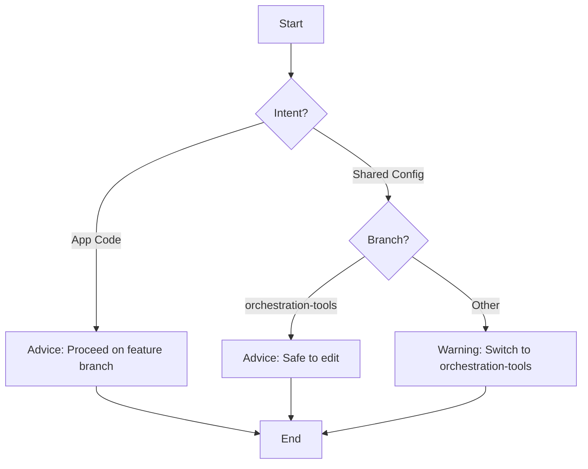
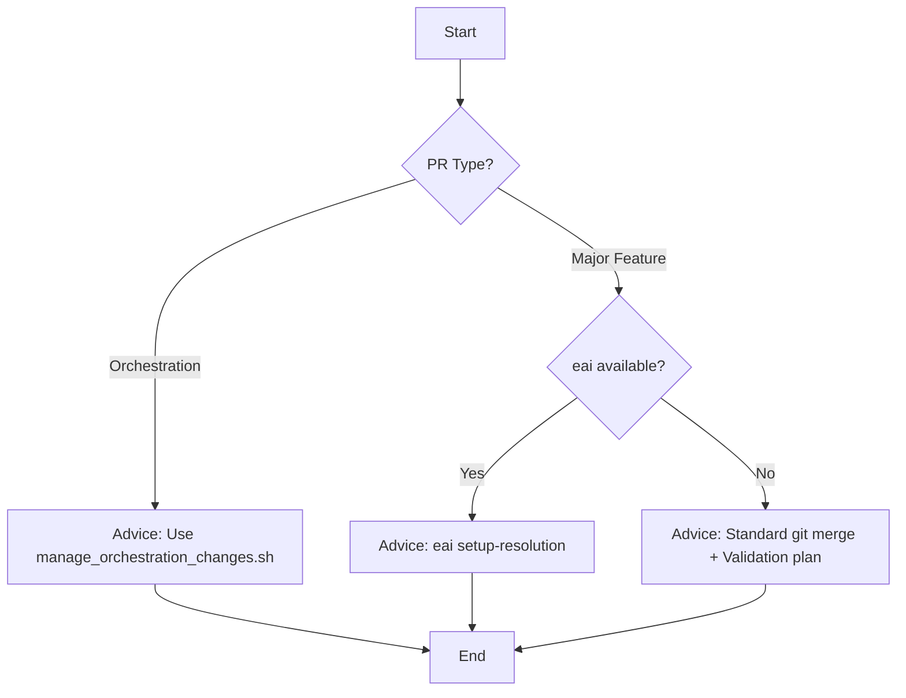

# CLI Workflow Map

This document provides a static overview of the decision trees implemented in the `dev.py` guided workflows.

## 1. `guide-dev` (Development Guidance)

## 2. `guide-pr` (PR Resolution)

## 3. Analysis & Resolution

- **`analyze`**: Ported from `scientific` `analyze-constitutional`. Scans for architectural violations.
- **`resolve`**: Ported from `scientific` `auto-resolve`. AI-driven conflict resolution.
- **`strategy`**: Ported from `scientific` `develop-spec-kit-strategy`. Generates merge plans.