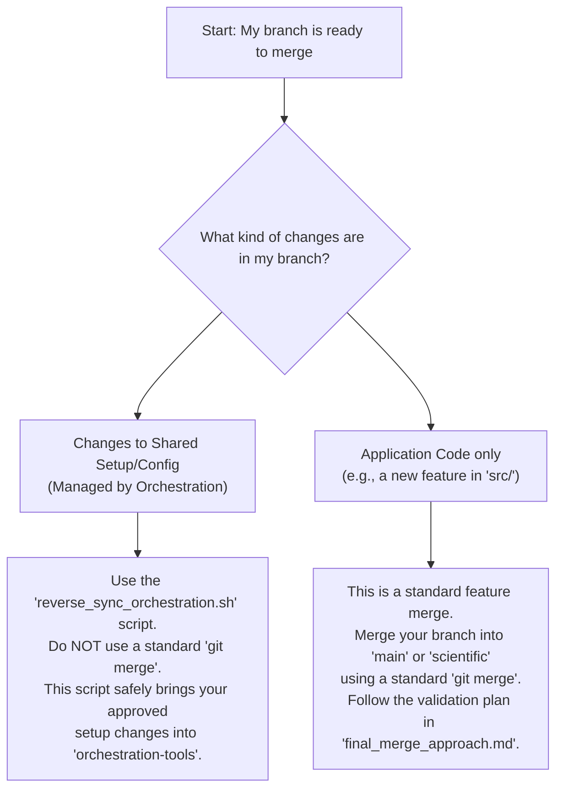

# CLI Workflow Map

This document provides a high-level overview of the key development workflows in this repository. For interactive, step-by-step guidance, use the `python launch.py guide-dev` and `python launch.py guide-pr` commands.

## Workflow 1: General Development

This workflow helps you decide how to make changes based on the type of file you are editing.

```mermaid
graph TD
    A[Start: I want to make a change] --> B{What kind of file?};
    B --> C[Application Code<br>(e.g., src/, client/)];
    B --> D[Shared Setup/Config<br>(e.g., setup/, .flake8)];

    C --> E["Work on any feature branch.<br>No special process needed.<br>Orchestration hooks will keep<br>setup files in sync."];

    D --> F{Am I on the 'orchestration-tools' branch?};
    F -->|Yes| G["✅ Safe to Edit<br>Commit and push directly to 'orchestration-tools'.<br>Changes will propagate to all other branches."];
    F -->|No| H["❌ Unsafe to Edit<br>Your changes will be overwritten.<br>Switch to 'orchestration-tools' branch first."];
```

## Workflow 2: Pull Request (PR) Resolution

This workflow helps you choose the correct method for merging a branch.



## Key Principles

-   The `orchestration-tools` branch is the **single source of truth** for all shared configuration.
-   Changes to shared files on any other branch **will be overwritten** by the automated sync hooks.
-   Use the `guide-dev` and `guide-pr` commands for interactive help.
