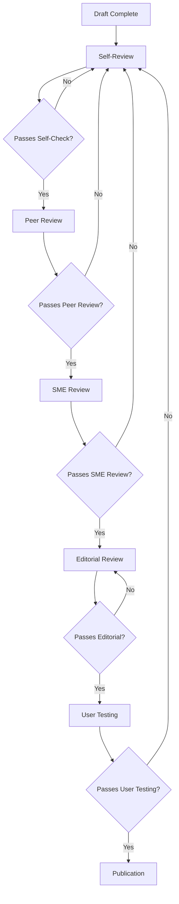

# Documentation Workflow & Review Process

## Overview

This document outlines the standardized workflow for creating, reviewing, and maintaining project documentation. The process ensures quality, consistency, and collaboration across all documentation efforts.

## Workflow Stages

### Stage 1: Planning & Requirements Gathering

#### Activities
- [ ] **Identify Documentation Need:** Determine what documentation is required
- [ ] **Define Scope:** Outline what will be covered and what won't
- [ ] **Gather Requirements:** Consult with subject matter experts and stakeholders
- [ ] **Create Task:** Add to backlog with clear acceptance criteria

#### Deliverables
- [ ] Backlog task with detailed ACs
- [ ] Initial outline or template
- [ ] Stakeholder approval

#### Time Estimate
- **Simple Updates:** 30 minutes - 2 hours
- **New Documents:** 2 - 4 hours
- **Complex Documentation:** 4 - 8 hours

---

### Stage 2: Content Creation

#### Activities
- [ ] **Use Standard Template:** Start with appropriate documentation template
- [ ] **Research & Analysis:** Gather technical details and examples
- [ ] **Write Draft Content:** Create comprehensive first draft
- [ ] **Add Code Examples:** Include tested, runnable examples
- [ ] **Create Visuals:** Add diagrams, flowcharts, screenshots as needed

#### Quality Gates
- [ ] **Self-Review:** Author reviews for completeness and accuracy
- [ ] **Template Compliance:** Follows established documentation standards
- [ ] **Code Validation:** All code examples tested and working

#### Tools & Resources
```bash
# Validate code examples
python scripts/validate_docs.py

# Check markdown formatting
markdownlint docs/

# Preview documentation
mkdocs serve
```

---

### Stage 3: Technical Review

#### Activities
- [ ] **Technical Accuracy Check:** SME validates technical content
- [ ] **Code Example Review:** Verify examples work with current codebase
- [ ] **API Reference Validation:** Confirm signatures and behaviors are current
- [ ] **Integration Point Verification:** Check cross-references and dependencies

#### Review Checklist
- [ ] **Accuracy:** Technical information is correct and current
- [ ] **Completeness:** All required elements are present
- [ ] **Consistency:** Follows established patterns and conventions
- [ ] **Testability:** Code examples can be verified

#### Reviewer Assignment
- **API Documentation:** Backend developer or API maintainer
- **Module Documentation:** Module owner or senior developer
- **User Guides:** Product manager or UX specialist
- **Architecture Docs:** Tech lead or system architect

---

### Stage 4: Editorial Review

#### Activities
- [ ] **Language & Clarity Check:** Review for readability and professionalism
- [ ] **Grammar & Spelling:** Comprehensive proofreading
- [ ] **Consistency Check:** Ensure consistent terminology and formatting
- [ ] **Structure Validation:** Logical flow and navigation

#### Editorial Standards
- [ ] **Tone:** Professional, clear, accessible
- [ ] **Language:** Active voice, present tense
- [ ] **Terminology:** Consistent technical vocabulary
- [ ] **Formatting:** Standard Markdown conventions

#### Automated Checks
```bash
# Spelling and grammar
aspell check docs/*.md

# Style consistency
vale docs/

# Link validation
linkchecker docs/
```

---

### Stage 5: User Acceptance Testing

#### Activities
- [ ] **Target Audience Review:** Get feedback from intended users
- [ ] **Usability Testing:** Verify documentation helps users accomplish tasks
- [ ] **Clarity Assessment:** Ensure complex topics are explained adequately
- [ ] **Navigation Testing:** Confirm users can find needed information

#### User Testing Scenarios
- [ ] **New Developer Onboarding:** Can users set up development environment?
- [ ] **API Integration:** Can developers integrate with documented APIs?
- [ ] **Troubleshooting:** Do solutions resolve documented issues?
- [ ] **Feature Usage:** Can users utilize documented features?

---

### Stage 6: Publication & Maintenance

#### Activities
- [ ] **Final Approval:** Obtain sign-off from documentation maintainer
- [ ] **Publication:** Add to appropriate repository location
- [ ] **Index Updates:** Update main documentation index
- [ ] **Cross-Reference Updates:** Update links in related documents

#### Publication Checklist
- [ ] [ ] All reviews completed and approved
- [ ] [ ] Quality standards met
- [ ] [ ] Links and references validated
- [ ] [ ] Version information updated
- [ ] [ ] Changelog entry added

---

## Review Process Details

### Review Types

#### 1. Self-Review (Author)
- **Purpose:** Initial quality check and completeness validation
- **Duration:** 30-60 minutes
- **Checklist:** Use documentation quality standards

#### 2. Peer Review (Team Member)
- **Purpose:** Technical accuracy and best practices
- **Duration:** 45-90 minutes
- **Checklist:** Code examples, API accuracy, integration points

#### 3. SME Review (Subject Matter Expert)
- **Purpose:** Domain expertise validation
- **Duration:** 60-120 minutes
- **Checklist:** Technical correctness, completeness, edge cases

#### 4. Editorial Review (Technical Writer)
- **Purpose:** Language, clarity, and consistency
- **Duration:** 30-60 minutes
- **Checklist:** Grammar, style, readability, formatting

#### 5. User Review (End User)
- **Purpose:** Usability and effectiveness validation
- **Duration:** 45-90 minutes
- **Checklist:** Task completion, clarity, navigation

### Review Workflow



### Review Timeframes

| Review Type | Target Duration | Max Duration |
|-------------|----------------|--------------|
| Self-Review | 30-60 min | 2 hours |
| Peer Review | 45-90 min | 4 hours |
| SME Review | 60-120 min | 1 day |
| Editorial Review | 30-60 min | 2 hours |
| User Review | 45-90 min | 1 day |

### Escalation Process

#### Slow Reviews
1. **Day 1:** Reminder to reviewer
2. **Day 2:** Follow-up with reviewer and offer assistance
3. **Day 3:** Escalate to review coordinator
4. **Day 5:** Escalate to engineering manager

#### Review Conflicts
1. **Discuss:** Author and reviewer discuss concerns
2. **Mediation:** Involve neutral third party
3. **Escalation:** Engineering manager makes final decision
4. **Documentation:** Record resolution for future reference

## Quality Assurance Integration

### Automated Checks
- **Pre-commit Hooks:** Basic formatting and link checks
- **CI/CD Pipeline:** Comprehensive validation on PRs
- **Scheduled Checks:** Weekly full documentation audit

### Manual Reviews
- **Monthly Audit:** Complete documentation review
- **Release Audit:** Pre-release documentation validation
- **User Feedback:** Ongoing improvement based on user input

## Maintenance Workflow

### Regular Updates
- **Daily:** Fix broken links and typos
- **Weekly:** Update version numbers and examples
- **Monthly:** Full content review and updates
- **Quarterly:** Major restructuring and reorganization

### Change Triggers
- **Code Changes:** Update affected documentation within 24 hours
- **API Changes:** Update API docs immediately
- **Security Updates:** Review and update security documentation
- **User Feedback:** Address user-reported issues within 1 week

## Communication & Collaboration

### Documentation Team
- **Documentation Maintainer:** Oversees quality and standards
- **Technical Writers:** Create and maintain documentation
- **Subject Matter Experts:** Provide technical accuracy
- **Review Coordinators:** Manage review process

### Communication Channels
- **Slack/Discord:** Daily coordination and quick questions
- **GitHub Issues:** Bug reports and feature requests
- **Pull Requests:** Documentation reviews and approvals
- **Monthly Meetings:** Process improvement and planning

### Training & Onboarding
- **New Contributors:** Documentation standards overview
- **Reviewers:** Review process and quality standards training
- **Maintainers:** Advanced documentation techniques

## Metrics & Reporting

### Process Metrics
- **Review Cycle Time:** Average time from draft to publication
- **Review Coverage:** Percentage of docs with required reviews
- **Quality Score:** Automated quality metrics
- **User Satisfaction:** Feedback survey results

### Quality Metrics
- **Defect Rate:** Issues found post-publication
- **Update Frequency:** How often docs are updated
- **Usage Analytics:** Which docs are most accessed
- **User Feedback:** Ratings and improvement suggestions

## Tools & Resources

### Primary Tools
- **Version Control:** Git with GitHub PR workflow
- **Documentation:** Markdown with standard templates
- **Review:** GitHub PR reviews with checklists
- **Quality:** Automated linting and validation

### Supporting Tools
- **Diagrams:** Mermaid, Draw.io for visual content
- **Validation:** Custom scripts for code example testing
- **Preview:** MkDocs or GitBook for documentation sites
- **Analytics:** Google Analytics for usage tracking

## Continuous Improvement

### Process Reviews
- **Monthly:** Review process effectiveness
- **Quarterly:** Major process improvements
- **Annually:** Complete process overhaul

### Feedback Integration
- **User Surveys:** Regular feedback collection
- **Review Feedback:** Incorporate reviewer suggestions
- **Metrics Analysis:** Use data to identify improvement areas
- **Industry Best Practices:** Stay current with documentation trends

---

## Quick Reference

### For Authors
1. Use standard templates
2. Include tested code examples
3. Follow quality standards
4. Request reviews early

### For Reviewers
1. Use provided checklists
2. Focus on your area of expertise
3. Provide constructive feedback
4. Complete reviews within timeframes

### For Maintainers
1. Monitor quality metrics
2. Address process bottlenecks
3. Update standards as needed
4. Ensure tool maintenance

---

*Process Version: 1.0*
*Last Updated: 2025-10-31*
*Next Review: Monthly*
*Owner: Documentation Team*
