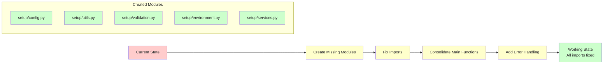
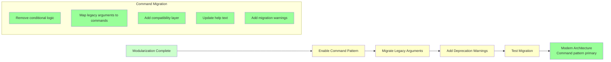

# EmailIntelligence Launch Architecture Diagrams

## Current Monolithic Architecture

```mermaid
graph TB
    subgraph "Entry Point"
        A[launch.py<br/>31 lines] --> B[setup/launch.py<br/>1288 lines]
    end
    
    subgraph "setup/launch.py - Monolithic File"
        B --> C[WSL Environment<br/>Functions 91-126]
        B --> D[Validation<br/>Functions 128-371]
        B --> E[Setup & Dependencies<br/>Functions 417-610]
        B --> F[Service Management<br/>Functions 652-707]
        B --> G[Main Workflow<br/>Functions 710-858]
        B --> H[Command Pattern<br/>Functions 1044-1287]
        
        B --> I[Duplicate main()<br/>Line 841]
        B --> J[Duplicate main()<br/>Line 1044]
    end
    
    subgraph "Broken Imports"
        B --> K[setup.project_config<br/>❌ Missing]
        B --> L[setup.utils<br/>❌ Missing]
        B --> M[setup.services<br/>❌ Missing]
        B --> N[setup.environment<br/>❌ Missing]
        B --> O[setup.validation<br/>❌ Missing]
    end
    
    subgraph "Command Pattern (Exists but unused)"
        P[Command Interface]
        Q[Command Factory]
        R[SetupCommand]
        S[RunCommand]
        T[TestCommand]
        U[CheckCommand]
        V[CleanupCommand]
    end
    
    style A fill:#ffcccc
    style B fill:#ffcccc
    style I fill:#ffcccc
    style J fill:#ffcccc
    style K fill:#ffcccc
    style L fill:#ffcccc
    style M fill:#ffcccc
    style N fill:#ffcccc
    style O fill:#ffcccc
    style P fill:#ccffcc
    style Q fill:#ccffcc
    style R fill:#ccffcc
    style S fill:#ccffcc
    style T fill:#ccffcc
    style U fill:#ccffcc
    style V fill:#ccffcc
```

## Target Modular Architecture

```mermaid
graph TB
    subgraph "Entry Point"
        A[launch.py<br/>31 lines] --> B[setup/launcher.py<br/>150 lines]
    end
    
    subgraph "Core Modules"
        B --> C[setup/config.py<br/>50 lines]
        B --> D[setup/utils.py<br/>100 lines]
        B --> E[setup/validation/<br/>200 lines]
        B --> F[setup/services/<br/>250 lines]
        B --> G[setup/setup/<br/>300 lines]
    end
    
    subgraph "Command Pattern (Integrated)"
        B --> H[setup/commands/<br/>400 lines]
        H --> I[Command Interface]
        H --> J[Command Factory]
        H --> K[SetupCommand]
        H --> L[RunCommand]
        H --> M[TestCommand]
        H --> N[CheckCommand]
        H --> O[CleanupCommand]
    end
    
    subgraph "Legacy Compatibility"
        B --> P[setup/compatibility.py<br/>200 lines]
    end
    
    subgraph "Service Modules"
        F --> Q[backend.py]
        F --> R[frontend.py]
        F --> S[process.py]
    end
    
    subgraph "Setup Modules"
        G --> T[venv.py]
        G --> U[dependencies.py]
        G --> V[nltk.py]
    end
    
    subgraph "Validation Modules"
        E --> W[environment.py]
        E --> X[orchestration.py]
        E --> Y[components.py]
    end
    
    style A fill:#ccffcc
    style B fill:#ccffcc
    style C fill:#ccccff
    style D fill:#ccccff
    style E fill:#ccccff
    style F fill:#ccccff
    style G fill:#ccccff
    style H fill:#99ff99
    style I fill:#99ff99
    style J fill:#99ff99
    style K fill:#99ff99
    style L fill:#99ff99
    style M fill:#99ff99
    style N fill:#99ff99
    style O fill:#99ff99
```



## Command Execution Flow Comparison

### Current Flow (Broken)

```mermaid
graph TD
    A[launch.py] --> B[setup/launch.py main()]
    B --> C{Two main() functions?}
    C -->|First main| D[Command pattern attempt<br/>Lines 841-954]
    C -->|Second main| E[Legacy handling<br/>Lines 1044-1098]
    
    D --> F[Conditional command usage]
    F --> G{COMMAND_PATTERN_AVAILABLE?}
    G -->|Yes| H[Try to use command factory]
    G -->|No| I[Fallback to legacy]
    
    E --> J[Parse legacy arguments]
    J --> K[Direct function calls]
    
    H --> L[Command.execute()]
    I --> M[Legacy function calls]
    
    B --> N[❌ Import errors<br/>Missing modules]
    
    style B fill:#ffcccc
    style C fill:#ffcccc
    style F fill:#ffcccc
    style G fill:#ffcccc
    style N fill:#ffcccc
```

### Target Flow (Clean)

```mermaid
graph TD
    A[launch.py] --> B[setup/launcher.py main()]
    B --> C[Parse arguments]
    C --> D{Modern command?}
    D -->|Yes| E[Command Pattern Path]
    D -->|No| F[Legacy Compatibility Path]
    
    E --> G[Command Factory]
    G --> H[Command.execute()]
    
    F --> I[Compatibility Layer]
    I --> J[Legacy function calls]
    
    H --> K[Load Configuration]
    K --> L[Validate Environment]
    L --> M[Execute Operations]
    
    J --> K
    
    K --> N[setup/config.py]
    L --> O[setup/validation/]
    M --> P[setup/services/]
    
    style A fill:#ccffcc
    style B fill:#ccffcc
    style E fill:#ccffcc
    style F fill:#ffffcc
    style G fill:#ccffcc
    style H fill:#ccffcc
    style I fill:#ffffcc
    style J fill:#ffffcc
```

## Refactoring Migration Plan

### Phase 1: Foundation (Weeks 1-2)



### Phase 2: Modularization (Weeks 3-4)

```mermaid
graph LR
    A[Foundation Complete] --> B[Extract Validation Logic]
    B --> C[Separate Service Management]
    C --> D[Extract Setup Logic]
    D --> E[Clean Up Imports]
    
    subgraph "Extracted Modules"
        F[setup/validation/environment.py]
        G[setup/validation/orchestration.py]
        H[setup/services/backend.py]
        I[setup/services/frontend.py]
        J[setup/setup/venv.py]
        K[setup/setup/dependencies.py]
    end
    
    E --> L[Modular State<br/>Reduced complexity]
    
    style A fill:#ccffcc
    style B fill:#ffffcc
    style C fill:#ffffcc
    style D fill:#ffffcc
    style E fill:#ffffcc
    style F fill:#ccccff
    style G fill:#ccccff
    style H fill:#ccccff
    style I fill:#ccccff
    style J fill:#ccccff
    style K fill:#ccccff
    style L fill:#ccffcc
```



### Phase 3: Command Pattern Migration (Weeks 5-6)



## File Size Comparison

### Current State
```
setup/launch.py: 1288 lines (52 functions)
├── WSL Environment: 35 lines
├── Validation: 243 lines  
├── Setup & Dependencies: 193 lines
├── Service Management: 55 lines
├── Main Workflow: 148 lines
├── Command Pattern: 243 lines
├── Duplicate Functions: 150 lines
└── Imports & Constants: 221 lines
```

### Target State
```
setup/
├── launcher.py: 150 lines (5 functions)
├── config.py: 50 lines (3 functions)
├── utils.py: 100 lines (8 functions)
├── validation/
│   ├── __init__.py: 20 lines
│   ├── environment.py: 80 lines (6 functions)
│   ├── orchestration.py: 100 lines (8 functions)
│   └── components.py: 60 lines (5 functions)
├── services/
│   ├── __init__.py: 20 lines
│   ├── backend.py: 90 lines (5 functions)
│   ├── frontend.py: 80 lines (4 functions)
│   └── process.py: 70 lines (3 functions)
├── setup/
│   ├── __init__.py: 20 lines
│   ├── venv.py: 100 lines (8 functions)
│   ├── dependencies.py: 120 lines (10 functions)
│   └── nltk.py: 60 lines (5 functions)
├── commands/
│   └── [existing 400 lines]
└── compatibility.py: 200 lines (15 functions)

Total: ~1,800 lines across 15 files
Average: ~120 lines per file
```

## Benefits Analysis

### Code Metrics Improvement

| Metric | Current | Target | Improvement |
|--------|---------|--------|-------------|
| Largest file size | 1,288 lines | 150 lines | 88% reduction |
| Functions per file | 52 in main file | 5 in main file | 90% reduction |
| Import errors | 5 missing modules | 0 | 100% resolution |
| Cyclomatic complexity | High (mixed concerns) | Low (focused modules) | Significant |
| Test coverage | Difficult (monolith) | Easy (modular) | Improved |
| Maintainability | Low | High | Major improvement |

### Developer Experience

| Aspect | Current State | Target State |
|--------|---------------|--------------|
| **Navigation** | Find function in 1288-line file | Navigate to specific module |
| **Testing** | Complex (entire monolith) | Simple (individual modules) |
| **Debugging** | Difficult (multiple concerns) | Easy (focused modules) |
| **Onboarding** | Overwhelming | Clear structure |
| **Contributions** | Risky (change affects all) | Safe (isolated changes) |
| **Code Review** | Complex diffs | Focused reviews |

### Operational Benefits

| Benefit | Current Issue | Solution |
|---------|---------------|----------|
| **Startup Time** | Import failures cause delays | All imports resolved |
| **Error Messages** | Unclear (monolithic failures) | Specific (module-specific) |
| **Logging** | Mixed concerns | Modular logging |
| **Configuration** | Hard-coded in main file | Centralized config module |
| **Environment Handling** | Scattered functions | Dedicated environment module |
| **Service Management** | Mixed with setup | Dedicated services module |

## Risk Mitigation

### High-Risk Changes
1. **Breaking CLI Interface**
   - Risk: Existing scripts stop working
   - Mitigation: Comprehensive compatibility layer
   - Testing: Full regression test suite

2. **Import Path Changes**
   - Risk: External dependencies break
   - Mitigation: Maintain backward compatibility
   - Testing: Integration tests with existing code

3. **Command Pattern Migration**
   - Risk: New architecture has bugs
   - Mitigation: Gradual migration with fallback
   - Testing: Parallel testing of both paths

### Low-Risk Changes
1. **Creating Missing Modules**
   - Risk: Minimal (new files)
   - Mitigation: Follow existing patterns
   - Testing: Unit tests for new modules

2. **Consolidating Main Functions**
   - Risk: Single point of failure
   - Mitigation: Clear error handling
   - Testing: Path coverage testing

## Success Criteria

### Technical Criteria
- ✅ Zero runtime import errors
- ✅ setup/launch.py reduced to <300 lines
- ✅ All existing functionality preserved
- ✅ Test coverage maintained or improved
- ✅ Performance not degraded

### Architectural Criteria
- ✅ Clear separation of concerns
- ✅ Well-defined module interfaces
- ✅ Command pattern fully integrated
- ✅ Legacy compatibility maintained
- ✅ Future extensibility enabled

### Developer Experience Criteria
- ✅ Easy to navigate codebase
- ✅ Clear module responsibilities
- ✅ Simple testing approach
- ✅ Reduced cognitive load
- ✅ Faster onboarding

This architectural refactoring will transform a monolithic, problematic launcher into a clean, maintainable, and extensible system while preserving all existing functionality.