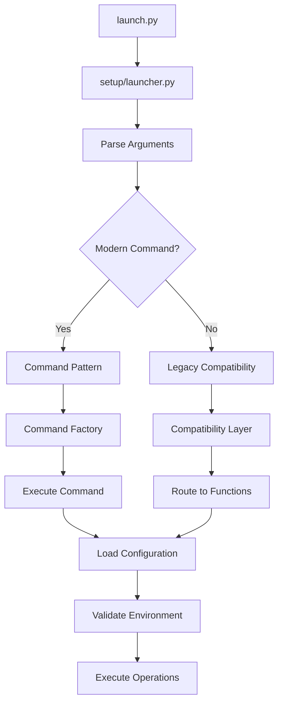

# EmailIntelligence Launch.py Architectural Analysis

## Executive Summary

The EmailIntelligence launch system exhibits a **monolithic architecture anti-pattern** with a single 1,288-line file (`setup/launch.py`) containing 52 functions across multiple responsibility domains. This analysis identifies critical architectural issues, missing dependencies, and provides a comprehensive refactoring strategy.

## Current Architecture Overview

### File Structure Analysis

**Primary Files:**
- `launch.py` (root): Simple wrapper (31 lines) forwarding to `setup/launch.py`
- `setup/launch.py`: Monolithic 1,288-line file with 52 functions
- Command Pattern Components: Well-designed but unused architecture

**Missing Critical Modules:**
- `setup/project_config.py` - Referenced but doesn't exist
- `setup/utils.py` - Referenced but doesn't exist  
- `setup/services.py` - Referenced but doesn't exist
- `setup/environment.py` - Referenced but doesn't exist
- `setup/validation.py` - Referenced but doesn't exist

## 1. Functional Module Mapping

### 1.1 WSL Environment Management (Lines 91-126)
```python
def setup_wsl_environment()      # Lines 91-110
def check_wsl_requirements()     # Lines 113-125
```
**Responsibility:** WSL-specific configuration and validation
**Issues:** Standalone functions scattered in main file

### 1.2 Python Version & Environment Validation (Lines 128-371)
```python
def check_python_version()                     # Lines 129-139
def check_for_merge_conflicts()                # Lines 143-190
def check_required_components()                # Lines 193-233
def validate_environment()                     # Lines 236-247
def check_critical_files()                     # Lines 250-355
def validate_orchestration_environment()       # Lines 358-371
```
**Responsibility:** System validation and environment checking
**Issues:** Mixed validation concerns, complex logic in single file

### 1.3 Setup & Dependency Management (Lines 417-610)
```python
def get_venv_executable()                      # Lines 417-424
def run_command()                              # Lines 427-441
def create_venv()                              # Lines 445-452
def install_package_manager()                  # Lines 454-457
def setup_dependencies()                       # Lines 459-493
def install_notmuch_matching_system()          # Lines 495-511
def download_nltk_data()                       # Lines 513-571
def check_uvicorn_installed()                  # Lines 573-588
def check_node_npm_installed()                 # Lines 591-600
def install_nodejs_dependencies()              # Lines 602-615
def start_client()                             # Lines 617-627
def start_server_ts()                          # Lines 629-650
```
**Responsibility:** Environment setup, dependency installation, version management
**Issues:** Interdependent setup logic scattered across functions

### 1.4 Service Management (Lines 652-707)
```python
def start_backend()                            # Lines 652-669
def start_node_service()                       # Lines 672-683
def setup_node_dependencies()                  # Lines 685-693
def start_gradio_ui()                          # Lines 696-707
```
**Responsibility:** Application service startup and management
**Issues:** Service configuration mixed with setup logic

### 1.5 Main Application Workflow (Lines 710-858)
```python
def handle_setup()                             # Lines 710-729
def prepare_environment()                      # Lines 732-742
def start_services()                           # Lines 745-756
def handle_test_stage()                        # Lines 758-788
def print_system_info()                        # Lines 791-839
def main()                                     # Lines 841-954
def _add_common_args()                         # Lines 956-964
def _add_legacy_args()                         # Lines 967-1042
```
**Responsibility:** Main application orchestration and command processing
**Issues:** Two separate main() functions, complex argument handling

### 1.6 Command Pattern Integration (Lines 1044-1287)
```python
def main()                                     # Lines 1044-1098
def _execute_command()                         # Lines 1100-1121
def _execute_check_command()                   # Lines 1124-1150
def _handle_legacy_args()                      # Lines 1153-1260
def _check_setup_warnings()                    # Lines 1262-1287
```
**Responsibility:** Command pattern execution and legacy compatibility
**Issues:** Duplicate main() function, partial command pattern adoption

## 2. Command Pattern Implementation Gap

### 2.1 Existing Command Pattern Architecture

**Well-Designed Components:**
```python
# setup/commands/command_interface.py
class Command(ABC):
    @abstractmethod
    def get_description() -> str
    def validate_args() -> bool
    def execute() -> int
    def cleanup() -> None

# setup/commands/command_factory.py
class CommandFactory:
    def __init__(self):
        self._commands = {
            'setup': SetupCommand,
            'run': RunCommand,
            'test': TestCommand,
            'check': CheckCommand,
            'cleanup': CleanupCommand,
        }
```

**Implementation Status:**
- ✅ Command interface defined
- ✅ Command factory implemented
- ✅ Individual command classes created
- ❌ **Main launcher doesn't use command pattern**
- ❌ **Legacy argument handling dominates**

### 2.2 Integration Issues

**Problem 1: Split Main Functions**
```python
# First main() - Command pattern attempt (lines 841-954)
# Second main() - Legacy handling (lines 1044-1098)
```
The code has **two main() functions** with competing logic.

**Problem 2: Conditional Command Pattern Usage**
```python
if COMMAND_PATTERN_AVAILABLE:
    # Use command pattern
else:
    # Fall back to legacy handling
```
This conditional logic creates complexity and inconsistent behavior.

**Problem 3: Legacy Argument Pollution**
The argument parser contains **100+ lines** of legacy argument definitions that duplicate modern command structure.

## 3. Data Flow Analysis

### 3.1 Program Entry Points

```mermaid
graph TD
    A[launch.py] --> B[setup/launch.py main()]
    B --> C{Command Available?}
    C -->|Yes| D[Command Pattern Path]
    C -->|No| E[Legacy Argument Path]
    
    D --> F[Parse Subcommands]
    F --> G[Execute via Factory]
    
    E --> H[Parse Legacy Args]
    H --> I[Route to Functions]
    
    G --> J[Command.execute()]
    I --> K[Direct Function Calls]
```

### 3.2 Configuration Sources

**Current Configuration Flow:**
1. **Environment Variables** - System environment
2. **Command Arguments** - Runtime parameters  
3. **Project Configuration** - Missing (referenced but doesn't exist)
4. **User Environment Files** - launch-user.env, .env

**Missing Project Config Impact:**
```python
# Referenced in launch.py but doesn't exist
from setup.project_config import get_project_config
ROOT_DIR = get_project_config().root_dir  # Line 77
```

## 4. Missing Dependencies Analysis

### 4.1 Referenced But Non-Existent Modules

| Module | Referenced In | Purpose | Status |
|--------|---------------|---------|--------|
| `setup.project_config` | Lines 48, 77, 182, 220, 193 | Project configuration | ❌ Missing |
| `setup.utils` | Line 28 | Utility functions | ❌ Missing |
| `setup.services` | Lines 22-23 | Service management | ❌ Missing |
| `setup.environment` | Lines 25-26 | Environment handling | ❌ Missing |
| `setup.validation` | Lines 18-21 | Validation functions | ❌ Missing |

### 4.2 Import Chain Analysis

**Broken Import Chain:**
```python
# setup/launch.py Line 48
from setup.project_config import get_project_config
# ❌ This module doesn't exist - causes ImportError
```

**Consequence:** The application has **runtime import failures** for critical functionality.

## 5. Architectural Decision Assessment

### 5.1 Why Monolithic Design?

**Historical Reasons:**
1. **Rapid Development** - Single file easy for quick prototyping
2. **Centralized Logic** - All launch logic in one place
3. **Backwards Compatibility** - Preserve existing usage patterns
4. **Iterative Growth** - Function added incrementally over time

### 5.2 Current Functionality at Risk

**Critical Dependencies:**
- Environment setup and validation
- Service management and startup
- Legacy argument compatibility
- Cross-platform support (WSL, Windows, Linux)

**Modularization Concerns:**
- Breaking existing command-line interfaces
- Disrupting orchestration workflows
- Affecting CI/CD pipelines
- Breaking backwards compatibility

### 5.3 Safe Refactoring Strategy

**Risk Assessment Matrix:**

| Refactoring Action | Risk Level | Impact | Mitigation Strategy |
|-------------------|------------|--------|-------------------|
| Extract validation module | Low | Minimal | Create separate module with clear interface |
| Extract service management | Medium | Service startup | Maintain function signatures |
| Remove duplicate main() | High | CLI interface | One function with clear path selection |
| Command pattern migration | High | All commands | Gradual migration with legacy support |
| Create project_config module | Low | Configuration | Simple config object with fallback |

## 6. Architectural Recommendations

### 6.1 Phase 1: Foundation (Low Risk)
1. **Create Missing Modules** - project_config, utils, validation, environment, services
2. **Extract Validation Logic** - Move validation functions to separate module
3. **Fix Duplicate Main** - Consolidate to single main() function
4. **Add Error Handling** - Graceful degradation for missing modules

### 6.2 Phase 2: Modularization (Medium Risk)
1. **Separate Service Management** - Extract service functions to services module
2. **Extract Setup Logic** - Create dedicated setup module
3. **Clean Up Imports** - Remove circular dependencies
4. **Add Configuration Layer** - Centralize configuration management

### 6.3 Phase 3: Command Pattern Migration (High Risk)
1. **Enable Command Pattern** - Remove conditional logic
2. **Migrate Legacy Arguments** - Map to command structure
3. **Deprecate Legacy Path** - Graceful transition with warnings
4. **Full Command Pattern** - Complete architectural migration

## 7. Recommended Architecture

### 7.1 Modular Structure

```
setup/
├── __init__.py
├── config.py              # Project configuration
├── utils.py               # Utility functions
├── validation/            # Validation modules
│   ├── __init__.py
│   ├── environment.py     # Environment validation
│   ├── orchestration.py   # Orchestration validation
│   └── components.py      # Component validation
├── setup/
│   ├── __init__.py
│   ├── venv.py           # Virtual environment management
│   ├── dependencies.py   # Dependency installation
│   └── nltk.py           # NLTK data management
├── services/
│   ├── __init__.py
│   ├── backend.py        # Backend service management
│   ├── frontend.py       # Frontend service management
│   └── process.py        # Process management
├── commands/             # Existing command pattern
│   ├── __init__.py
│   ├── setup_command.py  # Setup command
│   ├── run_command.py    # Run command
│   ├── test_command.py   # Test command
│   ├── check_command.py  # Check command
│   └── cleanup_command.py # Cleanup command
├── launcher.py           # Main launcher (simplified)
└── compatibility.py      # Legacy argument handling
```

### 7.2 Data Flow



## 8. Implementation Priorities

### High Priority (Immediate)
1. **Fix Missing Modules** - Create project_config.py, utils.py, etc.
2. **Consolidate Main Functions** - Single entry point
3. **Fix Import Errors** - Resolve runtime import failures

### Medium Priority (Short Term)
1. **Extract Validation Logic** - Separate validation modules
2. **Service Management Separation** - Extract service functions
3. **Configuration Centralization** - Consistent configuration handling

### Low Priority (Long Term)
1. **Complete Command Pattern Migration** - Full architectural change
2. **Deprecation of Legacy Path** - Remove old argument handling
3. **Advanced Service Orchestration** - Enhanced service management

## 9. Success Metrics

### Technical Metrics
- **Module Size** - Reduce setup/launch.py from 1288 to <300 lines
- **Import Errors** - Zero runtime import failures
- **Function Count** - Reduce from 52 to <15 functions in main module
- **Cyclomatic Complexity** - Reduce per-function complexity

### Functional Metrics
- **Backward Compatibility** - 100% compatible with existing usage
- **Performance** - No degradation in startup time
- **Error Handling** - Graceful degradation for all error conditions
- **Test Coverage** - Maintain existing test coverage

## Conclusion

The EmailIntelligence launch system exhibits classic monolithic architecture issues but has a well-designed command pattern foundation that was never fully implemented. The recommended approach is a **phased refactoring** that addresses immediate issues (missing modules, duplicate functions) before moving to architectural improvements (command pattern migration, modularization).

**Key Success Factors:**
1. **Preserve Backward Compatibility** - Existing usage must continue to work
2. **Address Missing Dependencies** - Create referenced but non-existent modules
3. **Gradual Migration** - Incremental changes rather than big-bang refactoring
4. **Clear Interfaces** - Well-defined boundaries between modules

This analysis provides the foundation for a systematic refactoring that will improve code maintainability while preserving all existing functionality.