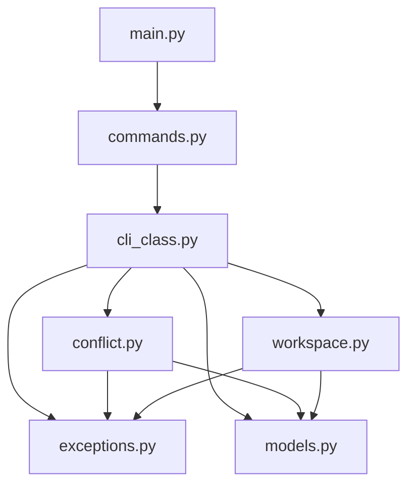

# EmailIntelligence CLI Refactoring Plan

## Overview

This document outlines a comprehensive plan to refactor `emailintelligence_cli.py` (2713 lines) into modular components under a new `cli/` directory. The goal is to improve code organization, maintainability, and follow single responsibility principles.

---

## Current State Analysis

### File: `emailintelligence_cli.py` (2713 lines)

| Section | Lines | Content |
|---------|-------|---------|
| Imports | 1-47 | Standard library + external dependencies |
| Exception Hierarchy | 50-106 | 11 custom exception classes |
| Enumerations | 110-127 | `ConflictType`, `ConflictSeverity` |
| Dataclasses | 133-243 | 5 dataclasses |
| Workspace Managers | 250-412 | 4 workspace manager classes |
| EmailIntelligenceCLI | 415-2499 | Main CLI class (~2085 lines) |
| CLI Entry Point | 2501-2714 | `main()` function |

### Components Identified

#### 1. Custom Exceptions (11 classes)
- [`EmailIntelligenceError`](emailintelligence_cli.py:54) - Base exception
- [`GitOperationError`](emailintelligence_cli.py:59) - Git operations failure
- [`MergeTreeError`](emailintelligence_cli.py:64) - merge-tree command failure
- [`BranchNotFoundError`](emailintelligence_cli.py:69) - Branch doesn't exist
- [`WorktreeUnavailableError`](emailintelligence_cli.py:74) - Worktree operations failure
- [`ConflictDetectionError`](emailintelligence_cli.py:79) - Conflict detection failure
- [`WorkspaceCreationError`](emailintelligence_cli.py:84) - Workspace creation failure
- [`ResolutionNotReadyError`](emailintelligence_cli.py:89) - Incomplete resolutions
- [`PushOperationError`](emailintelligence_cli.py:94) - Push operations failure
- [`BranchEnumerationError`](emailintelligence_cli.py:99) - Branch enumeration failure
- [`ScanExecutionError`](emailintelligence_cli.py:104) - All-branches scan failure

#### 2. Enumerations (2 classes)
- [`ConflictType`](emailintelligence_cli.py:113) - Conflict types: CHANGED_IN_BOTH, ADDED_IN_BOTH, REMOVED_IN_SOURCE, REMOVED_IN_TARGET, MODIFIED_DELETED
- [`ConflictSeverity`](emailintelligence_cli.py:122) - Severity levels: HIGH, MEDIUM, LOW

#### 3. Dataclasses (5 classes)
- [`ConflictRegion`](emailintelligence_cli.py:134) - Conflict region within a file
- [`ConflictFile`](emailintelligence_cli.py:149) - Structured conflict for a single file
- [`ConflictReport`](emailintelligence_cli.py:170) - Complete conflict detection result
- [`BranchPairResult`](emailintelligence_cli.py:205) - Single branch pair scan result
- [`ConflictMatrix`](emailintelligence_cli.py:221) - Complete conflict matrix for all pairs

#### 4. Workspace Manager Classes (4 classes)
- [`GitWorkspaceManager`](emailintelligence_cli.py:250) - Abstract base class
- [`GitWorktreeManager`](emailintelligence_cli.py:265) - Primary worktree manager
- [`FallbackWorkspaceManager`](emailintelligence_cli.py:336) - Fallback using temp directories
- [`RobustWorkspaceManager`](emailintelligence_cli.py:382) - Manager with fallback strategy

#### 5. Main CLI Class
- [`EmailIntelligenceCLI`](emailintelligence_cli.py:415) - Main CLI class with 20+ methods

Key methods to preserve:
- `setup_resolution()` - Setup resolution workspace
- `analyze_constitutional()` - Analyze conflicts against constitution
- `develop_spec_kit_strategy()` - Develop resolution strategy
- `align_content()` - Execute content alignment
- `validate_resolution()` - Validate completed resolution
- `auto_resolve_conflicts()` - Auto-resolve conflicts
- `push_resolution_to_target()` - Push to target branch
- `scan_all_branches()` - Scan all branch pairs
- `detect_conflicts_with_merge_tree()` - Detect conflicts
- `_enumerate_branches()` - Enumerate branches
- `_scan_branch_pair()` - Scan single branch pair

#### 6. CLI Commands (10 commands)
- `setup-resolution` - Setup resolution workspace
- `analyze-constitutional` - Analyze constitutional compliance
- `develop-spec-kit-strategy` - Develop resolution strategy
- `align-content` - Execute content alignment
- `validate-resolution` - Validate resolution
- `auto-resolve` - Auto-resolve conflicts
- `push-resolution` - Push to target branch (NEW)
- `scan-all-branches` - Scan all branches (NEW)
- `version` - Show version

#### 7. Missing Implementation
- `collect_pr_recommendations` - Method mentioned but NOT implemented (needs implementation)

---

## Proposed Module Structure

```
cli/
├── __init__.py           # Package exports and CLI initialization
├── exceptions.py         # Custom exception hierarchy (11 classes)
├── models.py             # Dataclasses and enumerations
├── workspace.py          # GitWorkspaceManager classes
├── conflict.py           # Conflict detection (scan_all_branches)
├── cli_class.py          # EmailIntelligenceCLI main class
├── commands.py           # CLI command handlers (argparse)
└── main.py               # Entry point (main() function)
```

### Module Details

#### 1. `cli/__init__.py`
**Purpose**: Package initialization and exports

```python
# Exports to maintain backward compatibility
from cli.exceptions import (
    EmailIntelligenceError,
    GitOperationError,
    # ... all exceptions
)
from cli.models import (
    ConflictType,
    ConflictSeverity,
    ConflictRegion,
    # ... all models
)
from cli.cli_class import EmailIntelligenceCLI

__all__ = [
    'EmailIntelligenceCLI',
    # ... exports
]
```

#### 2. `cli/exceptions.py`
**Purpose**: All custom exception classes

**Contents**:
- All 11 exception classes
- Exception hierarchy documentation

**Dependencies**: None (pure Python)

#### 3. `cli/models.py`
**Purpose**: All data models (dataclasses + enums)

**Contents**:
- `ConflictType` enum
- `ConflictSeverity` enum
- `ConflictRegion` dataclass
- `ConflictFile` dataclass
- `ConflictReport` dataclass
- `BranchPairResult` dataclass
- `ConflictMatrix` dataclass

**Dependencies**:
- `cli/exceptions` (for type hints if needed)
- Standard library: `dataclasses`, `enum`, `typing`

#### 4. `cli/workspace.py`
**Purpose**: Git workspace management

**Contents**:
- `GitWorkspaceManager` - Abstract base
- `GitWorktreeManager` - Primary implementation
- `FallbackWorkspaceManager` - Fallback implementation
- `RobustWorkspaceManager` - Manager with fallback

**Dependencies**:
- `cli/exceptions` (WorkspaceCreationError, WorktreeUnavailableError)
- `cli/models` (for type hints)
- Standard library: `subprocess`, `tempfile`, `shutil`, `pathlib`

#### 5. `cli/conflict.py`
**Purpose**: Conflict detection and scanning

**Contents**:
- Methods extracted from EmailIntelligenceCLI:
  - `_parse_merge_tree_output()` - Parse merge-tree output
  - `detect_conflicts_with_merge_tree()` - Detect conflicts
  - `_enumerate_branches()` - Enumerate branches
  - `_scan_branch_pair()` - Scan single pair
  - `scan_all_branches()` - Scan all branches (the main method)
  - `_display_scan_summary()` - Display scan results

**Dependencies**:
- `cli/exceptions`
- `cli/models`
- Standard library: `concurrent.futures`, `time`, `pathlib`, `subprocess`

#### 6. `cli/cli_class.py`
**Purpose**: Main CLI class

**Contents**:
- `EmailIntelligenceCLI` class with all methods except conflict detection

Methods to include:
- `__init__()` - Initialization
- All workflow methods (setup_resolution, analyze_constitutional, etc.)
- Helper methods for config, directories, git check
- **push_resolution_to_target()** - Already implemented

**Dependencies**:
- `cli/exceptions`
- `cli/models`
- `cli.workspace`
- `cli.conflict`
- External: `src.resolution`, `src.git.conflict_detector`, etc.

#### 7. `cli/commands.py`
**Purpose**: CLI command handlers

**Contents**:
- Argument parser definitions for all 10 commands
- Command execution functions

**Dependencies**:
- `cli.cli_class` (EmailIntelligenceCLI)
- Standard library: `argparse`

#### 8. `cli/main.py`
**Purpose**: Entry point

**Contents**:
- `main()` function
- Version info

**Dependencies**:
- `cli.commands`

---

## Import Dependency Graph



---

## Migration Steps

### Phase 1: Create Module Structure

1. **Create `cli/` directory**
   ```bash
   mkdir -p cli
   ```

2. **Create `cli/__init__.py`**
   - Add package metadata
   - Add re-exports for backward compatibility

### Phase 2: Extract Independent Modules

3. **Create `cli/exceptions.py`**
   - Copy all 11 exception classes
   - Update imports

4. **Create `cli/models.py`**
   - Copy enums and dataclasses
   - Add necessary imports from exceptions

5. **Create `cli/workspace.py`**
   - Copy workspace manager classes
   - Add imports from exceptions and models

### Phase 3: Extract Conflict Detection

6. **Create `cli/conflict.py`**
   - Extract conflict detection methods
   - Create standalone functions or a class
   - Add imports from exceptions and models

### Phase 4: Extract Main CLI Class

7. **Create `cli/cli_class.py`**
   - Copy EmailIntelligenceCLI class
   - Update method references to use new modules
   - Add imports from all new modules

### Phase 5: Extract Commands and Entry Point

8. **Create `cli/commands.py`**
   - Extract argparse definitions
   - Update to import from cli_class

9. **Create `cli/main.py`**
   - Copy main() function
   - Update imports

### Phase 6: Update Original File

10. **Update `emailintelligence_cli.py`**
    - Replace with backward-compatible imports
    - Keep existing functionality via re-exports

### Phase 7: Implement Missing Method

11. **Implement `collect_pr_recommendations`**
    - Add to appropriate module (likely cli_class.py)
    - Document the implementation requirements

---

## Implementation of collect_pr_recommendations

Based on the task description, this method needs implementation. Here's the proposed interface:

```python
def collect_pr_recommendations(
    self,
    pr_number: int,
    include_conflicts: bool = True,
    include_strategy: bool = True,
    include_validation: bool = True
) -> Dict[str, Any]:
    """
    Collect all recommendations for a PR.
    
    Args:
        pr_number: Pull request number
        include_conflicts: Include conflict recommendations
        include_strategy: Include strategy recommendations
        include_validation: Include validation recommendations
    
    Returns:
        Dictionary containing all recommendations
    """
```

---

## Backward Compatibility

To maintain backward compatibility:

1. **Option A: Re-export in original file**
   ```python
   # emailintelligence_cli.py
   from cli import EmailIntelligenceCLI, *
   
   # Keep main() function
   ```

2. **Option B: Create wrapper module**
   ```python
   # emailintelligence_cli.py
   from cli.main import main
   from cli.cli_class import EmailIntelligenceCLI
   from cli.exceptions import *
   from cli.models import *
   ```

---

## Testing Strategy

1. **Unit Tests**
   - Test each module independently
   - Mock external dependencies (git, subprocess)

2. **Integration Tests**
   - Test CLI commands end-to-end
   - Test import chain

3. **Backward Compatibility Tests**
   - Ensure existing scripts continue to work
   - Test import paths

---

## File Summary

| New File | Lines (est.) | Responsibility |
|----------|--------------|----------------|
| `cli/__init__.py` | ~30 | Package exports |
| `cli/exceptions.py` | ~60 | Exception hierarchy |
| `cli/models.py` | ~120 | Data models |
| `cli/workspace.py` | ~170 | Workspace management |
| `cli/conflict.py` | ~200 | Conflict detection |
| `cli/cli_class.py` | ~1500 | Main CLI class |
| `cli/commands.py` | ~250 | CLI commands |
| `cli/main.py` | ~30 | Entry point |
| **Total** | ~2360 | ~90% of original |

---

## Notes

1. **Circular Dependencies**: Avoid by importing at function level if needed
2. **External Imports**: Keep external imports in cli_class.py to minimize dependencies in core modules
3. **Configuration**: Consider moving config loading to a separate module
4. **Logging**: Centralize logging configuration

---

## Action Items

- [ ] Review and approve this plan
- [ ] Create `cli/` directory structure
- [ ] Implement each module in dependency order
- [ ] Add unit tests for each module
- [ ] Run integration tests
- [ ] Update documentation
- [ ] Implement `collect_pr_recommendations`
