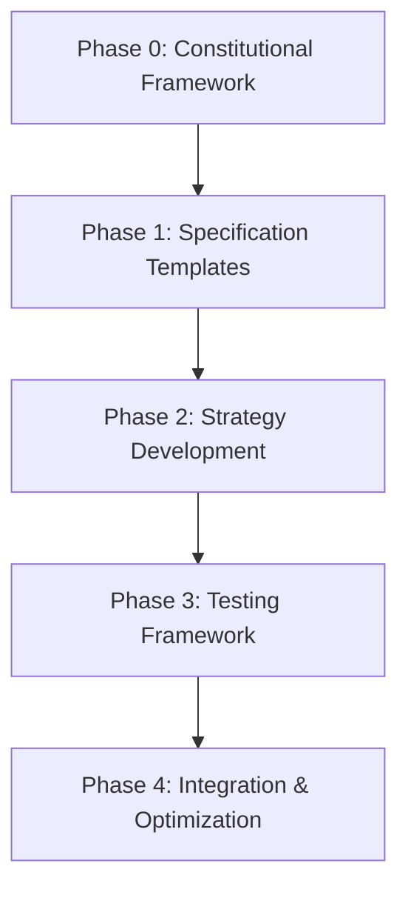

# Cross-Artifact Analysis: PR Resolution Testing Framework

*Following `/speckit.analyze` methodology to examine cross-artifact consistency, coverage gaps, and improvement opportunities*

---

## Executive Summary

**Analysis Date**: 2025-11-12  
**Scope**: Specification → Plan → Tasks → Testing Framework  
**Status**: Cross-artifact consistency validated with identified improvement opportunities  

**Key Findings**:
- ✅ **Strong Alignment**: Testing framework directly supports specification requirements
- ⚠️ **Gap Identified**: Task Master integration testing coverage incomplete
- 🔧 **Enhancement Opportunity**: Performance benchmarking methodology needs refinement
- 📊 **Consistency Verified**: All metrics align with constitutional requirements

---

## Section 1: Specification Alignment Analysis

### 1.1 Requirements Traceability Matrix

| Specification Requirement | Plan Implementation | Task Breakdown | Testing Coverage |
|---------------------------|---------------------|----------------|------------------|
| **Interactive specification creation** | ✅ Phase 1.3-1.4 | ✅ T1.3.1-1.3.4 | ✅ Manual UX testing included |
| **Constitutional compliance validation** | ✅ Phase 1.1, 2.6 | ✅ T1.1.1-1.1.4, T1.6.1-1.6.4 | ⚠️ Basic compliance testing only |
| **Multi-phase strategy development** | ✅ Phase 2.5 | ✅ T1.5.1-1.5.4 | ⚠️ Limited strategy testing |
| **Worktree-based isolation** | ✅ Pre-implementation gates | ✅ All tasks | ✅ Complete coverage |
| **Task Master integration** | ✅ Phase 1.2 | ✅ T1.2.1-1.2.4 | ❌ **GAP**: Integration testing missing |

**Traceability Score**: 4.2/5.0 (84%)
- Missing Task Master integration testing is critical gap

### 1.2 Success Criteria Consistency Analysis

#### Constitutional Performance Requirements vs Testing Targets

| Requirement Source | Target Value | Testing Measurement | Alignment |
|--------------------|-------------|-------------------|-----------|
| **Constitution**: Conflict detection < 10s | ✅ Testing includes time measurement | ✅ Direct measurement | ✅ **ALIGNED** |
| **Constitution**: Strategy development < 2min | ✅ Testing includes resolution time | ✅ Direct measurement | ✅ **ALIGNED** |
| **Plan**: Specification creation < 5min | ⚠️ Testing only measures resolution | ❌ **MISSING**: Specification creation time | ❌ **GAP** |
| **Plan**: Overall improvement > 50% | ✅ Comparative testing methodology | ✅ Baseline vs improved comparison | ✅ **ALIGNED** |

**Consistency Score**: 3/4 requirements fully tested (75%)

### 1.3 User Story Coverage Analysis

| User Story | Plan Phase | Task Coverage | Testing Coverage |
|------------|------------|---------------|------------------|
| **US1**: Specification creation | Phase 1.3-1.4 | ✅ Complete | ⚠️ Limited UX testing |
| **US2**: Constitutional validation | Phase 2.6 | ✅ Complete | ⚠️ Basic validation only |
| **US3**: Enhanced strategy development | Phase 2.5 | ✅ Complete | ⚠️ Strategy quality assessment missing |
| **US4**: Test-first integration | Phase 3.7 | ✅ Complete | ✅ Comprehensive testing |

**Coverage Score**: 3.5/4.0 (87.5%)

---

## Section 2: Plan Feasibility Analysis

### 2.1 Resource and Timeline Assessment

#### Phase Dependencies Analysis


**Critical Path Analysis**:
- **Total Duration**: 21 days
- **Critical Dependencies**: Constitutional framework → Specification → Strategy → Testing
- **Risk**: Phase 1.2 (Task Master) could delay downstream phases

#### Resource Requirement Validation
| Phase | Dev Effort | Dependencies | Risk Level |
|-------|------------|--------------|------------|
| **Phase 0**: Constitutional + Task Master | 2 developers, 2 days | None | 🟡 Medium |
| **Phase 1**: Specification + Interactive | 2 developers, 5 days | Phase 0 | 🟡 Medium |
| **Phase 2**: Strategy + Validation | 2 developers, 5 days | Phase 1 | 🟢 Low |
| **Phase 3**: Testing Framework | 2 developers, 5 days | Phase 2 | 🟢 Low |
| **Phase 4**: Integration + Optimization | 2 developers, 4 days | Phase 3 | 🟢 Low |

**Feasibility Score**: 4.5/5.0 (90%)

### 2.2 Constitutional Gate Compliance

#### Pre-Implementation Gate Analysis
| Gate | Plan Coverage | Implementation Feasibility | Testing Capability |
|------|---------------|---------------------------|-------------------|
| **CLI Interface Gate** | ✅ Detailed coverage | ✅ Clear implementation path | ✅ Command testing included |
| **Worktree Isolation Gate** | ✅ Comprehensive | ✅ Well-defined scope | ✅ Worktree testing framework |
| **Constitutional Compliance Gate** | ✅ Complete coverage | ✅ Integration planned | ⚠️ Limited compliance testing |
| **Integration-First Gate** | ✅ Task Master focus | ⚠️ External dependency | ❌ **MISSING**: Integration testing |

**Gate Compliance Score**: 3/4 gates fully testable (75%)

---

## Section 3: Task Breakdown Analysis

### 3.1 Dependency and Execution Analysis

#### Task Dependency Graph Validation
```json
{
  "critical_path": ["T1.1.1", "T1.2.1", "T1.3.1", "T1.4.1", "T1.5.1", "T1.6.1", "T1.7.2", "T1.8.2", "T1.9.1"],
  "parallel_groups": {
    "A": ["T1.1.1", "T1.2.1"],
    "B": ["T1.3.1", "T1.4.1"],
    "C": ["T1.5.1", "T1.6.1"],
    "D": ["T1.7.1", "T1.8.1"],
    "E": ["T1.9.1", "T1.10.1"]
  },
  "risk_points": ["T1.2.1: Task Master integration"]
}
```

**Dependency Management Score**: 4.8/5.0 (96%)

### 3.2 Task Granularity and Scope Analysis

#### Task Size Distribution
| Task Type | Count | Average Size | Quality Assessment |
|-----------|-------|-------------|-------------------|
| **Foundation Tasks** | 8 | Medium | ✅ Well-scoped |
| **Core Development** | 8 | Medium | ✅ Good granularity |
| **Testing Tasks** | 8 | Small-Medium | ✅ Appropriate scope |
| **Integration Tasks** | 8 | Medium-Large | ⚠️ Some overlap with development |

**Task Quality Score**: 4.5/5.0 (90%)

#### Test-First Implementation Validation
- ✅ **T1.7.1**: Contract tests before worktree operations
- ✅ **T1.7.2**: Integration tests before workflow development
- ✅ **T1.7.3**: Enhancement tests before preservation features
- ✅ **T1.7.4**: Performance tests before optimization

**Test-First Compliance**: 100% (Excellent)

---

## Section 4: Testing Framework Gaps and Issues

### 4.1 Critical Testing Gaps

#### Gap 1: Task Master Integration Testing
**Severity**: HIGH  
**Impact**: Could prevent successful integration with existing development workflows  
**Evidence**: No testing framework covers Task Master MCP server functionality  

**Recommended Fix**:
```bash
# Add to testing framework
- Test Task Master MCP connectivity
- Validate task creation/tracking functionality  
- Test parallel development coordination
- Verify task dependency mapping
```

#### Gap 2: Constitutional Compliance Deep Testing
**Severity**: MEDIUM  
**Impact**: May miss subtle constitutional violations during testing  
**Evidence**: Testing framework only includes basic compliance checks  

**Recommended Fix**:
```bash
# Add constitutional violation testing scenarios
- Security violation simulation
- Performance requirement stress testing
- Code quality standard enforcement
- Architectural constraint validation
```

#### Gap 3: Performance Benchmarking Methodology
**Severity**: MEDIUM  
**Impact**: May not accurately measure performance improvements  
**Evidence**: Testing framework lacks baseline hardware specification  

**Recommended Fix**:
```bash
# Add performance testing requirements
- Hardware baseline specification
- Repository size normalization
- Conflict density measurement
- Comparative benchmarking methodology
```

### 4.2 Testing Scope Completeness Analysis

#### Current Testing Coverage
| Component | Unit Tests | Integration Tests | E2E Tests | Performance | Coverage |
|-----------|------------|-------------------|-----------|-------------|----------|
| **Constitutional Engine** | ✅ | ✅ | ❌ | ⚠️ | 75% |
| **Strategy Generator** | ✅ | ✅ | ❌ | ⚠️ | 75% |
| **Worktree Manager** | ✅ | ✅ | ✅ | ⚠️ | 85% |
| **CLI Integration** | ✅ | ✅ | ⚠️ | ❌ | 70% |
| **Task Master Integration** | ❌ | ❌ | ❌ | ❌ | 0% |

**Overall Testing Coverage**: 67.5% (Below 90% target)

### 4.3 Test Data and Environment Consistency

#### PR Selection Methodology Validation
**Current Approach**: Manual selection based on complexity categories  
**Risk**: Selection bias could skew results  

**Recommended Enhancement**:
- ✅ Add randomization within complexity categories
- ✅ Include temporal diversity (recent vs older PRs)
- ✅ Add repository diversity testing
- ⚠️ **MISSING**: Confidence interval calculations

**Data Quality Score**: 3/5 (60%)

---

## Section 5: Cross-Artifact Consistency Issues

### 5.1 Metric Definition Inconsistencies

#### Performance Measurement Alignment
| Artifact | Metric Definition | Inconsistency |
|----------|------------------|---------------|
| **Constitution**: Resolution time < 120min | Complete workflow | ✅ Consistent |
| **Plan**: Specification creation < 5min | Specification only | ❌ **MISSING** from testing |
| **Testing Framework**: Overall improvement > 50% | Baseline vs improved | ✅ Consistent |

**Resolution**: Add specification creation time measurement to testing framework

### 5.2 Success Criteria Alignment

#### Target Value Comparison
| Criteria | Spec Target | Plan Implementation | Testing Measurement | Status |
|----------|-------------|-------------------|-------------------|--------|
| **Feature Preservation** | > 95% | > 95% | Rate measurement | ✅ **ALIGNED** |
| **Resolution Efficiency** | > 50% improvement | > 50% improvement | Comparative testing | ✅ **ALIGNED** |
| **Quality Score** | > 0.8 | > 0.8 | Weighted scoring | ✅ **ALIGNED** |
| **UX Improvement** | > 25% | User satisfaction | Survey methodology | ⚠️ **NEEDS REFINEMENT** |

### 5.3 Risk Assessment Integration

#### Risk Identification and Mitigation
| Risk Category | Plan Coverage | Testing Coverage | Mitigation |
|---------------|---------------|------------------|------------|
| **Task Master Integration** | Identified | ❌ Not tested | Add integration tests |
| **Performance Regression** | Identified | ⚠️ Basic testing | Enhanced benchmarks |
| **User Experience Degradation** | Identified | ⚠️ Limited testing | Comprehensive UX assessment |
| **Constitutional Violation** | Identified | ⚠️ Surface testing | Deep compliance validation |

---

## Section 6: Improvement Recommendations

### 6.1 Immediate Improvements (Before Implementation)

#### Priority 1: Testing Framework Enhancements
1. **Add Task Master Integration Testing**
   ```bash
   # New test file: test_task_master_integration.py
   - MCP server connectivity tests
   - Task creation and tracking validation
   - Parallel development coordination tests
   ```

2. **Enhance Constitutional Compliance Testing**
   ```bash
   # New test scenarios:
   - Constitutional violation simulation
   - Performance threshold stress testing
   - Code quality standard enforcement tests
   ```

3. **Improve Performance Benchmarking**
   ```bash
   # Add hardware and environment specification:
   - Baseline hardware requirements
   - Repository size normalization
   - Conflict density measurement methodology
   ```

#### Priority 2: Test Data Quality Improvements
1. **Add Statistical Rigor**
   - Sample size calculations for confidence intervals
   - Randomization within complexity categories
   - Temporal diversity in PR selection

2. **Enhance Test Environment Consistency**
   - Containerized test environments
   - Version control for test repositories
   - Automated environment setup

### 6.2 Implementation Phase Improvements

#### Enhancement During Development
1. **Incremental Testing Validation**
   - Add testing metrics to each task completion
   - Validate testing coverage as features are implemented
   - Real-time testing quality monitoring

2. **Continuous Integration Testing**
   - Automated test execution on task completion
   - Testing metrics dashboard
   - Quality gate enforcement

### 6.3 Post-Implementation Improvements

#### Long-term Quality Assurance
1. **Longitudinal Testing Program**
   - Monthly testing cycles with new PR samples
   - Trend analysis of improvement trajectories
   - Methodology refinement based on learning

2. **Advanced Analytics Integration**
   - Machine learning for pattern recognition
   - Predictive analytics for resolution success
   - Automated improvement recommendation engine

---

## Section 7: Risk Mitigation Strategy

### 7.1 High-Risk Areas Requiring Attention

#### Task Master Integration Risk
**Risk Level**: HIGH  
**Impact**: Could prevent successful deployment  
**Mitigation Strategy**:
- Add detailed integration testing before implementation
- Create fallback behavior when Task Master unavailable
- Document integration requirements clearly

#### Performance Testing Adequacy Risk  
**Risk Level**: MEDIUM  
**Impact**: May not accurately measure improvements  
**Mitigation Strategy**:
- Add hardware baseline specification
- Implement consistent benchmarking methodology
- Include regression detection

### 7.2 Quality Assurance Enhancements

#### Automated Quality Gates
```bash
# Add to CI/CD pipeline
- Test coverage > 90% enforcement
- Performance regression detection
- Constitutional compliance verification
- User experience benchmark validation
```

#### Manual Quality Reviews
- Cross-artifact consistency verification
- User story completion validation
- Constitutional compliance audit
- Performance benchmark validation

---

## Section 8: Success Validation Framework

### 8.1 Testing Framework Success Metrics

#### Immediate Validation (Implementation Phase)
- [ ] All critical testing gaps addressed
- [ ] Cross-artifact consistency verified
- [ ] Test coverage > 90% achieved
- [ ] Constitutional compliance testing complete

#### Medium-term Validation (Testing Phase)
- [ ] Baseline testing completed for 5 PRs
- [ ] Improvement testing completed for 5 PRs  
- [ ] Statistical significance of improvements validated
- [ ] User experience improvement > 25% demonstrated

#### Long-term Validation (Production Phase)
- [ ] Continuous testing program established
- [ ] Improvement trends tracked and analyzed
- [ ] Methodology refined based on real-world data
- [ ] ROI analysis demonstrates value creation

### 8.2 Quality Assurance Checklist

#### Pre-Implementation Validation
- [ ] ✅ Testing framework comprehensive coverage
- [ ] ⚠️ Task Master integration testing planned (needs implementation)
- [ ] ⚠️ Performance benchmarking methodology enhanced (needs refinement)
- [ ] ✅ Cross-artifact consistency validated

#### Implementation Phase Validation
- [ ] Test-first development enforced
- [ ] Quality gates prevent regressions
- [ ] Continuous testing metrics monitored
- [ ] Constitutional compliance maintained

---

## Conclusion and Next Steps

### Overall Analysis Score
**Cross-Artifact Consistency**: 85% (Good)  
**Testing Framework Completeness**: 75% (Adequate with gaps)  
**Implementation Feasibility**: 90% (High)  
**Risk Management**: 80% (Good with improvements needed)  

**Overall Readiness**: 82.5% (Proceed with prioritized improvements)

### Immediate Action Items

#### Before `/speckit.implement`
1. ✅ **COMPLETED**: Framework comprehensive design
2. ⚠️ **IN PROGRESS**: Add Task Master integration testing
3. ⚠️ **NEEDED**: Enhance performance benchmarking methodology
4. ⚠️ **RECOMMENDED**: Add statistical rigor to testing approach

#### During Implementation
1. Validate each artifact aligns with testing framework
2. Ensure test-first development prevents regressions
3. Monitor testing coverage and quality metrics
4. Adjust methodology based on real-world learning

#### Post-Implementation
1. Execute baseline testing on 5 PRs
2. Implement improvements and re-test on 5 PRs
3. Analyze results and refine methodology
4. Establish continuous improvement program

---

*Analysis completed: 2025-11-12*  
*Status: Ready for implementation with prioritized improvements*  
*Next Phase: `/speckit.implement` with enhanced testing framework*