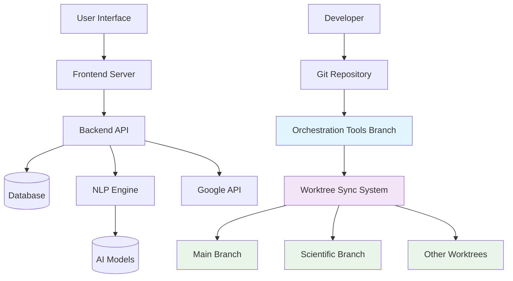

# EmailIntelligence Architecture Diagram

## High-Level Architecture



## Component Details

### Core Application Components

1. **Frontend Server**
   - Serves the React-based user interface
   - Communicates with Backend API via HTTP/REST
   - Built with Vite/React/TypeScript

2. **Backend API**
   - FastAPI-based REST API server
   - Handles business logic and data processing
   - Integrates with NLP engine for email analysis
   - Connects to Google APIs for email access

3. **NLP Engine**
   - Natural Language Processing for email analysis
   - Uses Hugging Face Transformers
   - Implements sentiment analysis, topic classification, etc.
   - Loads pre-trained AI models

4. **Database**
   - SQLite/PostgreSQL for data storage
   - Stores email metadata, user preferences, analysis results

5. **AI Models**
   - Pre-trained machine learning models
   - Stored in models/ directory
   - Used by NLP engine for analysis tasks

### Orchestration System Components

1. **Orchestration Tools Branch**
   - Central source of truth for development environment
   - Contains setup scripts, Git hooks, and configuration
   - Never merged with other branches

2. **Git Hooks System**
   - Pre-commit: Validates changes to orchestration files
   - Post-commit: Triggers synchronization after commits
   - Post-merge: Updates setup files after merges
   - Post-push: Detects orchestration changes and creates PRs

3. **Worktree Sync System**
   - Synchronizes setup files between worktrees
   - Maintains consistency across development environments
   - Uses sync_setup_worktrees.sh script

4. **Worktrees**
   - Main branch: Primary development branch
   - Scientific branch: Scientific computing features
   - Other worktrees: Feature branches, experiments

## Data Flow

1. **User Interaction Flow**
   - User interacts with Frontend UI
   - Frontend makes API calls to Backend
   - Backend processes requests and accesses data
   - Results returned to Frontend for display

2. **Email Processing Flow**
   - Backend fetches emails via Google API
   - Emails processed by NLP Engine
   - Analysis results stored in Database
   - Results served to Frontend

3. **Development Orchestration Flow**
   - Developer commits to any branch
   - Git hooks validate and synchronize changes
   - Orchestration changes trigger PR creation
   - Worktree sync maintains environment consistency
```